Ameba ARDUINO with BW16 typec (RTL8720DN)
=========================================

.. contents::
  :local:
  :depth: 2

Introduction
------------

Realtek RTL8720DN is a Wi-Fi and Bluetooth IC that supports 2.4GHz and 5GHz dual bands for Wi-Fi communication, and Bluetooth Low Energy (BLE) 5.0. 
BW16 module is manufactured by B&T, this module is a highly integrated Wi-Fi and Bluetooth module with the RTL8720DN as the main SoC (System on Chip),
it can be regarded as an SoC for the Wi-Fi and Bluetooth application with typical SBCs. BW16 Type C board is a development board that integrated with the module.
There are 2 BW16 boards, BW16 and BW16 Type C. BW16 Type C board uses USB Type C connector and has Auto Upload circuit.

**BW16 Type C board**
~~~~~~~~~~~~~~~~~~~~~

|image01|

The size of the board is 50.4*25.4(±0.2) mm. It uses Type C USB to supply power, which is common in many smart devices.
Please refer to the following figure and table for the pin diagram and functions.

|image02|

+---+-------------+--------------+---------+----------+---------------------+------------------+----------------+--------------+------------+----------------+
|   | **GPIO Pin**| **GPIO INT** | **ADC** | **PWM**  |     **UART**        |     **SPI**      |    **I2C**     |   **IR**     |** RGB LED**|    **SWD**     |
+===+=============+==============+=========+==========+=====================+==================+================+==============+============+================+
| 0 | PA7         |  ✓           |         |          |     LOG_TX          |                  |                |              |            |                |
+---+-------------+--------------+---------+----------+---------------------+------------------+----------------+--------------+------------+----------------+
| 1 | PA8         |  ✓           |         |          |     LOG_RX          |                  |                |              |            |                |
+---+-------------+--------------+---------+----------+---------------------+------------------+----------------+--------------+------------+----------------+
| 2 | PA27        |  ✓           |         |          |                     |                  |                |              |            | SWD_DATA       |
+---+-------------+--------------+---------+----------+---------------------+------------------+----------------+--------------+------------+----------------+
| 3 | PA30        |  ✓           |         |  ✓       |                     |                  |                |              |            |                |                            
+---+-------------+--------------+---------+----------+---------------------+------------------+----------------+--------------+------------+----------------+
| 4 | PB1         |  ✓           |         |          |     SERIAL1_TX      |                  |                |              |            |                |
+---+-------------+--------------+---------+----------+---------------------+------------------+----------------+--------------+------------+----------------+
| 5 | PB2         |  ✓           |         |          |     SERIAL1_RX      |                  |                |              |            |                |
+---+-------------+--------------+---------+----------+---------------------+------------------+----------------+--------------+------------+----------------+
| 6 | PB3         |  ✓           | A2      |          |                     |                  |                |              |            | SWD_CLK        |
+---+-------------+--------------+---------+----------+---------------------+------------------+----------------+--------------+------------+----------------+
| 7 | PA25        |  ✓           |         |  ✓       |                     |                  |  I2C_SCL       |  IR_TX       |            |                |
+---+-------------+--------------+---------+----------+---------------------+------------------+----------------+--------------+------------+----------------+
| 8 | PA26        |  ✓           |         |  ✓       |                     |                  |  I2C_SDA       |  IR_RX       |            |                |
+---+-------------+--------------+---------+----------+---------------------+------------------+----------------+--------------+------------+----------------+
| 9 | PA15        |  ✓           |         |          |                     |   SPI_SS         |                |              |            |                |
+---+-------------+--------------+---------+----------+---------------------+------------------+----------------+--------------+------------+----------------+
| 10| PA14        |  ✓           |         |          |                     |   SPI_SCLK       |                |              | LED_G      |                |
+---+-------------+--------------+---------+----------+---------------------+------------------+----------------+--------------+------------+----------------+
| 11| PA13        |  ✓           |         |  ✓       |                     |  SPI_MISO        |                |              | LED_B      |                |
+---+-------------+--------------+---------+----------+---------------------+------------------+----------------+--------------+------------+----------------+
| 12| PA12        |  ✓           |         |  ✓       |                     |  SPI_MOSI        |                |              | LED_R      |                |
+---+-------------+--------------+---------+----------+---------------------+------------------+----------------+--------------+------------+----------------+

There are 2 buttons besides USB connector. “RST” button is on the left
and “Burn” button is on the right as shown on above figures. Refer the
following table for the functions of the buttons.

+---------------------------+------------------------------------------+
| **Button Functions**      | **Button Process**                       |
+===========================+==========================================+
| **Reset board**           | 1. Press then release "RST"              |
+---------------------------+------------------------------------------+
| **Enter upload mode**     | 1. Press and hold "Burn"                 |
|                           |                                          |
|                           | 2. Press then release "RST"              |
|                           |                                          |
|                           | 3. Release "Burn"                        |
+---------------------------+------------------------------------------+

The Upload Mode is required by board when erase flash or upload firmware. BW16 Type C has Auto Upload circuit. It can skip manually enter the Upload Mode.

Set up Development Environment
------------------------------

Step 1. OS Environment
~~~~~~~~~~~~~~~~~~~~~~

BW16 Type C (RTL8720DN) board currently supports Windows OS 32-bits or 64-bits, 
Linux OS (Ubuntu) and macOS. To have the best experiences, please use the latest version of OS.

Step 2. Set up Arduino IDE
--------------------------

From version 1.6.5, Arduino IDE supports third-party hardware. Arduino IDE is used to develop applications on the board, and the Arduino basic examples (refer to the basic example link).

Arduino IDE can be downloaded in the Arduino website: https://www.arduino.cc/en/Main/Software

When the installation is finished, open Arduino IDE. Go to “File” -> “Preferences”.

And paste the following URL into the “Additional Boards Manager URLs” field: https://github.com/ambiot/ambd_arduino/raw/master/Arduino_package/package_realtek.com_amebad_index.json

Next, go to “Tools” -> “Board” -> “Boards Manager”:

|image03|

The “Boards Manager” requires several seconds to refresh all hardware files (if the network is in bad condition, it may take longer). Search “Realtek” 
then find “Realtek Ameba Boards (32-bits ARM Cortex-M33 @200MHz)” in the list, click “Install”, then the Arduino IDE starts to download required files for AmebaD family includes BW16.

|image04|

If there is downloading issue (Bad internet or GitHub access), please refer to the following link at “Download/Software Development Kit”. There are 3 sections.
1. “AmebaD_Arduino_patch1_SDK”, please select at least 1 of the SDKs. There are 5 latest released SDK options.
2. “AmebaD_Arduino_patch2_Tools”, please select according to operating system. There are Windows, Linux, and macOS.
3. “AmebaD_Arduino_Source_Code”, this section is optional. Download for the latest source code.

https://www.amebaiot.com.cn/en/ameba-arduino-summary/  

Download the files selected, then unzip (patch1 and patch2 are compulsory). There are “Install.doc”/“Install.pdf” for you to refer to installation steps. 
According to your system, please run the installation tool in the “Offline_SDK_installation_tool” folder.

After the installation, select AmebaD as current connected board in “Tools” -> “Board” -> “Ameba ARM (32-bits) Boards” ->” BW16(RTL8720DN)”:

|image05|

Step 3. Install the Serial Port
~~~~~~~~~~~~~~~~~~~~~~~~~~~~~~~

First, connect the board to computer via Type C USB:

**BW16 Type C board**
~~~~~~~~~~~~~~~~~~~~~

|image06|

After connected, the USB driver will be automatically installed. If there is any driver issue of connecting board, 
please go to http://www.wch-ic.com/downloads/CH341SER_ZIP.html for USB driver. Check the COM Port number in Device Manager for Windows OS user: 

|image07|

Go to “Tools” -> “Port” and select the correct COM port.  

|image08|

Go to “Tools” -> “Serial Monitor”, set the baud rate as “115200”, and press the RST button to check the serial port connection.  

|image09|

|image10|

Step 4. Erase flash
~~~~~~~~~~~~~~~~~~~

Depending on the batch of manufacturing, some boards might have built-in the default B&T firmware, the firmware information is shown below: 

|image11|

The firmware is at the OTA section. All new compiled firmware will be replaced automatically by the OTA section firmware. 
Therefore, OTA section firmware needs to be erased first to make use of compiled firmware. 

Method 1: “Erase Flash Enable” by Arduino SDK after V3.1.3
~~~~~~~~~~~~~~~~~~~~~~~~~~~~~~~~~~~~~~~~~~~~~~~~~~~~~~~~~~

Select “Tools” -> “Erase Flash” -> “Enable”

|image12|

Then enter the enter the upload mode.

* Manually. Press and hold "Burn" button, press then release "RST" button and release "Burn” button.
* Auto. Select “Tools” -> “Auto Upload Mode” -> “Enable”. Note that only boards with auto upload circuit built-in can use the Auto Upload Mode, 
  otherwise it will back to normal upload mode and wait for 5 seconds. 

Next, Select “Sketch” -> “Upload”. “Erase flash done.” will show up.  

|image13|

|image14|

Check the serial monitor and reset board by press RST button. If only “#” shows that means erase flash success. Remember to select “Tools” -> “Erase Flash” -> “Disable”. 

|image15|

Try the First Example
---------------------

Step 1. Compile & Upload
~~~~~~~~~~~~~~~~~~~~~~~~

Arduino IDE provides many built-in examples, which can be compiled, uploaded, and run directly on the boards. Here, we take the “Blink” example as the first try.

Open :guilabel:`“File” -> “Examples” -> “01.Basics” -> “Blink”`:

|image16|

|image17|

.. tip::
   There is an onboard RGB LED, the default ``LED_BUILTIN`` is green color. 
   Change ``LED_BUILTIN`` to ``LED_R``, ``LED_G``, or ``LED_B`` for red, green, or blue colors. 

Next, we compile the sample code directly.
:guilabel:`“Sketch” -> “Verify/Compile”`

Then if there is no compile error, followed by “Sketch” -> “Upload”. 

* Check and select “Tools” -> “Erase Flash” -> “Disable”.
* Enter the Upload Mode. Manual or Auto. Select “Tools” -> “Auto Upload Mode” -> “Enable”/ ”Disable”.
* “Verify/Compile” then “Upload”. (“Verify/Compile” can be skipped the “Upload” includes it.)

Successful upload will show “All images are sent successfully!”

|image18|

Step 2. Run the Blink example
~~~~~~~~~~~~~~~~~~~~~~~~~~~~~

The board will be reset automatically, press RST button if board does not support Auto Upload Mode. And the onboard RGB LED will blinking. 

In each example, Arduino not only provides sample code but also detailed documentation, including wiring diagram, sample code explanation, 
technical details, …etc. These examples can be directly used on the board. 
Refer to detailed information of the Blink example in the link below: https://www.arduino.cc/en/Tutorial/BuiltInExamples/Blink

References
----------

#. Introduction of BW16 on Instructable:
   https://www.instructables.com/RTL8720DN/
#. Load Arduino image into BW16:
   `How to load BW16 program with Arduino - #13 <https://forum.amebaiot.com/t/how-to-load-bw16-program-with-arduino/517/13>`_
#. BW16 IMG2 SIGN Invalid Solution:
   `RTL8720DN(BW16) IMG2 SIGN Invalid Solution <https://forum.amebaiot.com/t/rtl8720dn-bw16-img2-sign-invalid-solution/669>`_
#. FTDI Driver Download from here:
   https://ftdichip.com/wp-content/uploads/2021/02/CDM21228_Setup.zip

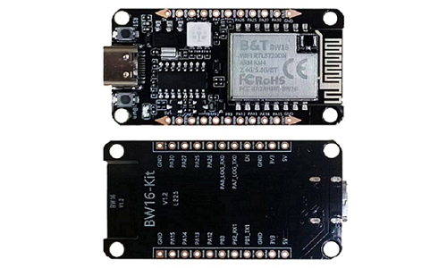
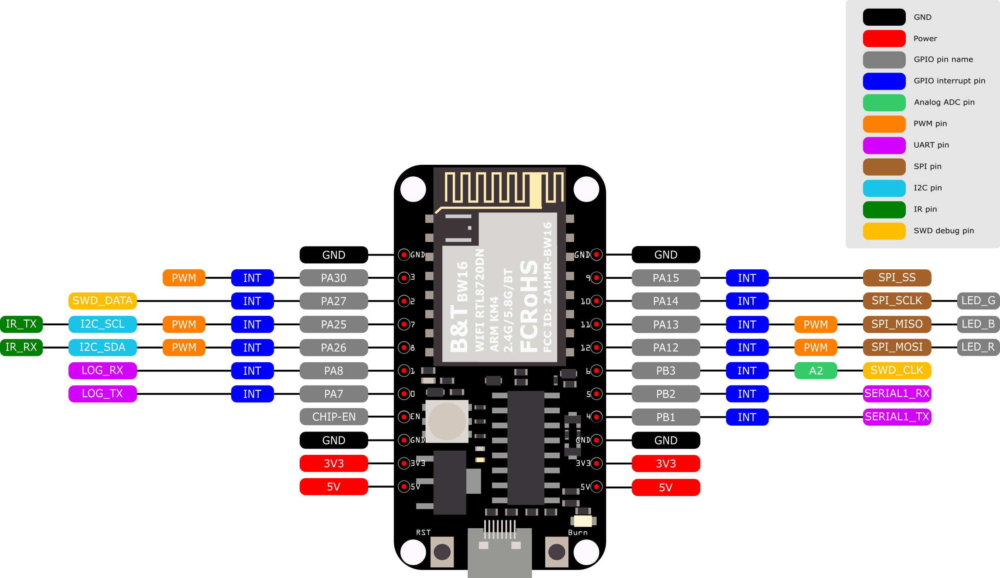
.. |image03| image:: ../../../_static/amebad/Getting_Started/BW16_typec_getting_started/image03.png
   :width:  712 px
   :height:  886 px
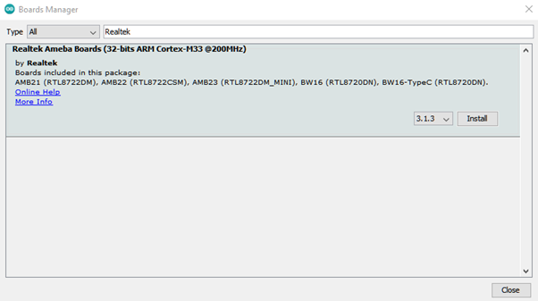
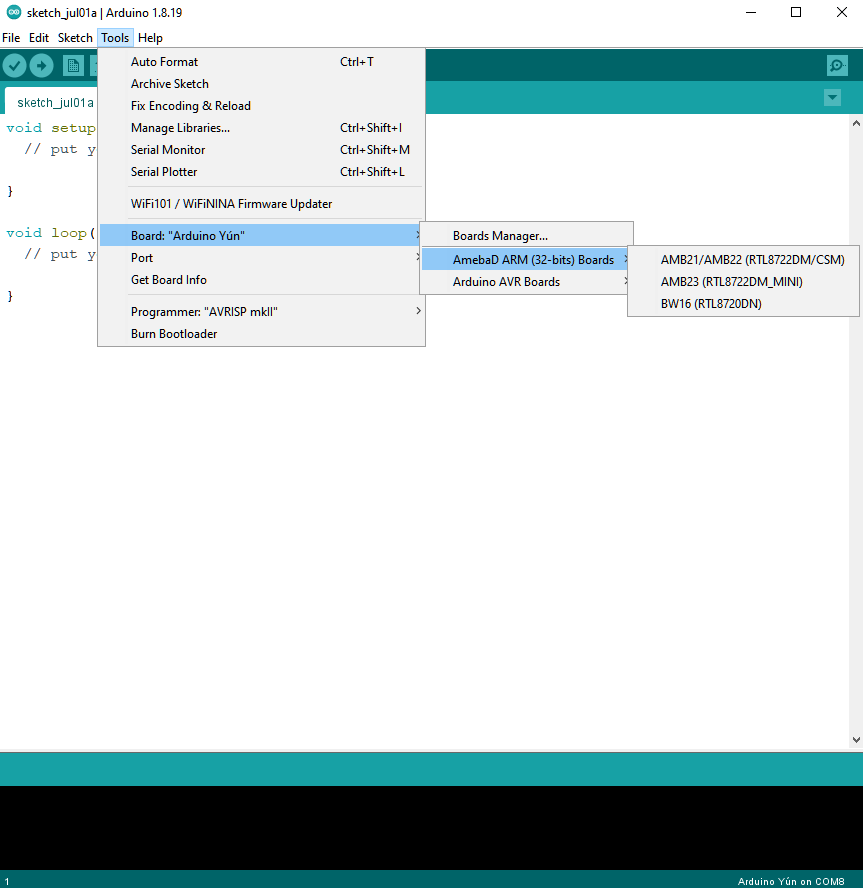
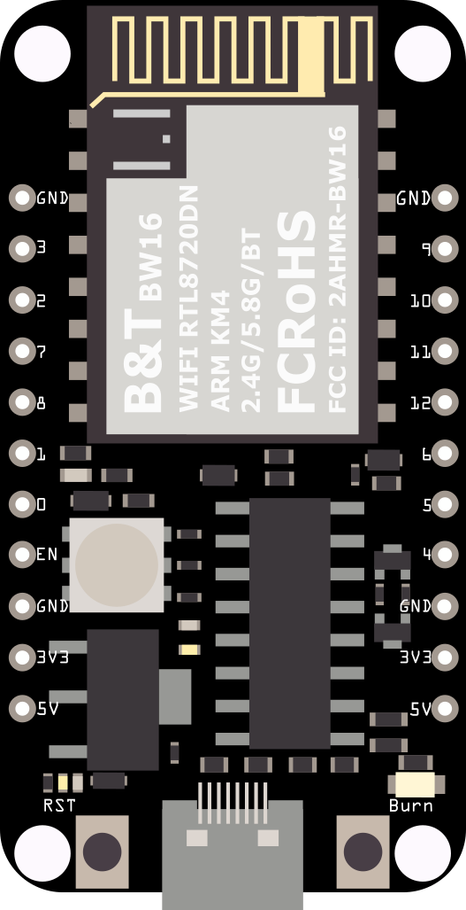
.. |image07| image:: ../../../_static/amebad/Getting_Started/BW16_typec_getting_started/image07.png
   :width:  307 px
   :height:  484 px
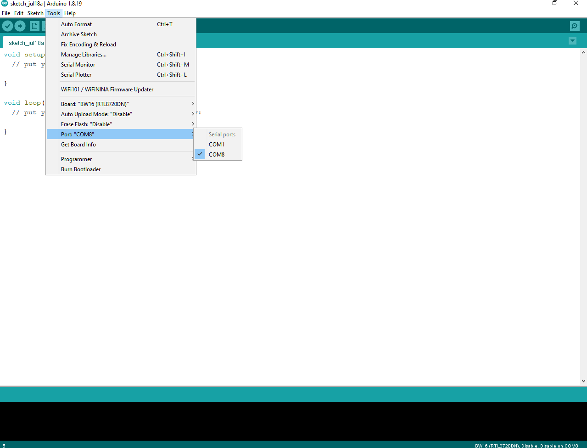
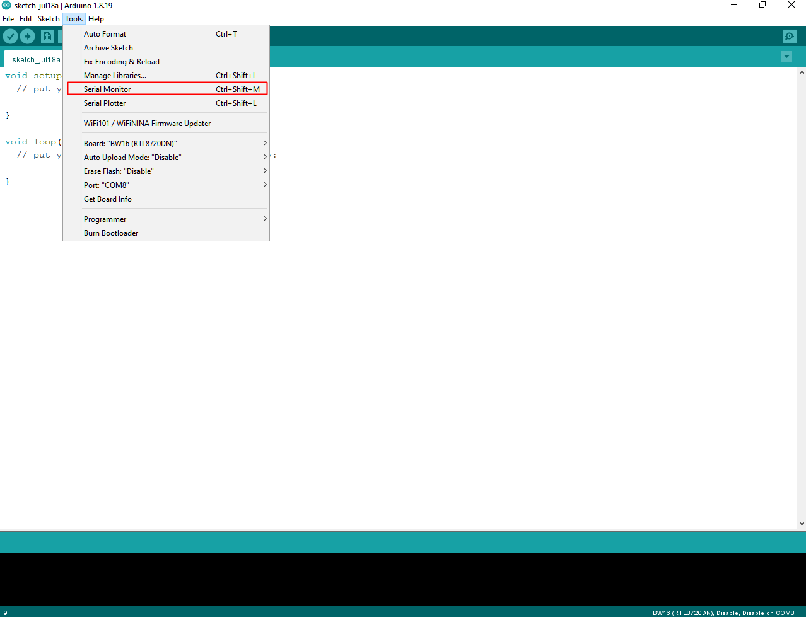
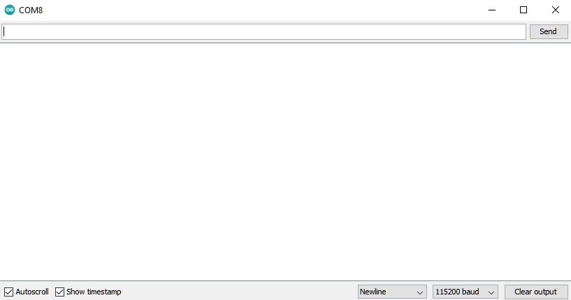
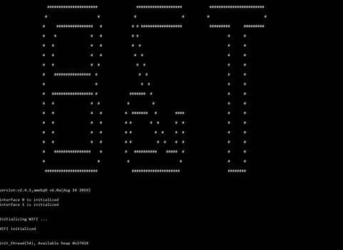
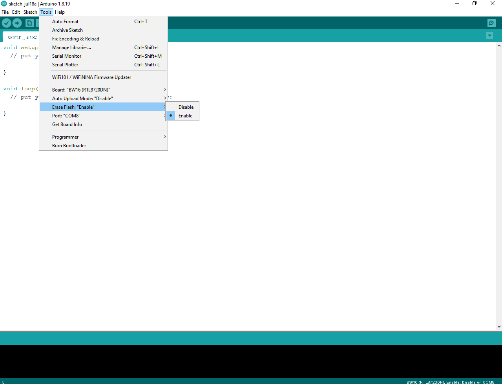
.. |image13| image:: ../../../_static/amebad/Getting_Started/BW16_typec_getting_started/image13.png
   :width:  863 px
   :height:  887 px
.. |image14| image:: ../../../_static/amebad/Getting_Started/BW16_typec_getting_started/image14.png
   :width:  864 px
   :height:  887 px
.. |image15| image:: ../../../_static/amebad/Getting_Started/BW16_typec_getting_started/image15.png
   :width:  818 px
   :height:  435 px
.. |image16| image:: ../../../_static/amebad/Getting_Started/BW16_typec_getting_started/image16.png
   :width:  1278 px
   :height:  981 px
   :scale: 70%
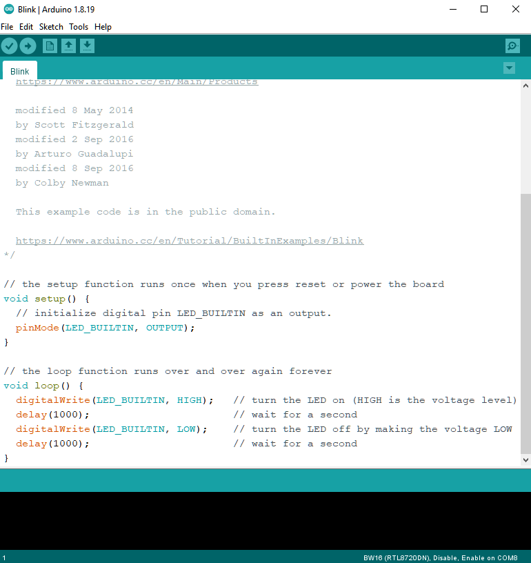
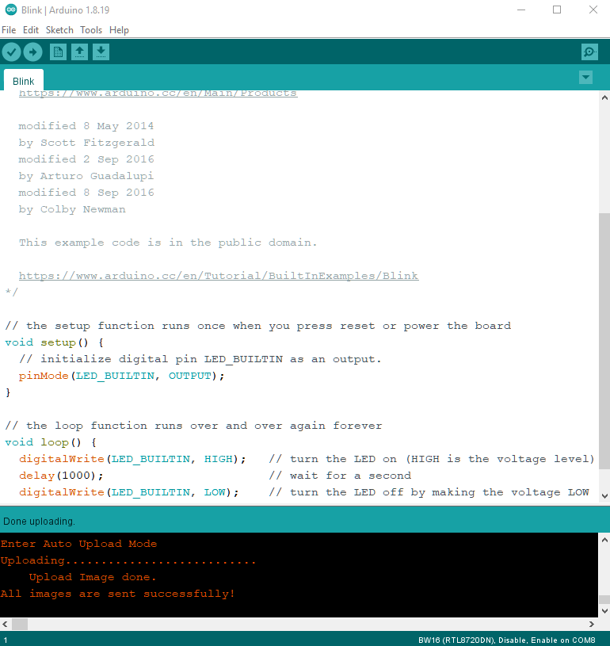
