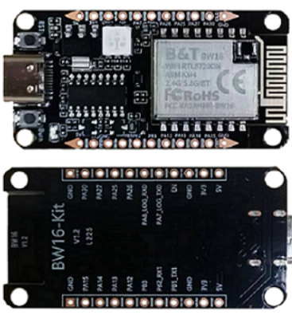

BW16-TypeC Arduino
==================

.. table::
   :class: table-transparent
   :align: center

   +------------------------------------------------------------------------+----------------------------------------------------------+
   | |image01|                                                              | - MCU                                                    |
   |                                                                        |    - Part Number: RTL8720DN                              |
   | |image02|                                                              |    - 32-bit KM4 (Arm Cortex-M33 compatible)              |
   |                                                                        |    - 32-bit KM0 (Arm Cortex-M23 compatible)              |
   | **BW16 type C**                                                        | - Memory                                                 |
   |                                                                        |    - 512KB SRAM                                          |
   | (Ameba RTL8720DN)                                                      |    - 2MB Flash (Up to 4MB)                               |
   |                                                                        | - Key Features                                           |
   | by **Ai-Thinker**                                                      |    - Integrated 802.11a/n Wi-Fi SoC                      |
   |                                                                        |    - BLE5.0                                              |
   +------------------------------------------------------------------------+    - Auto DownLoad Mode                                  |
   | |image03|                                                              | - Other Features                                         |
   |                                                                        |    - 2 UART interfaces                                   |
   | - Worldwide                                                            |    - 1 I2C Interface                                     |
   |    - TBD                                                               |    - 1 ADC interfaces                                    |
   | - Regional                                                             |    - 1 SPI interfaces                                    |
   |    - `Taiwan ICShop <link01_>`_                                        |    - 5 PWM interfaces                                    |
   |    - `Taiwan ICShop (Module only) <link02_>`_                          |    - Max 13 GPIO                                         |
   |                                                                        |    - 1 RGB LED                                           |
   |                                                                        |    - TypeC USB port                                      |
   +------------------------------------------------------------------------+----------------------------------------------------------+

.. toctree::
   :caption: Category list
   :maxdepth: 2

   Getting_Started/index
   Example_Guides/index
   API_Documents/index

SDK Source Code
---------------

* |image04| `ameba-arduino-d <https://github.com/Ameba-AIoT/ameba-arduino-d>`_

.. _link01: https://www.icshop.com.tw/products/368030501730?locale=en

.. _link02: https://www.icshop.com.tw/products/368030502076?locale=en

.. |image02| image:: ../../_static/partner_designed_logo.png

.. |image03| image:: ../../_static/shopping_cart_white.png

.. |image04| image:: ../../_static/GitHub_Logo_2025.png
   :target: https://github.com/Ameba-AIoT
   :width:  50px
