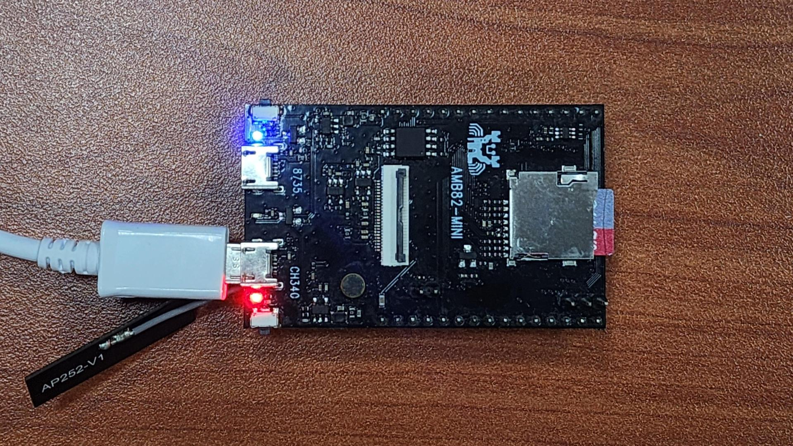
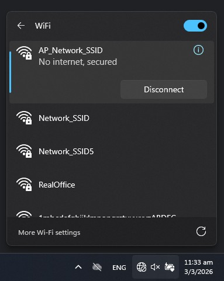

AC-Powered Camera
=================

.. contents::
  :local:
  :depth: 2

Materials
---------
- `AMB82-mini <https://www.amebaiot.com/en/where-to-buy-link/#buy_amb82_mini>`_ x 1
- Camera Module (eg. JX-F37) x 1
- SD card x 1
- WiFi capable device with browser (Microsoft Edge, Google Chrome, etc)

Introduction
------------
This proof of concept is designed to provide a continuous high resolution surveillance. The software has integrated AI capabilities to enable object and motion detection in real-time, recording moments that matter.
Users may also connect to AMB82-Mini for a live video feed to monitor the target area under surveillance.

How it Works
------------

First, AMB82-Mini switches to its WiFi AP mode to allow external devices to connect to it directly. Then a websocket viewer is set up to allow connected devices to view the video stream in real-time but this will require a browser for viewing.
Second, the video frames are put through our motion detection algorithm and an object detection model to identify when an event is happening in the area under surveillance. When an event is detected, AMB82-Mini will begin recording a video for until no further event has occurred for a few moments before saving the
recording into the SD card. Each recording will have an event name and timestamp to keep track of when something has occurred for future reference.

Getting Started
---------------

- Insert the SD card into AMB82-Mini 
|image01|

- Find the POC example under "Files" -> "Examples" -> "AmebaPOC" -> "AC-PoweredCamera" from the top left corner of the ArduinoIDE.
|image02|

- Update the WiFi AP network ID and Password in the following sections. This will be the network to connect to later.
|image03| 

- Compile and upload the code into AMB82-Mini and reset the board to start running the POC example.

- Once the example is running, you may move into the frame and it should begin recording. You will see the following message when recording has started.
|image04| 

- After about 10 seconds of non-event, the recording will be stopped automatically with the following message being printed out.
|image05| 

- For live viewing of the video stream, first connect to AMB82-Mini's WiFi using the network SSID and password that you have defined earlier.
|image03|
|image06|

- Open your browser and connect to the following IP Address: http://192.168.1.1/.
|image07| 

Optional:
---------

The object detection model can be changed out to your preferred model by following this example - `Example for Changing Object Detection Model <https://ameba-doc-arduino-sdk.readthedocs-hosted.com/en/latest/ameba_pro2/amb82-mini/Example_Guides/Neural%20Network/Object%20Detection.html>`_ 

The default model is able to detect up to 80 separate objects as described in the "objectClassList.h". This can be edited to restrict the model to only detect objects of interest for your use case.
|image08|

.. |image02| image::  ../../../../_static/amebapro2/Example_Guides/POC/AC-PoweredCamera/image02.jpg
.. |image03| image::  ../../../../_static/amebapro2/Example_Guides/POC/AC-PoweredCamera/image03.jpg
.. |image04| image::  ../../../../_static/amebapro2/Example_Guides/POC/AC-PoweredCamera/image04.jpg
.. |image05| image::  ../../../../_static/amebapro2/Example_Guides/POC/AC-PoweredCamera/image05.jpg

.. |image07| image::  ../../../../_static/amebapro2/Example_Guides/POC/AC-PoweredCamera/image07.jpg
.. |image08| image::  ../../../../_static/amebapro2/Example_Guides/POC/AC-PoweredCamera/image08.jpg

