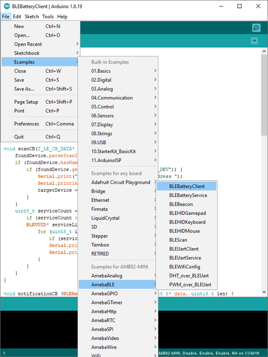
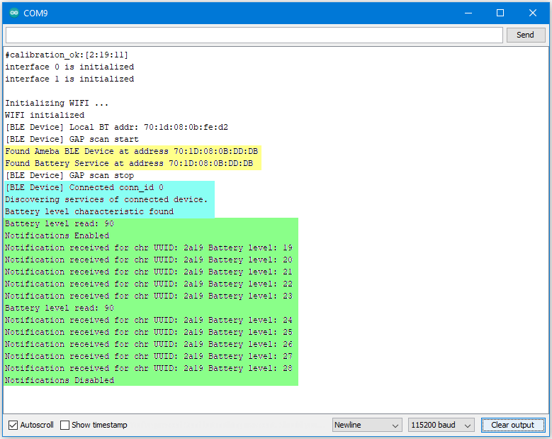

BLE Battery Client
==================

.. contents::
  :local:
  :depth: 2

Materials
---------

-  `AMB82-mini <https://www.amebaiot.com/en/where-to-buy-link/#buy_amb82_mini>`_ x 2

Example
-------

Introduction
~~~~~~~~~~~~

BLE connections use a server client model. The server contains the data
of interest, while the client connects to the server to read the data.
Commonly, a Bluetooth peripheral device acts as a server, while a
Bluetooth central device acts as a client. Servers can contain many
services, with each service containing some set of data. Clients can
send requests to read or write some data and can also subscribe to
notifications so that the server can send data updates to a client.

In this example, a basic battery client is set up on the Ameba Bluetooth
stack. The client connects to another Ameba board running the
corresponding BLE battery service to read the battery level data.

Procedure
~~~~~~~~~

On the first Ameba board, upload the BLEBatteryService example code and
let it run.

For the second Ameba board, open the example "Files" -> "Examples" ->
“AmebaBLE” -> “BLEBatteryClient”.

|image01|

Upload the code and press the reset button on Ameba once the upload is
finished.

Open the serial monitor and observe the log messages as the Ameba board
with the battery client scans, connects, and reads data from the Ameba
board with the battery service.

|image02|

Highlighted in yellow, the Ameba board with the battery client first
scans for advertising BLE devices with the advertised device name
“AMEBA_BLE_DEV” and the advertised service UUID of 0x180F representing
the battery service.

After finding the target device, the Ameba board with the battery client
forms a BLE connection and searches for a battery service on the
connected device, highlighted in blue.

With the client connected to the service, the battery client begins to
read data using both regular data reads and notifications, highlighted
in green.

Code Reference
---------------

``BLEClient`` is used to create a client object to discover services and
characteristics on the connected device.

``setNotifyCallback()`` is used to register a function that will be called
when a battery level notification is received.

``BLE.configClient()`` is used to configure the Bluetooth stack for client
operation.

``addClient(connID)`` creates a new BLEClient object that corresponds to
the connected device.

