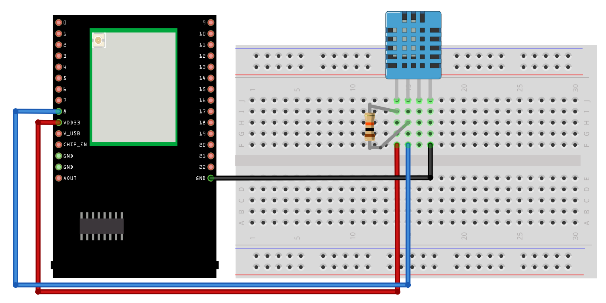
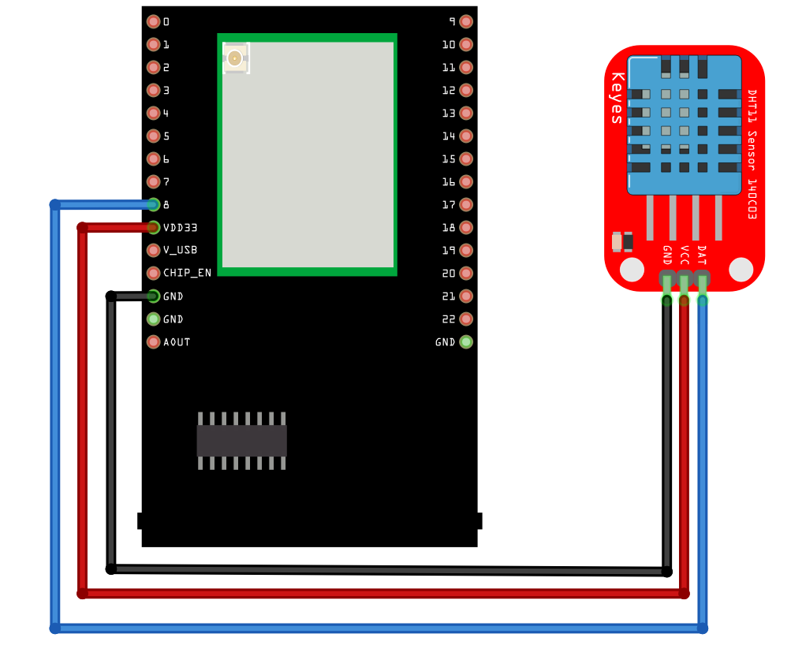
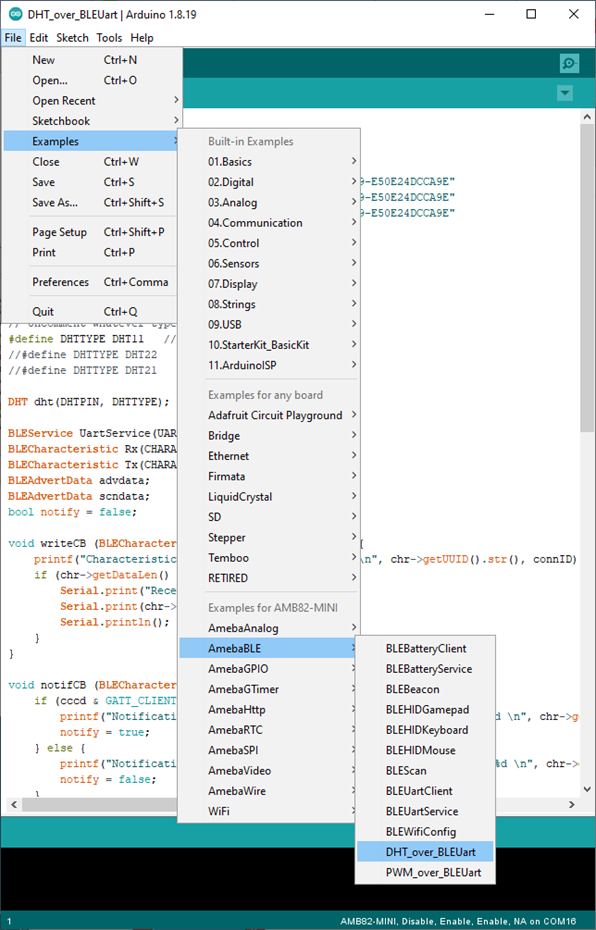
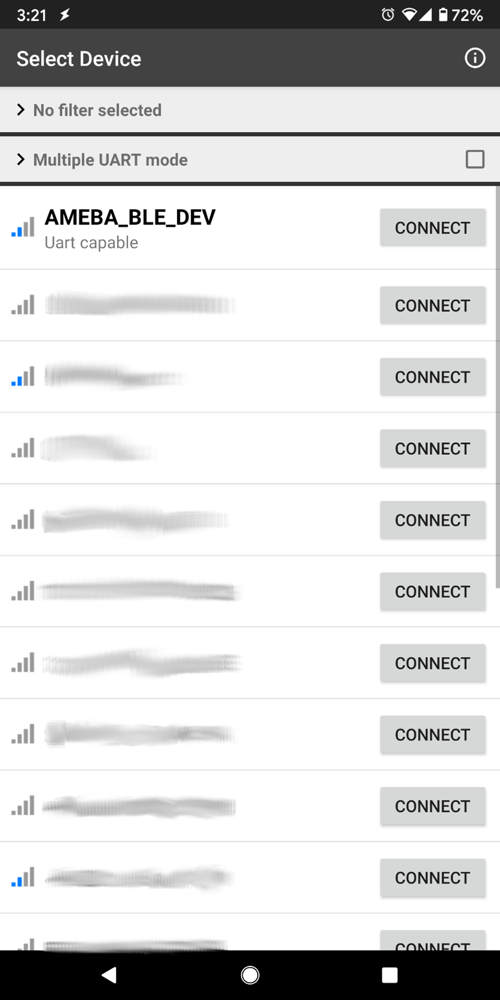
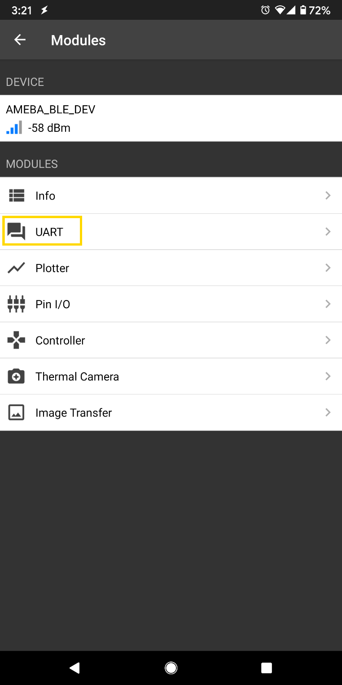
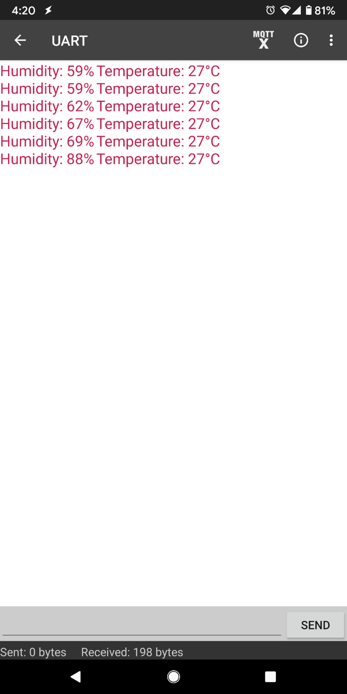

DHT over BLE UART
=================

.. contents::
  :local:
  :depth: 2

Materials
---------

-  `AMB82-mini <https://www.amebaiot.com/en/where-to-buy-link/#buy_amb82_mini>`_ x 1

-  DHT11 or DHT22 or DHT21

-  Android / iOS smartphone

Example
-------

Introduction
~~~~~~~~~~~~

In this example, the data obtained from a DHT temperature and humidity
sensor are transmitted over a BLE UART service to a smartphone. Refer to
the other examples for detailed explanations of using the DHT sensor and
the BLE UART service.

Procedure
~~~~~~~~~

Take note that if you are using a DHT sensor that is not mounted on a
PCB, you will have to add in a 10K Ohm pull up resistor.

Connect the DHT sensor to the Ameba board following the diagram.

**AMB82 MINI:**

DHT sensor not mounted on a PCB board

|image01|

DHT sensor mounted on a PCB board

|image02|

Ensure that a compatible BLE UART app is installed on your smartphone, it is available at:

* Google Play Store:
   * https://play.google.com/store/apps/details?id=com.adafruit.bluefruit.le.connect
   * https://play.google.com/store/apps/details?id=de.kai_morich.serial_bluetooth_terminal

* Apple App Store: 
   * https://apps.apple.com/us/app/bluefruit-connect/id830125974

Open the example, “Files” -> “Examples” -> “AmebaBLE” -> “DHT_over_BLEUart”.

|image03|

Upload the code and press the reset button on Ameba once the upload is finished.

Open the app on your smartphone, scan and connect to the Ameba board shown as “AMEBA_BLE_DEV” and choose the UART function in the app.

|image04|

|image05|

After starting the UART function, notifications should be received every
5 seconds containing the measured temperature and humidity.

|image06|

