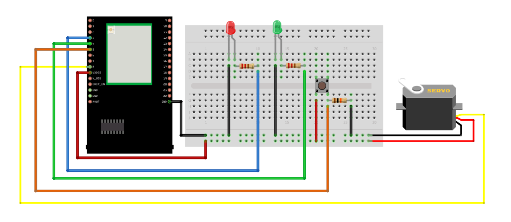
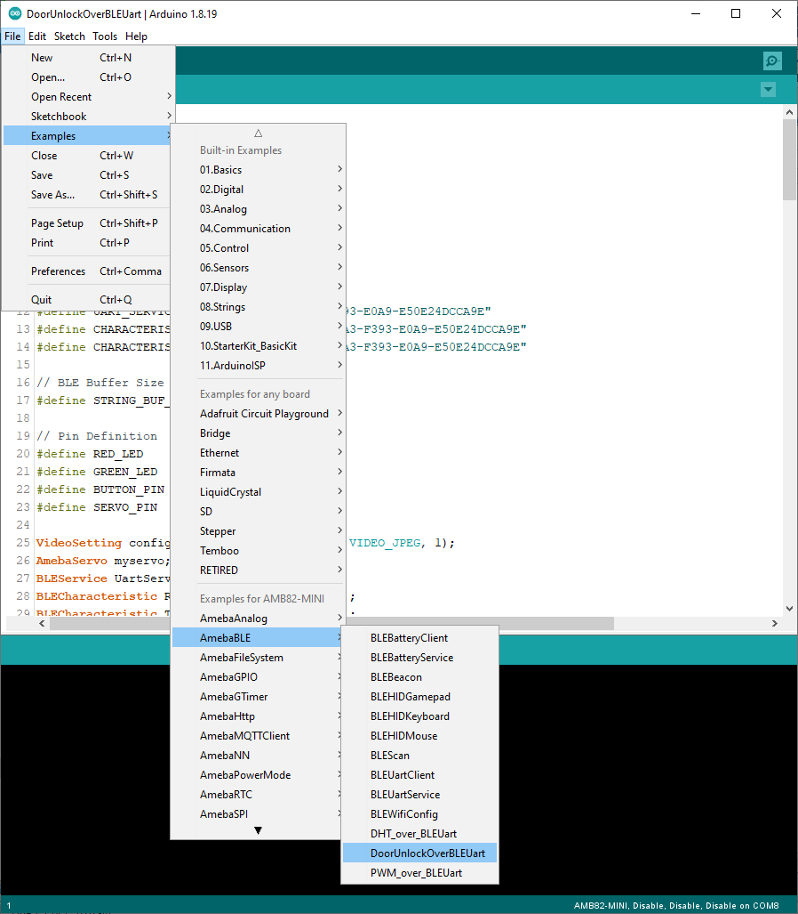
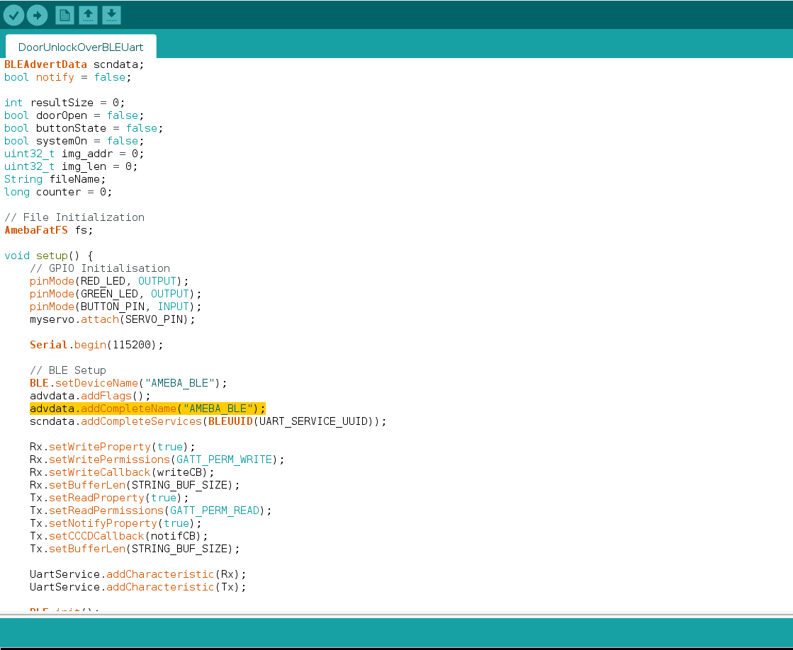
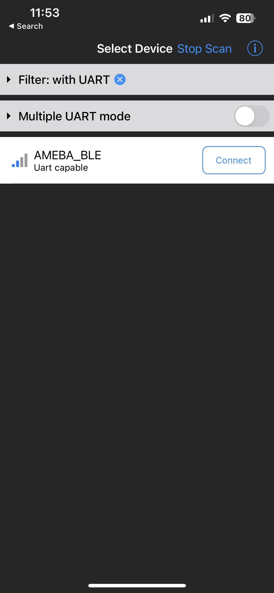
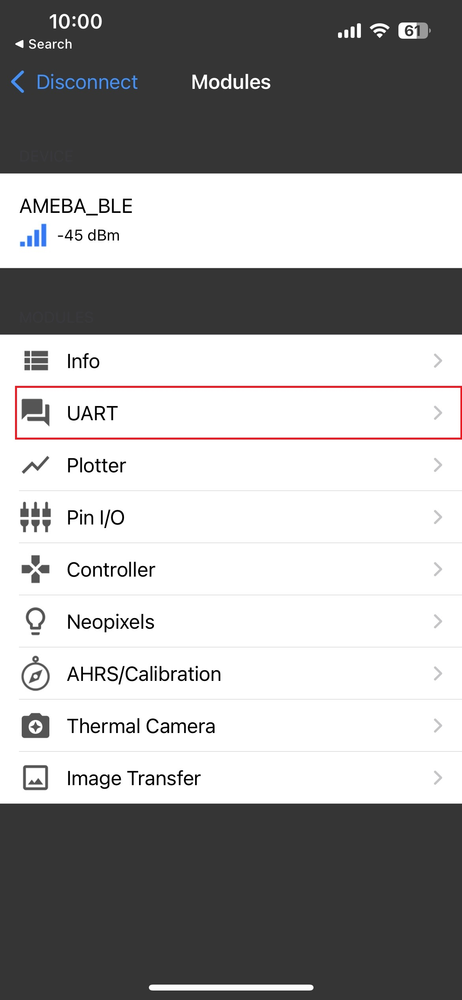
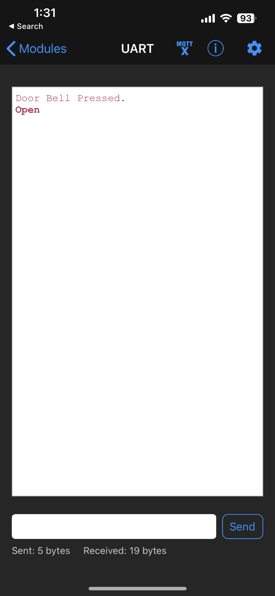
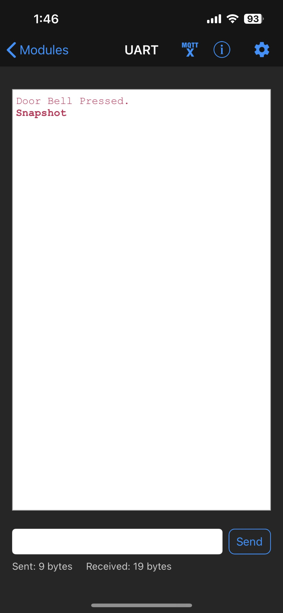

Door Unlock Over BLE Uart
=========================

Materials
---------

-  `AMB82-mini <https://www.amebaiot.com/en/where-to-buy-link/#buy_amb82_mini>`__ x 1

-  SD card x 1

-  Button x 1

-  Green LED x 1

-  Red LED x 1

-  Servo (Ex. Tower Pro SG90) x 1

-  220 Ohm resistor x 2

-  10K Ohm resistor x 1

-  Android / iOS smartphone

Example
-------

Introduction
~~~~~~~~~~~~

In this example, we will be using Ameba Pro2 development board to create
a simple door access control system with BLE. Door can be unlocked
remotely through BLE UART service.

Procedure
~~~~~~~~~

**AMB82 MINI** wiring diagram:

|image01|

Ensure that a compatible BLE UART app is installed on your smartphone,
it is available at:

* Google Play Store:

   * https://play.google.com/store/apps/details?id=com.adafruit.bluefruit.le.connecta>

   * https://play.google.com/store/apps/details?id=de.kai_morich.serial_bluetooth_terminal

* Apple App Store:

   * https://apps.apple.com/us/app/bluefruit-connect/id830125974

Open the BLE example in :guilabel:`File -> Examples -> AmebaBLE -> DoorUnlockOverBLEUart`

|image02|

In the highlighted code snippet, set your preferred BLE Device Name.

|image03|

Compile the code and upload it to Ameba.

**Unlock door with BLE UART Service**

Open the Adafruit Bluefruit app on your smartphone, scan and connect to
the Ameba board shown as "AMEBA_BLE" or any BLE device name that has
been set. Then, choose UART function in the app.

|image04|

|image05|

You should see the message "Door Bell Pressed" appearing in the UART
terminal section of the app when button is pressed. Enter "Open" message
and click send, this allows user to open the door and take a snapshot.
The image will be saved to SD card and named as Authorized{counter}.jpg.

|image06|

To take another snapshot, enter "Snapshot" message in the UART terminal
section after pressing the button. Image will be named as
SnapshotTaken{counter}.jpg and saved to SD card.

|image07|

