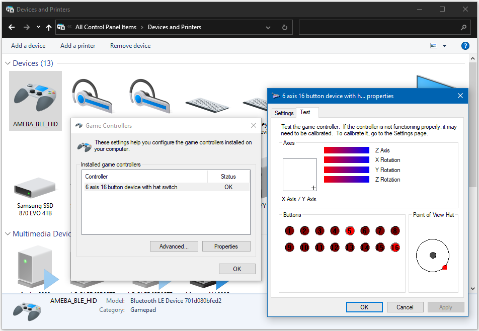

HID Gamepad
===========

.. contents::
  :local:
  :depth: 2

Materials
---------

-  `AMB82-mini <https://www.amebaiot.com/en/where-to-buy-link/#buy_amb82_mini>`_ x 1

-  BLE capable host device [Windows / Linux / MacOS / Android]

Example
-------

Introduction
~~~~~~~~~~~~~

In this example, the AmebaPro2 board emulates a HID gamepad connected
using BLE.

Procedure
~~~~~~~~~

Open the example, "Files" -> "Examples" -> "AmebaBLE" -> "BLEHIDGamepad".

|image01|

Upload the code and press the reset button once the upload is finished.

Immediately after reset, the board will begin BLE advertising as
"AMEBA_BLE_HID". On your host device, go to the Bluetooth settings menu,
scan, and connect to the board.

You should ensure that the connection process is completed before
proceeding.

On Windows, ensure that any driver installation is finished, and the
board shows up in the Bluetooth menu under the "Mouse, keyboard & pen"
category.

|image02|

On Android, ensure that "Input device" is enabled for the board.

|image03|

After the Bluetooth connection process is completed, the board is ready
to send gamepad input to the host device. Connect digital pin 8 to 3.3V
to start sending input, and connect to GND to stop.

To view the input, open a browser window and go to
https://gamepad-tester.com/. The connected gamepad device should show up
here, and some of the buttons and axes should show changing values.

|image04|

On Windows, gamepad input can also be viewed by going to "Control Panel"
-> "Devices and Printers" -> "AMEBA_BLE_HID" -> "Game Controller
Settings" -> "Properties". The buttons and axes should also show
changing values here.

|image05|

|image06|

On Android, gamepad testing apps such as
https://play.google.com/store/apps/details?id=com.chimera.saturday.evogamepadtester
can also be used to view the gamepad input.

|image07|

Code Reference
--------------

By default, the board emulates a gamepad with an 8-direction hat switch
(d-pad), 6 analog axes and 16 buttons. How the inputs are interpreted is
dependent on the host device, and the button ordering may differ between
devices. Also, some axes or buttons may be disabled or missing on certain host devices.

.. |image02| image:: ../../../../_static/amebapro2/Example_Guides/BLE/HID_Gamepad/image02.png
   :width: 2560 px
   :height: 1395 px
   :scale: 40%
.. |image03| image:: ../../../../_static/amebapro2/Example_Guides/BLE/HID_Gamepad/image03.png
   :width: 1440 px
   :height: 2880 px
   :scale: 30%
.. |image04| image:: ../../../../_static/amebapro2/Example_Guides/BLE/HID_Gamepad/image04.png
   :width: 1006 px
   :height: 585 px
   :scale: 70%
.. |image05| image:: ../../../../_static/amebapro2/Example_Guides/BLE/HID_Gamepad/image05.png
   :width: 952 px
   :height: 658 px
   :scale: 80%

.. |image07| image:: ../../../../_static/amebapro2/Example_Guides/BLE/HID_Gamepad/image07.png
   :width: 2880 px
   :height: 1440 px
   :scale: 30%
