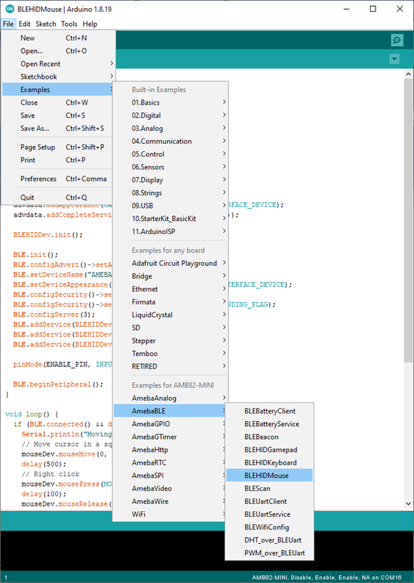
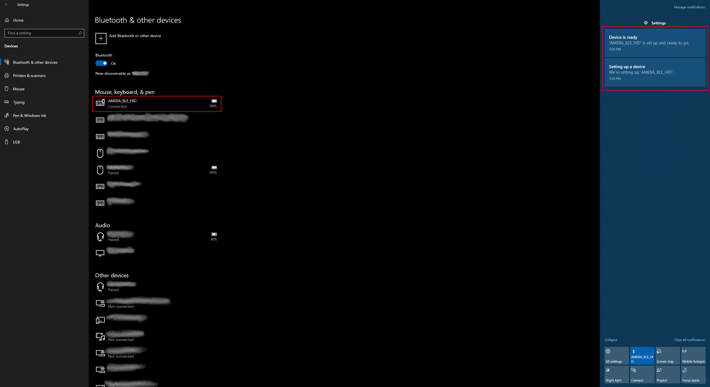

HID Mouse
=========

.. contents::
  :local:
  :depth: 2

Materials
---------

-  `AMB82-mini <https://www.amebaiot.com/en/where-to-buy-link/#buy_amb82_mini>`_ x 1

-  BLE capable host device [Windows / Linux / MacOS / Android]

Example
-------

Introduction
~~~~~~~~~~~~

In this example, the AmebaPro2 board emulates a HID mouse connected
using BLE.

Procedure
~~~~~~~~~

Open the example, "Files" -> "Examples" -> "AmebaBLE" -> "BLEHIDMouse".

|image01|

Upload the code and press the reset button once the upload is finished.

Immediately after reset, the board will begin BLE advertising as
“AMEBA_BLE_HID”. On your host device, go to the Bluetooth settings menu,
scan, and connect to the board.

You should ensure that the connection process is completed before
proceeding.

On Windows, ensure that any driver installation is finished, and the
board shows up in the Bluetooth menu under the "Mouse, keyboard & pen"
category.

|image02|

On Android, ensure that “Input device” is enabled for the board.

|image03|

After the Bluetooth connection process is completed, the board is ready
to send mouse input to the host device. Connect digital pin 8 to 3.3V to
start sending input, connect to GND to stop.

You should see the mouse cursor move around four points in a square,
performing right and left clicks, and scrolling up and down

Code Reference
--------------

How the mouse input is interpreted is dependent on the host system. Some
systems, such as mobile operating systems, may not support all mouse
button input functions.

.. |image03| image:: ../../../../_static/amebapro2/Example_Guides/BLE/HID_Mouse/image03.png
   :width: 1440 px
   :height: 2880 px
   :scale: 30%
