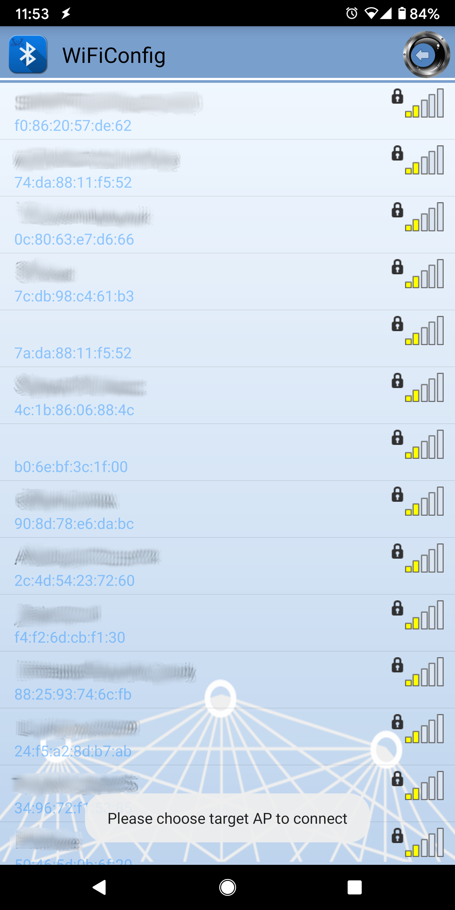

WiFi Config Service
===================

.. contents::
  :local:
  :depth: 2

Materials
---------

-  `AMB82-mini <https://www.amebaiot.com/en/where-to-buy-link/#buy_amb82_mini>`_ x 1

-  Android / iOS mobile phone

Example
-------

Introduction
~~~~~~~~~~~~

In this example, a WiFi configuration service is set up on the Ameba
Bluetooth stack. A mobile phone with the configuration app connects to
the Ameba device using BLE and configures the Ameba to connect to the
correct WiFi access point.

Procedure
~~~~~~~~~

Ensure that the Realtek WiFi configuration app is installed on your
mobile phone, it is available at:

-  Google Play Store:
   https://play.google.com/store/apps/details?id=com.rtk.btconfig

-  Apple App Store:
   https://apps.apple.com/sg/app/easy-wifi-config/id1194919510

Open the example, "Files" -> "Examples" -> "AmebaBLE" -> "BLEWifiConfigService".

|image01|

Upload the code and press the reset button on Ameba once the upload is
finished.

On your mobile phone, open the Realtek WiFiConfig app and tap the round
button to scan for Ameba boards.

|image02|

Select the correct Ameba board from the scan results. The app will
connect to the Ameba board and ask the board to scan for WiFi networks
and send the scan results back to the app using BLE.

|image03|

|image04|

|image05|

If your phone is currently connected to a WiFi network, the app will ask
for the WiFi password to connect the Ameba board to the same WiFi
network. Tap "Select AP" to choose another WiFi network, or enter the
password and tap continue to connect Ameba to the selected WiFi network.

|image06|

After the Ameba board connects to the WiFi network, the following
message will be shown. Tap "Try another AP" to connect to another WiFi
network or tap "Confirm" to keep the current WiFi network and disconnect
BLE from the Ameba board.

|image07|

Code Reference
--------------

``BLEWifiConfigService`` is used to create an instance of the WiFi
configuration service to run on the Bluetooth device.

``BLE.configAdvert()`` -> ``setAdvType(configService.advData())`` is used to set
the correct advertisement data necessary for the phone app to find the Ameba Bluetooth device.

.. |image02| image:: ../../../../_static/amebapro2/Example_Guides/BLE/WiFi_Config_Service/image02.png
   :width: 1440 px
   :height: 2880 px
   :scale: 30%
.. |image03| image:: ../../../../_static/amebapro2/Example_Guides/BLE/WiFi_Config_Service/image03.png
   :width: 1440 px
   :height: 2880 px
   :scale: 30%

.. |image06| image:: ../../../../_static/amebapro2/Example_Guides/BLE/WiFi_Config_Service/image06.png
   :width: 1440 px
   :height: 2880 px
   :scale: 30%
.. |image07| image:: ../../../../_static/amebapro2/Example_Guides/BLE/WiFi_Config_Service/image07.png
   :width: 1440 px
   :height: 2880 px
   :scale: 30%
