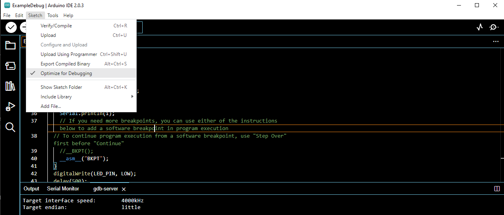
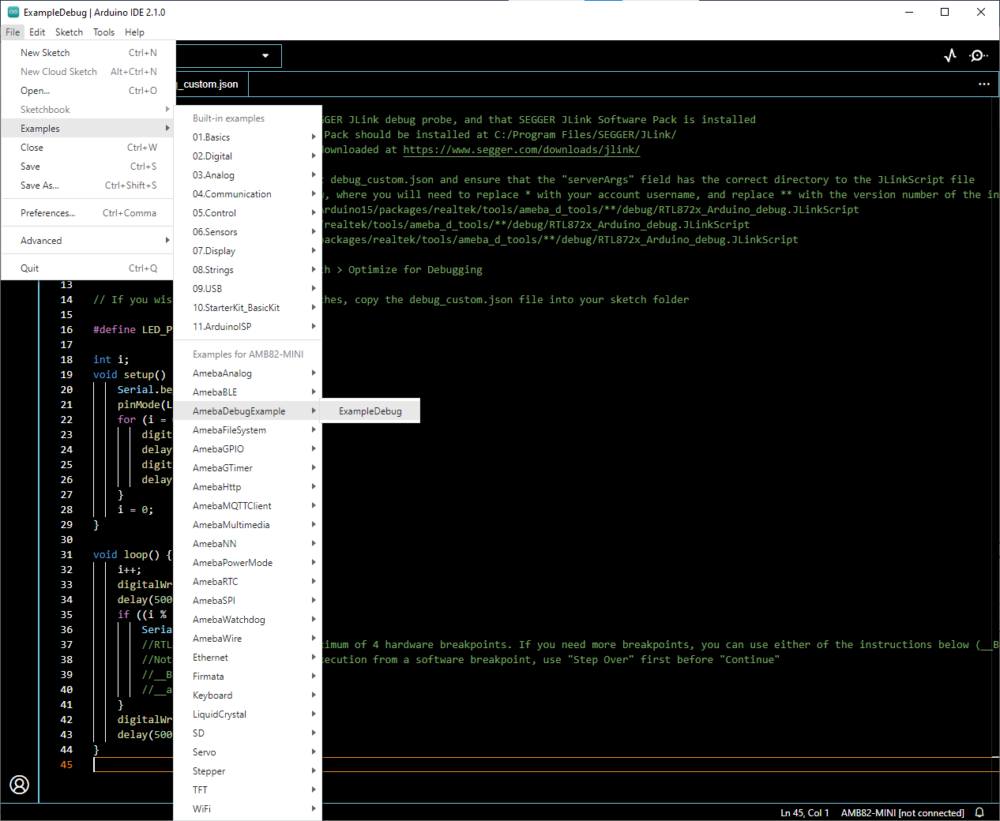
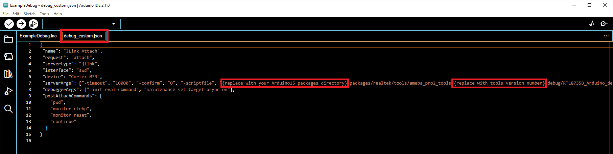
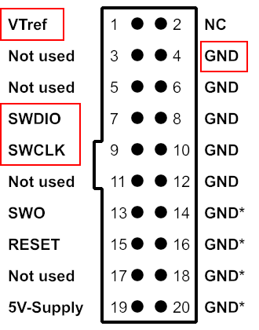
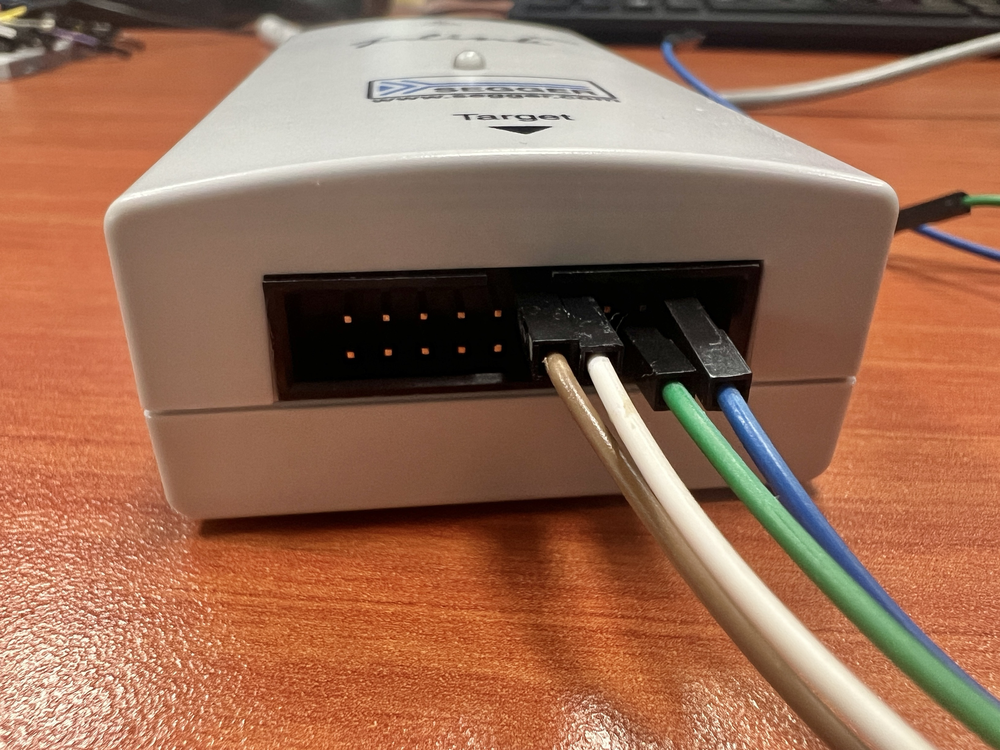
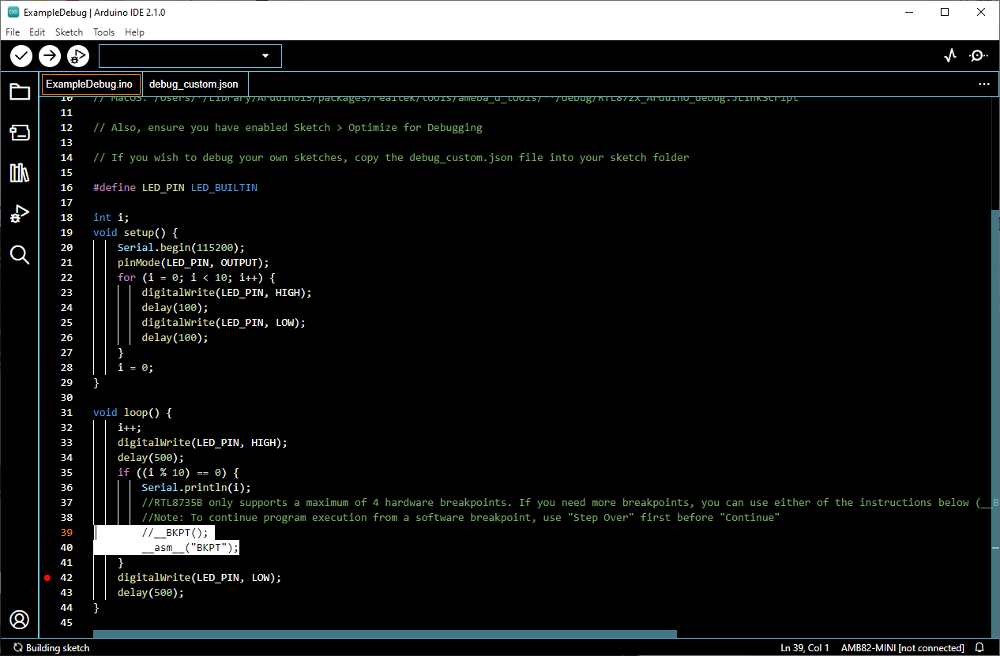
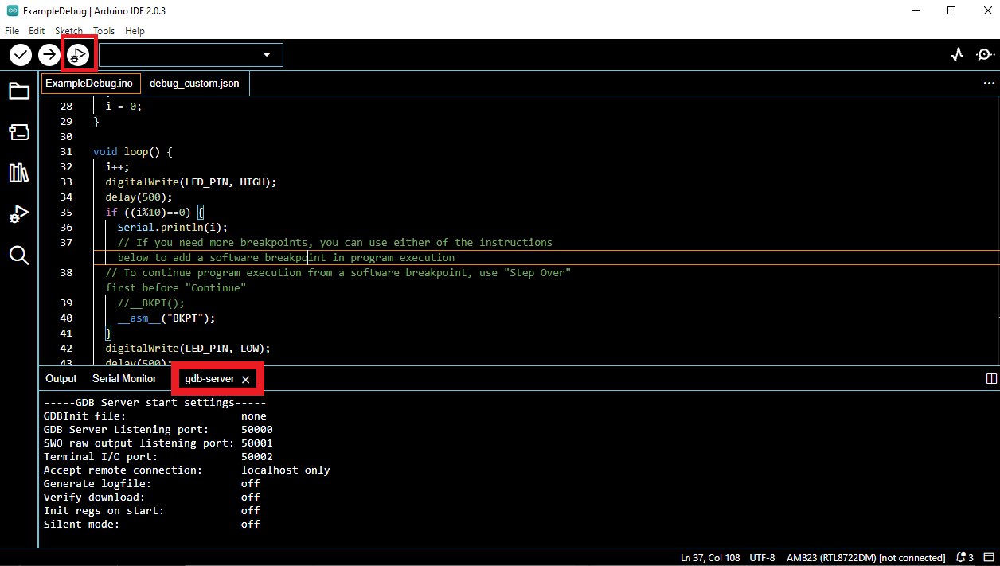
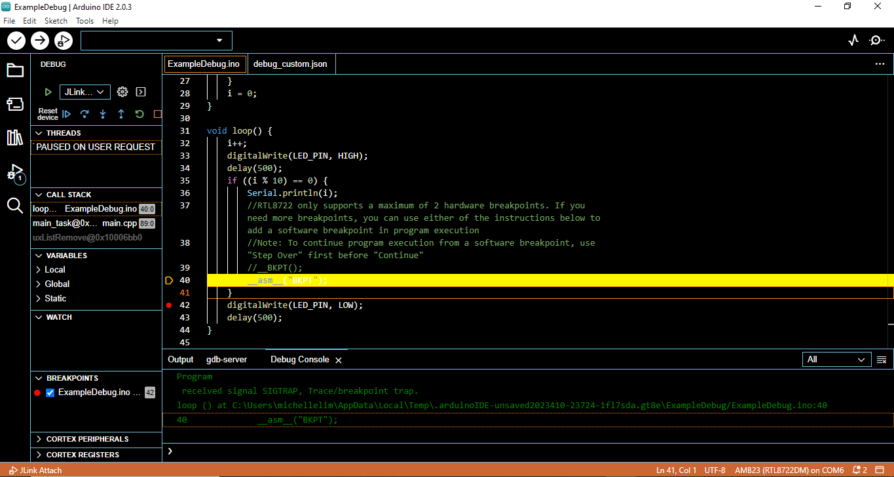
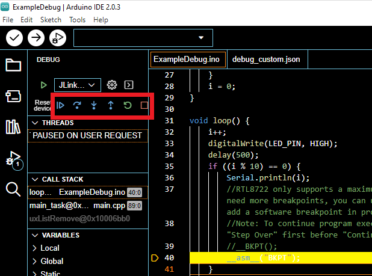

Debugging - Using the Debug Interface
=====================================

.. contents::
  :local:
  :depth: 2

Materials
---------

-  `AMB82-mini <https://www.amebaiot.com/en/where-to-buy-link/#buy_amb82_mini>`_ x 1

- SEGGER debug probe x 1

Example
-------

Using the debugging feature available in the Arduino 2.0 IDE to debug your board. In this example, we will use SEGGER's debug probe with Arduino IDE's debug interface. Begin by installing the SEGGER debugging software. This can be found on SEGGER's official website: https://www.segger.com/downloads/jlink/ 

Before debugging, ensure that the code is optimized for debugging. Enable it by navigating to Sketch -> Optimize for Debugging.

|image01|

Open the Debug example, “File” -> “Examples” -> “Debugging” -> “ExampleDebug”

|image02|

Two files will open in the IDE; ExampleDebug.ino and debug_custom.json. Click on debug_custom.json. Under “serverArgs”, insert the directory path to Arduino15 folder, as well as the current version number of the tools folder.

|image03|

Connect the JLink Debug Probe and AmebaD board to the computer. Refer to the table below for the wiring connection between JLink Debug Probe and AmebaD board. For more information, please refer to: https://www.segger.com/products/debug-probes/j-link/technology/interface-description/ 

+-----------------------------------+-----------------------------------+
| **JLink Debug Probe**             | **AMB82 Mini Board**              |
+===================================+===================================+
| VTref                             | 3.3V                              |
+-----------------------------------+-----------------------------------+
| GND                               | GND                               |
+-----------------------------------+-----------------------------------+
| SWDIO                             | SWDIO                             |
+-----------------------------------+-----------------------------------+
| SWCLK                             | SWCLK                             |
+-----------------------------------+-----------------------------------+

|image04|

|image05|

[STRIKEOUT:Note that, VTref (Pin 1) is indicate by the blue/red wire on the cable depending on the JLink Debug Probe that you are using.]

AMB82 Mini boards have 4 hardware breakpoints. Hardware breakpoints can be set at the left of the code and are indicated by a red dot shown in line 42. Setting more than 4 hardware breakpoints will cause debugging to fail. You will need to stop debugging and reset if this happens.

If 4 hardware breakpoint is not enough, software breakpoint can be used. Either of the instructions (\__BKPT() or \__asm\_\_("BKPT")) can be used to add a software breakpoint in the program execution.

|image06|

Upload the code and press the reset button on Ameba once the upload is finished.

Once uploading is completed, reset the board. Start debugging by selecting the Debug button. This is located to the right of the upload button. Arduino will proceed with opening a gdb-server tab in the same window as the output window if all connections were connected correctly between JLink and board. This can sometimes take up to 10 seconds to set up.

|image07|

The line highlighted in yellow indicates which line of code the program is currently halted at. Debug console will appear to show the debugging information. 

|image08|

To continue running the code after the breakpoint, use any of the single-stepping functions highlighted in the red box above (continue, step over, step into, step out, restart, stop)

.. note :: For AmebaD boards, using any of the single-stepping functionality requires both hardware breakpoint resources to be free. You should remove or disable all existing breakpoints before using them.

|image09|

