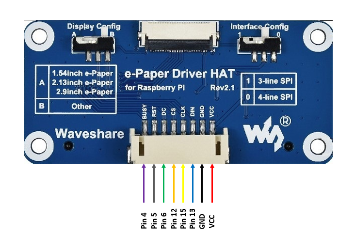
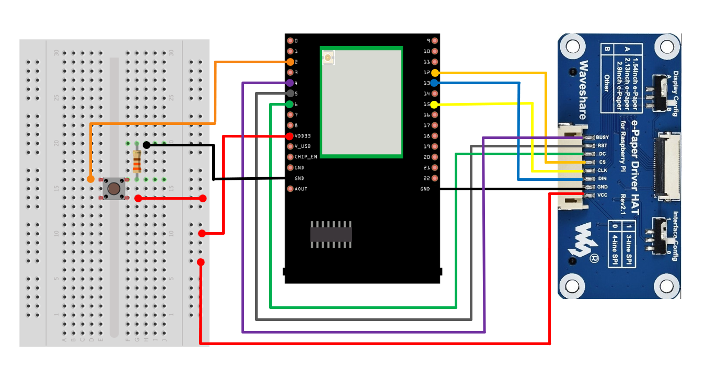
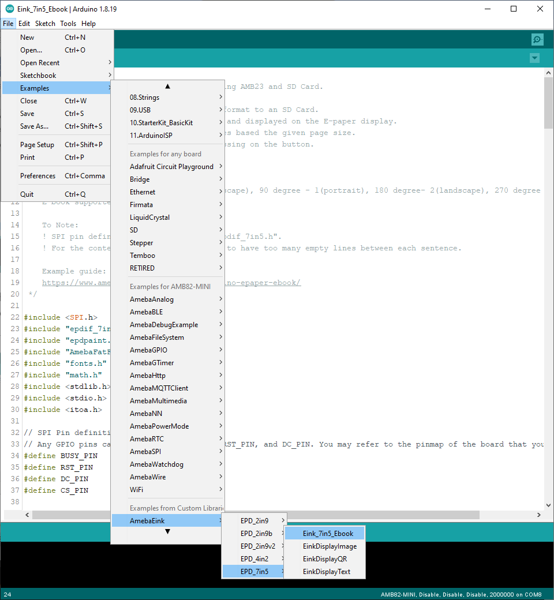
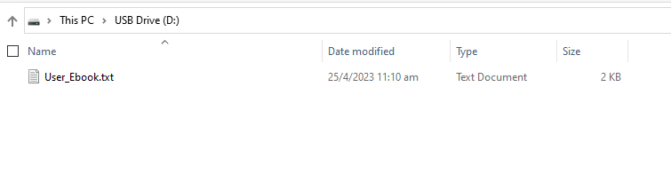
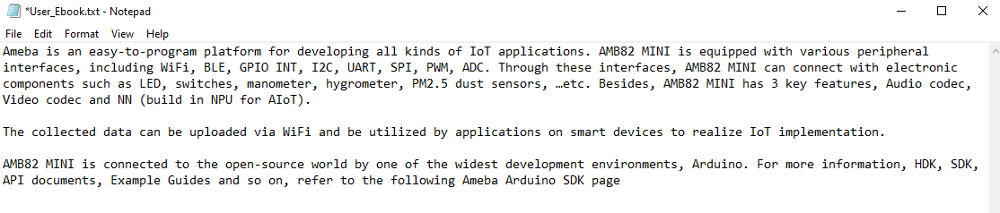
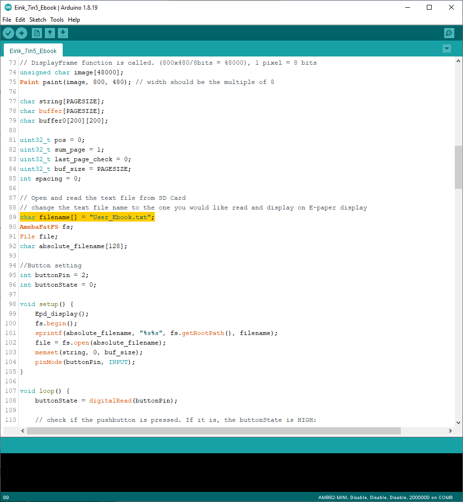
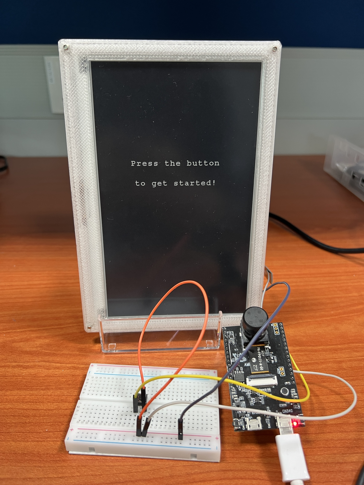
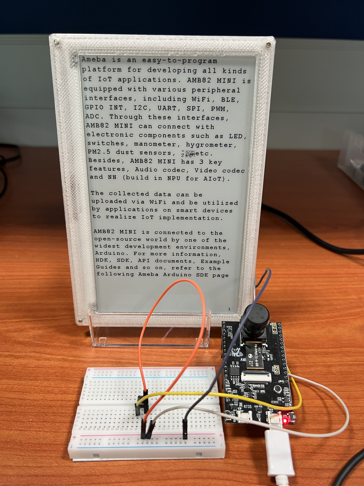
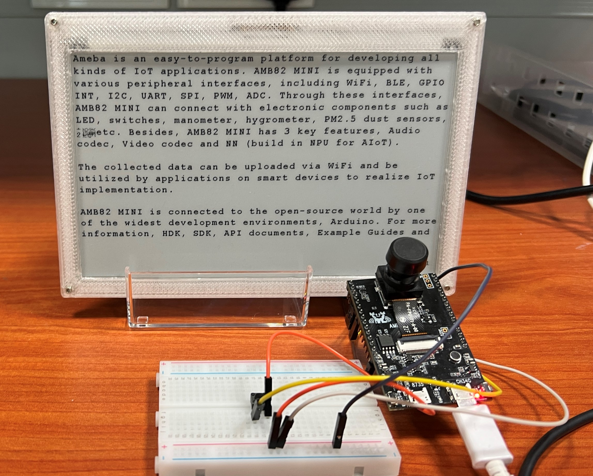
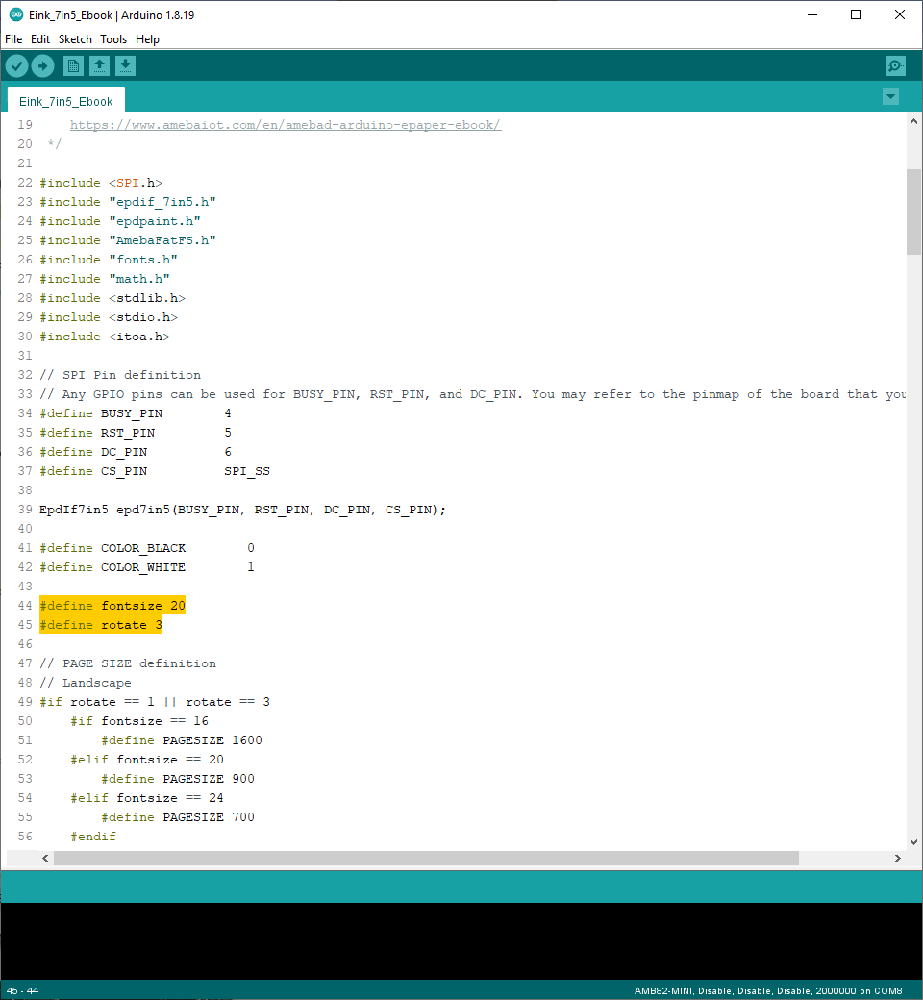

7.5-inch e-Book with MicroSD card
=================================

.. contents::
  :local:
  :depth: 2

Materials
---------

- `AMB82-mini <https://www.amebaiot.com/en/where-to-buy-link/#buy_amb82_mini>`_ x 1

-  Waveshare E-Paper [7.5-inch E-Ink display HAT] x1

-  Button x 1

-  MicroSD card x 1

-  330 Ohm resistor x1

Introduction
------------

In this example, we will be connecting Ameba Pro2 board to Waveshare 7.5-inch e-Paper module to be used as an e-Book. The 7.5” active area contains 800 x 480 pixels and has 1-bit white/black full display capabilities. An integrated circuit contains gate buffer, source buffer, interface, timing control logic, oscillator, etc. are supplied with each panel. You may refer to [7.5inch-e-paper-specification] `https://www.waveshare.com/w/upload/6/60/7.5inch_e-Paper_V2_Specification.pdf <https://www.waveshare.com/w/upload/6/60/7.5inch_e-Paper_V2_Specification.pdf>`_ for more information about this e-Paper module.

Procedure
---------

**AMB82-Mini wiring diagram:**

Do note that Display Config should be set to B and Interface Config should be set to 0.

|image01|

|image02|

Next, download the Eink zip library, AmebaEink.zip, at `https://github.com/ambiot/ambpro2_arduino/tree/dev/Arduino_zip_libraries <https://github.com/ambiot/ambpro2_arduino/tree/dev/Arduino_zip_libraries>`_
Then install the AmebaEink.zip by navigating to “Sketch” -> “Include Library” -> “Add .ZIP Library…”.

After AmebaEink.zip is installed, Open the “Eink_7in5_Ebook” example by
selecting “File” -> “Examples” -> “AmebaEink” -> “EPD_7in5” ->
“Eink_7in5_Ebook”.

|image03|

Next, insert the MicroSD card into your computer and create a new text file named “User_Ebook.txt”. Then, save the content that you would like to display in the text file (Note: do only include words). The contentof “User_Ebook.txt” shown below is for illustration purposes only.

|image04|

|image05| 

Alternatively, if you prefer another filename for your text file, you can modify the highlighted code snippet in the sketch with the new filename.

|image06|

Once the file is created, insert the MicroSD card into the onboard SD card reader on AMB82 Mini. Upload the code and press the reset button once the uploading is done. When the reset button is pressed, the e-Paper display will refresh and display a cover page.

|image07|

By pressing the button, the content in the selected text file saved in MicroSD card will be read and displayed onto the e-Paper display. The content will be split into pages.

To proceed to the next page, press the button once more. The page number
will be shown at the bottom right-hand corner as the page changes. You
will see the following in either portrait or landscape mode based on
your orientation choice after button is pressed:

|image08| 

|image09|

You can modify the highlighted code snippet to change the font size or
orientation of the displayed text.

Supported font size: 16, 20, 24
Supported orientation: 0 degree – 0 (landscape), 90 degree – 1 (portrait), 180 degree- 2 (landscape), 270 degree – 3 (portrait)

|image10|

