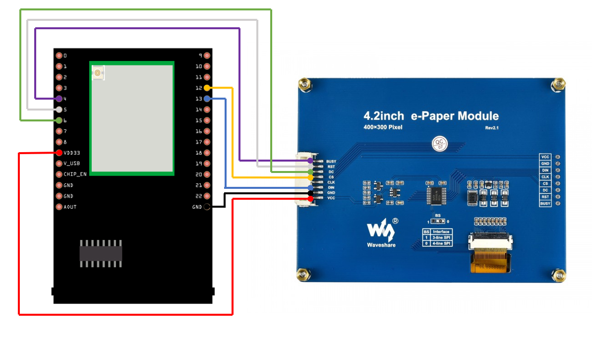
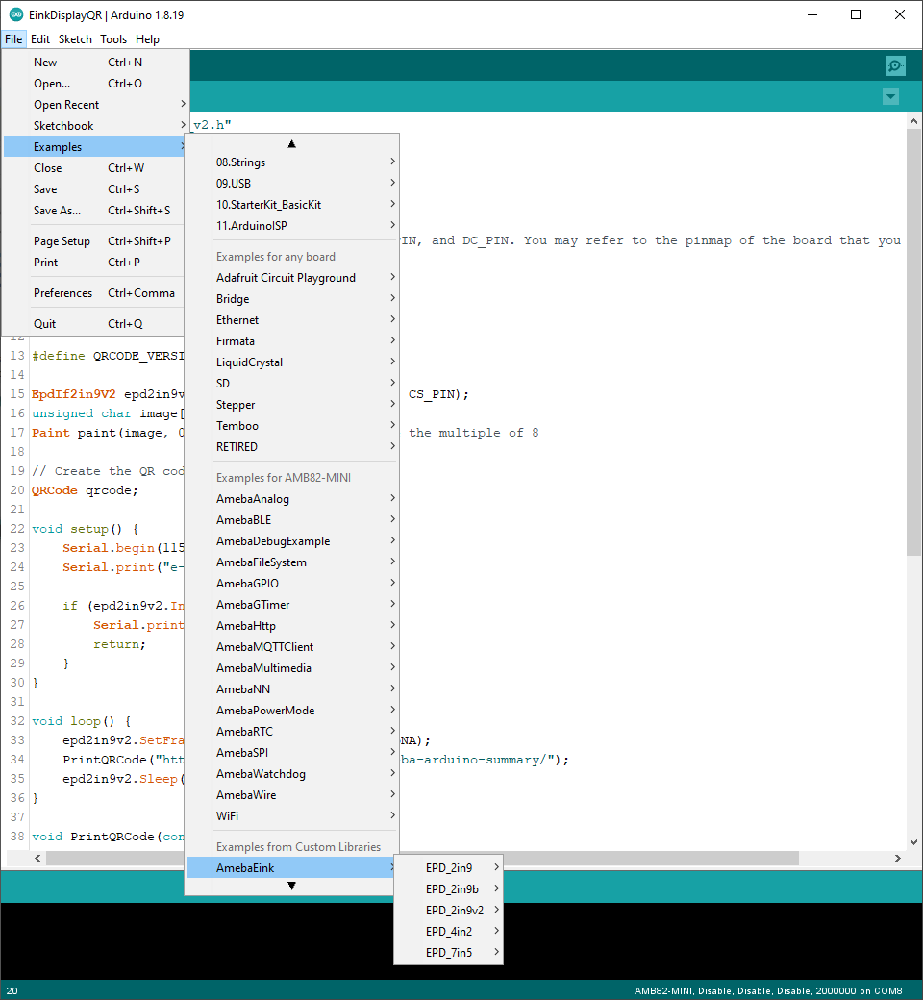
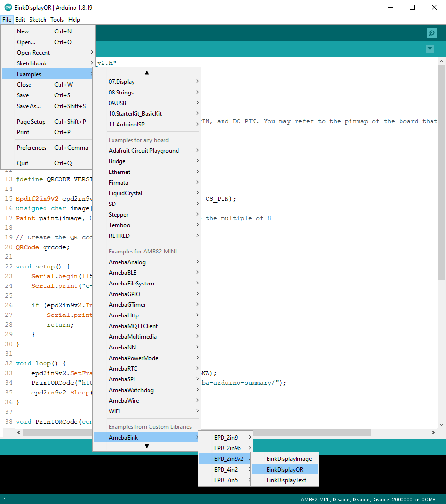
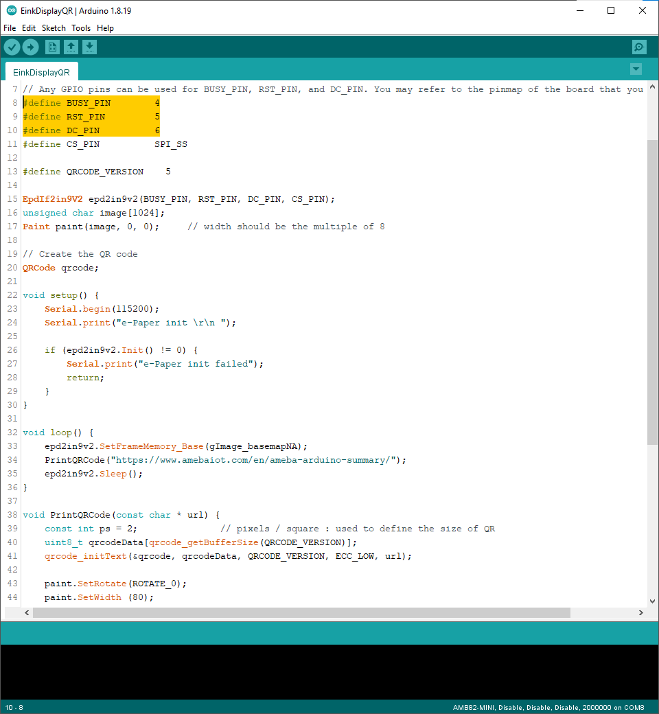
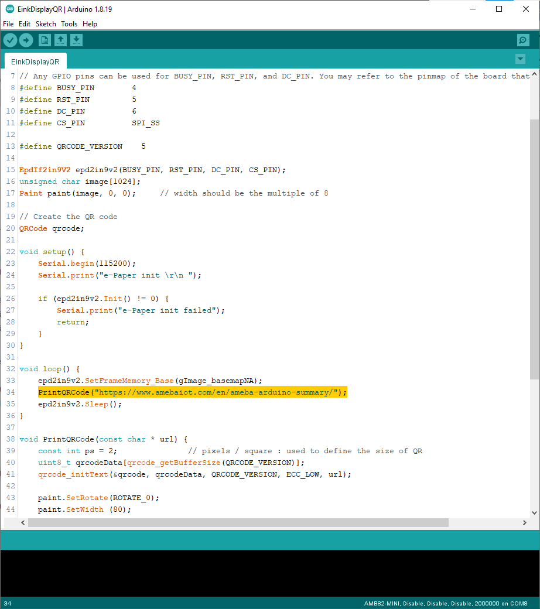
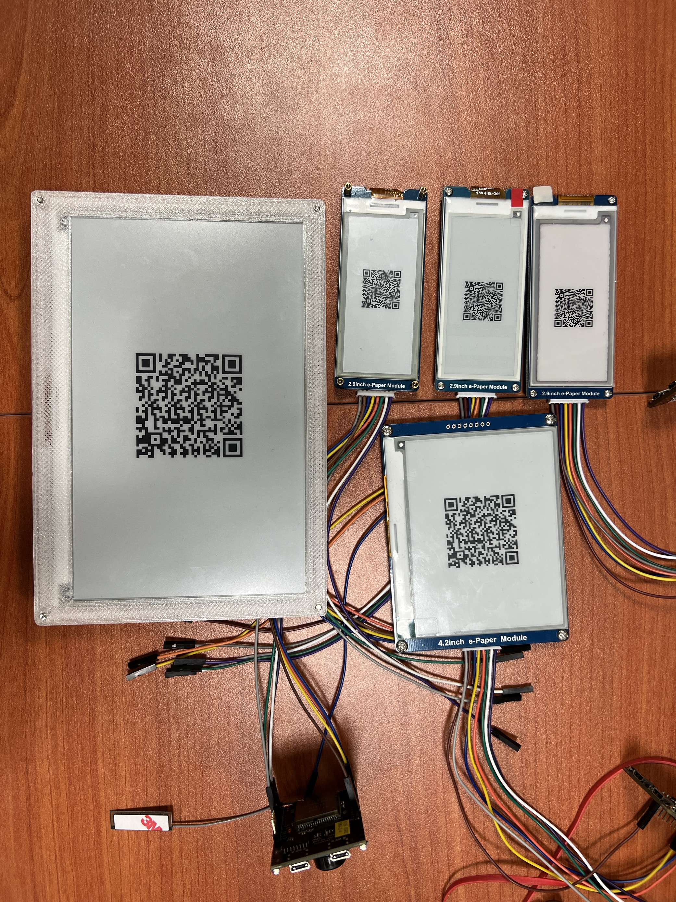

Display User-generated QR code
==============================

.. contents::
  :local:
  :depth: 2

Materials
---------

- `AMB82-mini <https://www.amebaiot.com/en/where-to-buy-link/#buy_amb82_mini>`_ x 1

-  Waveshare E-Paper [2.9inch E-Paper HAT (D)/ 2.9inch E-Paper V2/ 2.9inch e-Paper Module (B)/ 4.2inch e-Paper Module/ 7.5-inch E-Ink display HAT] x1

Example
-------

**Introduction**

In this example, Ameba Pro2 board will be used to connect to a Waveshare e-Paper module (2.9inch/ 4.2inch/ 7.5inch) to display texts. The display uses the flexible substrate as base plate, with an interface and a reference system design. You may refer to the
official `datasheet <https://www.waveshare.net/w/upload/b/b5/2.9inch_e-Paper_(D)_Specification.pdf>`_ to know more information about these modules.

**Procedure**

**AMB82-Mini wiring diagram:**

2.9inch HAT (D) e-Paper Module

|image01|

2.9inch E-Paper V2 e-Paper Module/ 2.9inch e-Paper Module (B)

|image02|

4.2inch e-Paper Module

|image03|

7.5-inch e-Paper Module

Do note that Display Config should be set to B and Interface Config
should be set to 0.

|image04|

| Next, download the Eink zip library, AmebaEink.zip, at https://github.com/ambiot/ambpro2_arduino/tree/dev/Arduino_zip_libraries
| Then install the AmebaEink.zip by navigating to “Sketch” -> “Include Library” -> “Add .ZIP Library…”.

Eink examples are categorised based on the size and modules of the e-Paper display.

|image05|

Open one of the “EinkDisplayQR” examples. For example, “File” → “Examples” → “AmebaEink” → “EPD_2in9v2”-> “EinkDisplayQR”:

|image06|

You may choose any GPIO pins for Busy, Reset and DC pin. You can refer to https://www.amebaiot.com/en/amebapro2-amb82-mini-arduino-getting-started/ for AMB82-Mini's pinmap.

|image07|

Modify the URL in the loop() section highlighted in yellow for your QR code, then upload the code to the Ameba board. Upload the code to the board and press the reset button after uploading is done.

A QR code generated based on the input URL will be shown on the E-paper module. In the example, the QR code links to Ameba IoT official website.

|image08|

Upload the code to the board and press the reset button after uploading is done. Wait for around 1-2 seconds for the e-Paper module to refresh its screen.

|image09|

Code Reference
--------------

| [1] We use Good Display GDEH029A1 2.9 Inch / 296x128 Resolution / Partial Refresh Arduino Sample Code to get the e-Paper successfully Display:
| http://www.good-display.com/product/201.html

| [2] EPD libraries can be obtained from:
| https://github.com/waveshare/e-Paper

| [3] Provide the link to how to generate a QR code on the E-paper module:
| https://eugeniopace.org/qrcode/arduino/eink/2019/07/01/qrcode-on-arduino.html

| [4] A simple library for generating QR codes in C, optimized for processing and memory-constrained systems: 
| https://github.com/ricmoo/QRCode#data-capacities

.. |image01| image:: ../../../../_static/amebapro2/Example_Guides/E-Paper/Display_User-generated_QR_code/image01.png 
   :width: 1006 px
   :height: 499 px
.. |image02| image:: ../../../../_static/amebapro2/Example_Guides/E-Paper/Display_User-generated_QR_code/image02.png
   :width: 971 px
   :height: 443 px

.. |image04| image:: ../../../../_static/amebapro2/Example_Guides/E-Paper/Display_User-generated_QR_code/image04.png
   :width: 1015 px
   :height: 688 px

