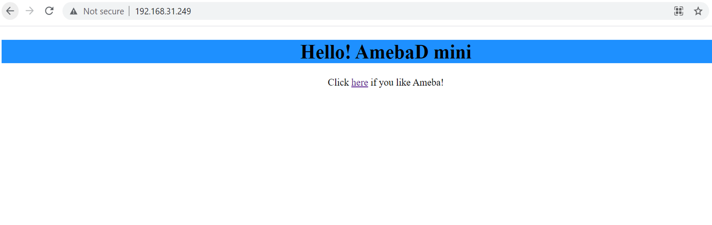

Read and display HTML file from SD card
=======================================

.. contents::
  :local:
  :depth: 2

Materials
---------

-  `AMB82-mini <https://www.amebaiot.com/en/where-to-buy-link/#buy_amb82_mini>`_ x 1

-  MicroSD card

Example
-------

Procedure
~~~~~~~~~

Using a card reader, connect the SD card to a computer and copy the HTML
file into the SD card. Take note to place the file in the root directory
and not in any folder. The HTML sample file can be downloaded at
https://github.com/ambiot/ambpro2_arduino/tree/dev/Ameba_misc/Example_Samples/Web_test.html.

|image01|

Then insert the MicroSD card into the SD card slot of the AMB82 MINI
board.

Open the example, "Files" -> "Examples" -> "AmebaFileSystem" ->
"ReadHTMLFile"

In the sample code, modify "ssid" to the WiFi SSID to be connected to
and "pass" to the network password.

|image02|

Upload the code and press the reset button on the board once the upload
is finished.

Wait for the board to connect to WiFi. When the connection is
established, the message "To see this page in action, open a browser to
http://xxx.xxx.xxx.xxx" will be printed in the serial monitor.

|image03|

Next, on a device connected to the same network, use a web browser to open the address provided in the serial monitor. The following web page will be displayed.

.. note:: The device and ameba board must connect to the same network in order to access to the demo html page. 

|image04|

