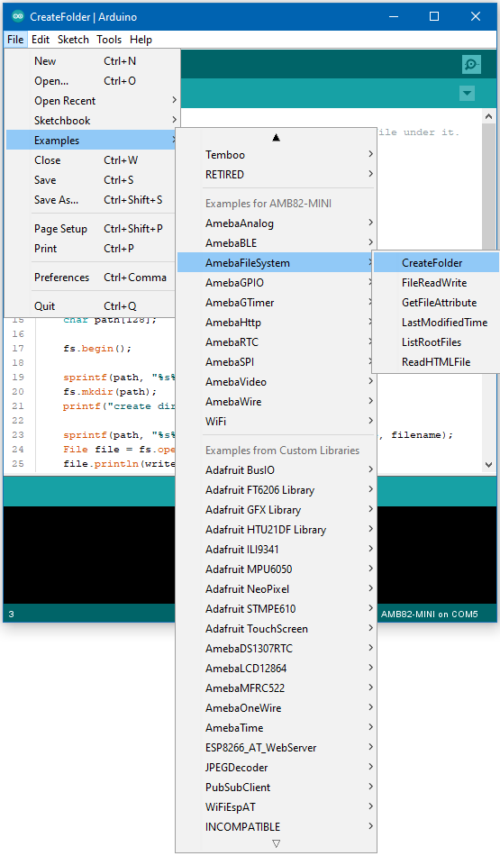
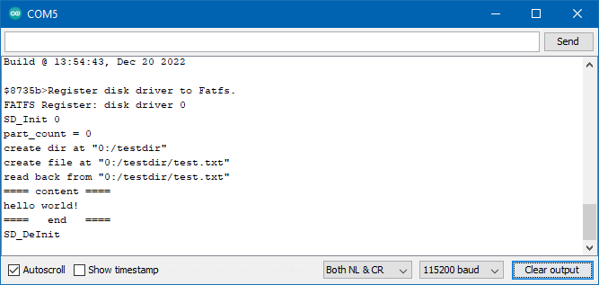
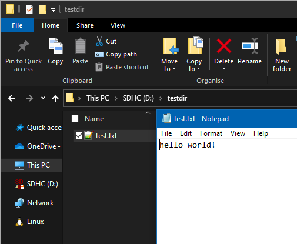
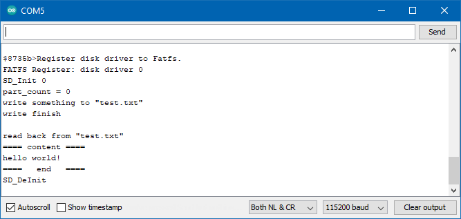
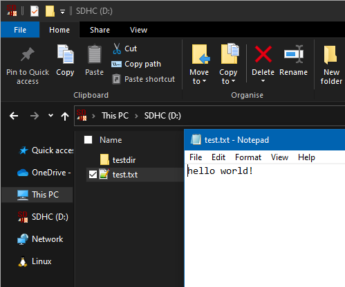
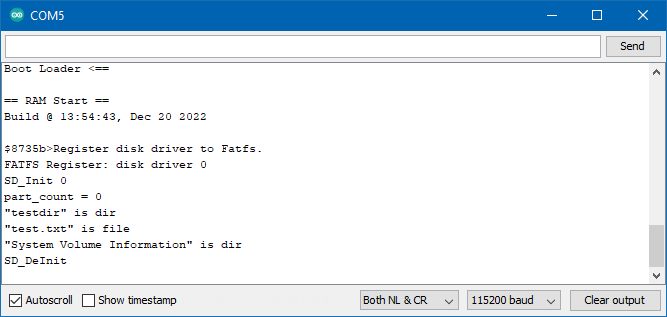
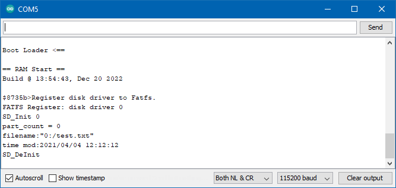
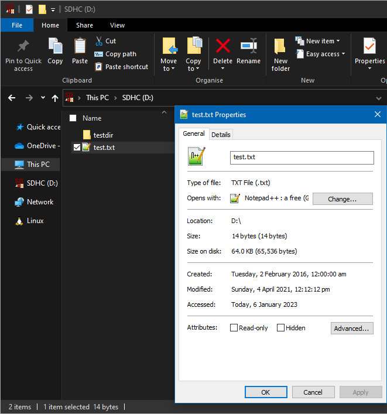
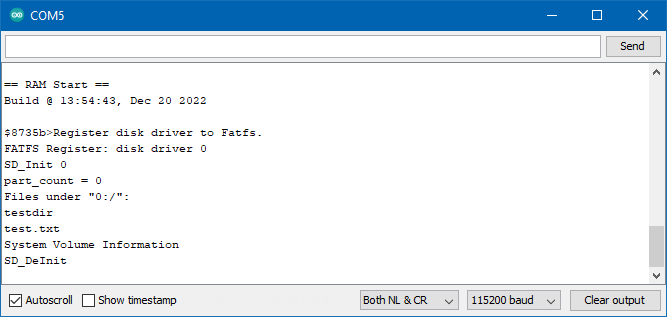

Simple applications with SD card
================================

.. contents::
  :local:
  :depth: 2

Materials
---------

-  `AMB82-mini <https://www.amebaiot.com/en/where-to-buy-link/#buy_amb82_mini>`_ x 1

-  MicroSD card

Example
-------

Procedure
~~~~~~~~~

Insert a MicroSD card into the SD card slot of the AMB82 MINI board.

Example 01 CreateFolder
~~~~~~~~~~~~~~~~~~~~~~~

Open the example, "Files" -> "Examples" -> "AmebaFileSystem" ->
"CreateFolder".

|image01|

Upload the code and press the reset button on the board once the upload
is finished.

The sample code first creates a folder named "testdir", a text file
named "test.txt" is next created, and the text "hello world!" is saved
into the file. After that, the contents of the file are retrieved and
printed to the serial monitor.

|image02|

Using a card reader, connect the SD card to a computer, open the folder
and the file to verify that the contents are as expected.

|image03|

Example 02 FileReadWrite
~~~~~~~~~~~~~~~~~~~~~~~~

Open the example, "Files" -> "Examples" -> "AmebaFileSystem" ->
"FileReadWrite".

Upload the code and press the reset button on the board once the upload
is finished.

The sample code first creates a text file named "test.txt", then the
text "hello world!" is saved into the file. After that, the contents of
the file are retrieved and printed to the serial monitor.

|image04|

Using a card reader, connect the SD card to a computer, open the file to
verify that the contents are as expected.

|image05|

Example 03 GetFileAttribute
~~~~~~~~~~~~~~~~~~~~~~~~~~~

Open the example, "Files" -> "Examples" -> "AmebaFileSystem" ->
"GetFileAttribute".

Upload the code and press the reset button on the board once the upload
is finished.

The sample code reads the contents of a directory and determines if each
item is a file or folder.

|image06|

Using a card reader, connect the SD card to a computer and verify that
the contents are as expected.

Example 04 LastModifiedTime
~~~~~~~~~~~~~~~~~~~~~~~~~~~

Open the example, "Files" -> "Examples" -> "AmebaFileSystem" ->
"LastModifiedTime".

Upload the code and press the reset button on the board once the upload
is finished.

The sample code first opens the text file named "test.txt". After that,
the last modified date and time of the file are changed and then printed
to the serial monitor.

|image07|

Using a card reader, connect the SD card to a computer and verify that
the last modified time of the file are as expected.

|image08|

Example 05 ListRootFiles
~~~~~~~~~~~~~~~~~~~~~~~~

Open the example, "Files" -> "Examples" -> "AmebaFileSystem" ->
"ListRootFiles".

Upload the code and press the reset button on the board once the upload
is finished.

The sample code will print out the names of all files and folders in the
root directory to the serial monitor.

|image09|

Using a card reader, connect the SD card to a computer and verify that
the contents are as expected.

