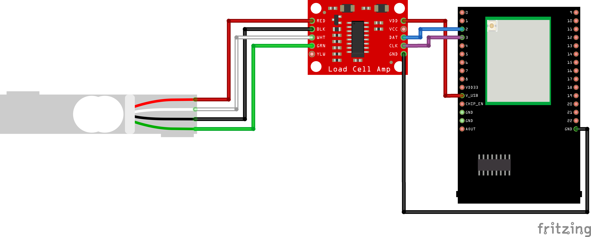
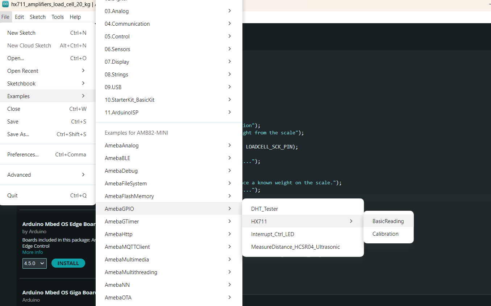
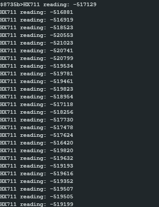

HX711 Basic Reading
=========================

Materials
---------

- `AMB82-mini <https://www.amebaiot.com/en/where-to-buy-link/#buy_amb82_mini>`__ x 1

- `SparkFun Load Cell Amplifier - HX711 <https://www.sparkfun.com/sparkfun-load-cell-amplifier-hx711.html>`__ x 1

- `Load Cell (20 kg) <https://shopee.sg/Load-Cell-1kg-5kg-10kg-20kg-i.440521573.7989384220>`__  x 1

Example
-------

Introduction
~~~~~~~~~~~~

This example shows how to use SparkFun HX711 to get raw readings from a Load Cell.

Procedure
~~~~~~~~~

Connect the Load Cell to HX711.

    * Connect the red wire of Load Cell to RED pin (Excitation +) of HX711.
    * Connect the black wire of Load Cell to BLK pin (Excitation -) of HX711.
    * Connect the green wire of Load Cell to GRN pin (Signal +) of HX711.
    * Connect the white wire of Load Cell to WHT pin (Signal -) of HX711.

Connect the AMB82-mini to HX711.

    * Connect the V_USB of AMB82-mini to VDD of HX711.
    * Connect the GND   of AMB82-mini to GND of HX711.
    * Connect the Pin 2 of AMB82-mini to DAT of HX711.
    * Connect the Pin 3 of AMB82-mini to CLK of HX711.

The final wiring should look like the diagram below.

|image01|

Open the example in :guilabel:`File -> Examples -> AmebaGPIO -> HXH711 -> BasicReading`

|image02|

Compile and run the example.

|image03|

The measurements from the Load Cell will be printed at 1s interval.
Please take note that this is raw and amplified readings from the Load Cell. We will learn how to calibrate this setup in the next example, so that the output is actually meaningful in grams.

