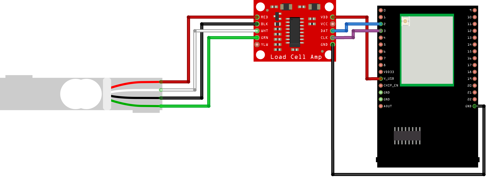
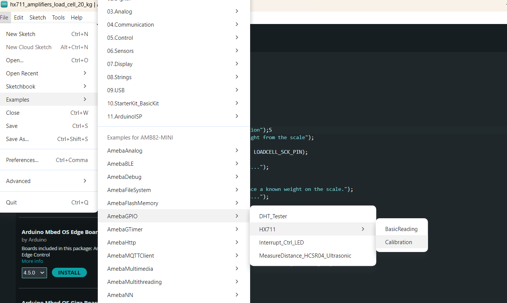
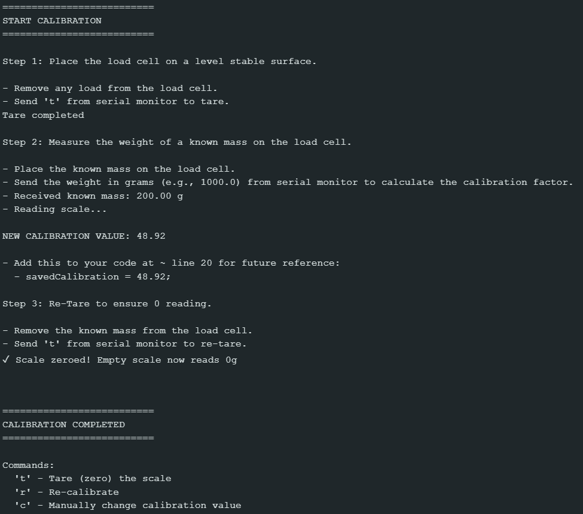

HX711 Calibration
=========================

Materials
---------

- `AMB82-mini <https://www.amebaiot.com/en/where-to-buy-link/#buy_amb82_mini>`__ x 1

- `SparkFun Load Cell Amplifier - HX711 <https://www.sparkfun.com/sparkfun-load-cell-amplifier-hx711.html>`__ x 1

- `Load Cell (20 kg) <https://shopee.sg/Load-Cell-1kg-5kg-10kg-20kg-i.440521573.7989384220>`__  x 1

- `Known weights for calibration purposes (e.g., 200g and 500g)` x 2
    - 1st known weight is used DURING calibration to calculate calibration factor.
    - 2nd known weight is used AFTER calibration to test the accuracy of the calibrated setup.

Example
-------

Introduction
~~~~~~~~~~~~

This example shows how to calibrate SparkFun HX711 to get actual measurements (in grams) from a Load Cell.

Procedure
~~~~~~~~~

Connect the Load Cell to HX711.

    * Connect the red wire of Load Cell to RED pin (Excitation +) of HX711.
    * Connect the black wire of Load Cell to BLK pin (Excitation -) of HX711.
    * Connect the green wire of Load Cell to GRN pin (Signal +) of HX711.
    * Connect the white wire of Load Cell to WHT pin (Signal -) of HX711.

Connect the AMB82-mini to HX711.

    * Connect the V_USB of AMB82-mini to VDD of HX711.
    * Connect the GND   of AMB82-mini to GND of HX711.
    * Connect the Pin 2 of AMB82-mini to DAT of HX711.
    * Connect the Pin 3 of AMB82-mini to CLK of HX711.

The final wiring should look like the diagram below.

|image01|

Open the example in :guilabel:`File -> Examples -> AmebaGPIO -> HXH711 -> Calibration`

|image02|

The calibration process here involves three main steps:

    1. **Taring (Zeroing)** - Remove any offset to ensure the scale reads 0g when empty.
    2. **Calibration** - Use a known weight to calculate the calibration factor.
    3. **Verification** - Re-tare to confirm accurate 0g reading.

|image03|

Step 1: Taring the Scale
~~~~~~~~~~~~~~~~~~~~~~~~

**Purpose:** Zero out the scale to remove any initial offset or bias.

    1. Remove any objects from the Load Cell.
    2. Ensure the Load Cell is on a level, stable surface.
        * Please take note that the Load Cell is very sensitive to any form of vibration or pressure, you should ensure the Load Cell is firmly mounted a flat surface to get accurate readings.
    3. When prompted, send ``t`` (tare) from the Serial Monitor.
    4. Wait for the confirmation message: "Tare completed".

**What's happening:** The HX711 takes multiple readings and sets this as the zero point (baseline). Any future measurements will be relative to this baseline.

Step 2: Measuring Known Weight
~~~~~~~~~~~~~~~~~~~~~~~~

**Purpose:** Calculate the calibration factor by comparing raw sensor readings to a known weight.

**Procedure:**

    1. Place your 1st known weight (e.g., 200g) on the Load Cell.
    2. When prompted, enter the weight in grams in the Serial Monitor (e.g., ``200.0`` for 200g).
    3. Press Enter to send the value.
    4. The system will take 30 readings and calculate the calibration factor.
    5. Note down the **NEW CALIBRATION VALUE** displayed in the Serial Monitor.

**What's happening:** The code reads the raw and amplified signal from the HX711 and divides it by your known mass to determine how many raw units equal one gram. This ratio is your calibration factor.

Step 3: Re-Taring for Verification
~~~~~~~~~~~~~~~~~~~~~~~~

**Purpose:** Verify that the scale correctly reads 0g when empty after calibration.

    1. Remove the known mass from the Load Cell.
    2. When prompted, send ``t`` from the Serial Monitor.
    3. Wait for confirmation: "✓ Scale zeroed! Empty scale now reads 0g".

**What's happening:** This ensures that after calibration, the scale still properly zeros out when empty.

Step 4: Calibration Complete
~~~~~~~~~~~~~~~~~~~~~~~~

After completing all three steps, your scale is now calibrated! The Serial Monitor will continuously display weight readings every second.
    
    1. Now, place you 2nd known weight to test if the calibrated setup is accurate.
    2. Finally, you can use these commands in the Serial Monitor:

        * ``t`` - Tare (zero) the scale
        * ``r`` - Run the full calibration procedure again
        * ``c`` - Manually change the calibration factor

**Tips:** Use heavier calibration weights (200g-1000g) as they provide more reliable calibration factors.

