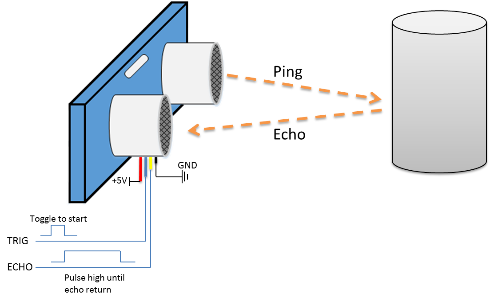
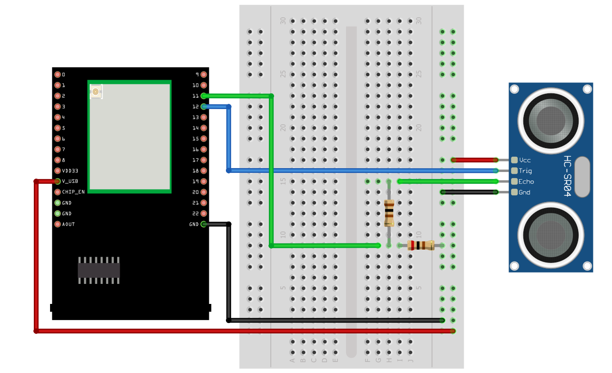
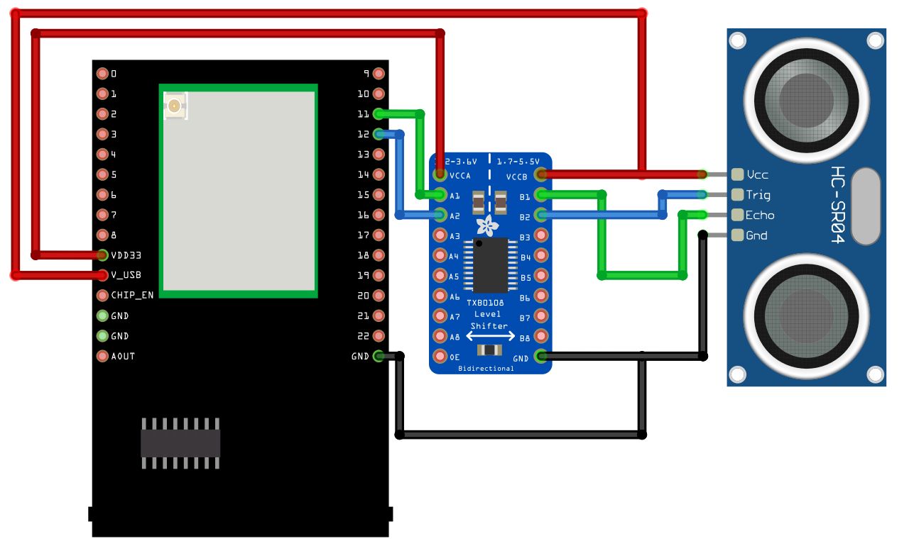
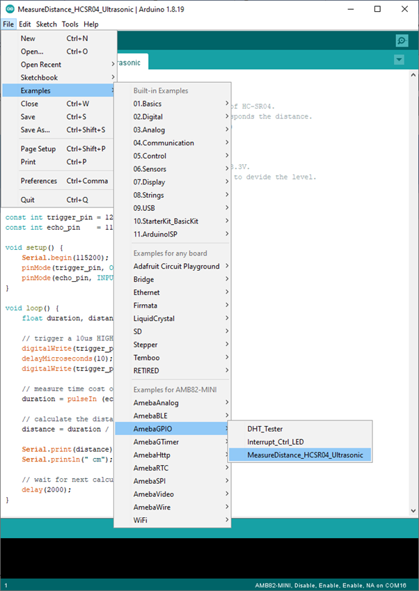

Measure Distance HCSR04 Ultrasonic
==================================

.. contents::
  :local:
  :depth: 2

Materials
---------

- `AMB82-mini <https://www.amebaiot.com/en/where-to-buy-link/#buy_amb82_mini>`_ x 1

-  HC-SR04 Ultrasonic x 1

-  Dropping resistor or Level converter

Example
-------

| HC-SR04 is a module that uses ultrasound to measure the distance. It looks like a pair of eyes in its appearance, therefore it’s often installed onto robot-vehicle or mechanical bugs to be their eyes.
| The way it works is that first we “toggle high” the TRIG pin (that is to pull high then pull low). The HC-SR04 would send eight 40kHz sound wave signal and pull high the ECHO pin. When the sound wave returns, it pull low the ECHO pin.

|image01|

| Assume the velocity of sound is 340 m/s, the time it takes for the sound to advance 1 cm in the air is 340*100*10^-6 = 29 us。
| The sound wave travels twice the distance between HC-SR04 and the object, therefore the distance can be calculated by (time/29) / 2 = time / 58。
| The working voltage of HC-SR04 is 5V. When we pull high the ECHO pin to 5V, the voltage might cause damage to the GPIO pin of Ameba. To avoid this situation, we need to drop the voltage as follows:

**AMB82 MINI** Wiring Diagram:

|image02|

| We pick the resistors with resistance 1:2, any value of resistance is fine but not recommended too high values.
| If you do not have resistors in hand, you can use level converter instead.The TXB0108 8 channel level converter is a suitable example:

**AMB82 MINI** Wiring Diagram:

|image03|

Next, open the sample code in “File” -> “Examples” -> “AmebaGPIO” -> “HCSR04_Ultrasonic”

|image04|

Compile and upload to Ameba, then press the reset button. Open the Serial Monitor, the calculated result is output to serial monitor every 2 seconds.

|image05|

Note that the HCSR04 module uses the reflection of sound wave to calculate the distance, thus the result can be affected by the surface material of the object (e.g., harsh surface tends to cause scattering of sound wave, and soft surface may cause the sound wave to be absorbed).

Code Reference
--------------

Before the measurement starts, we need to pull high the TRIG pin for 10us and then pull low. By doing this, we are telling the HC-SR04 that we are about to start the measurement:

.. code-block:: c++

    digitalWrite(trigger_pin, HIGH);
    delayMicroseconds(10);
    digitalWrite(trigger_pin, LOW);

Next, use pulseIn to measure the time when the ECHO pin is pulled high.

.. code-block:: c++

    duration = pulseIn (echo_pin, HIGH);

Finally, use the formula to calculate the distance.

.. code-block:: c++

    distance = duration / 58; 

.. |image05| image:: ../../../../_static/amebapro2/Example_Guides/GPIO/Measure_Distance_HCSR04_Ultrasonic/image05.png
   :width:  649 px
   :height:  372 px
