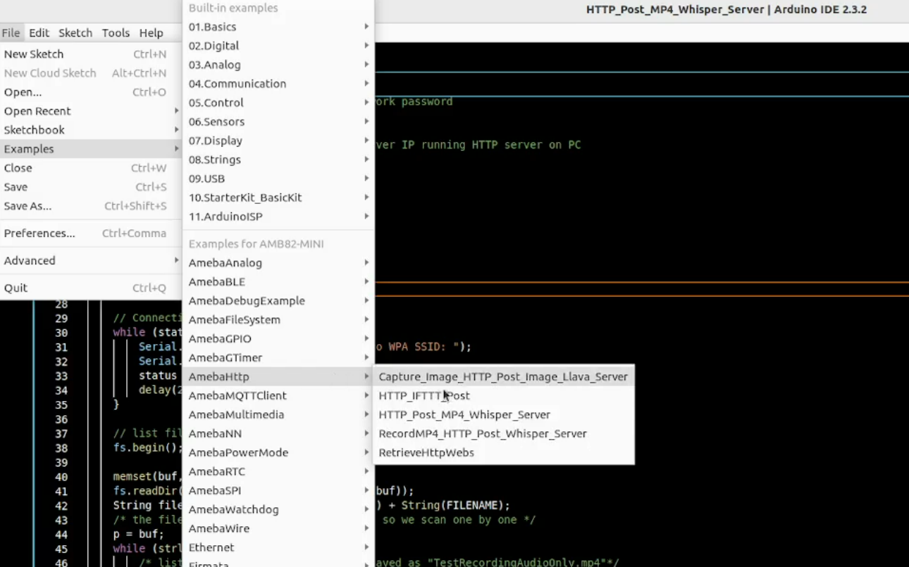
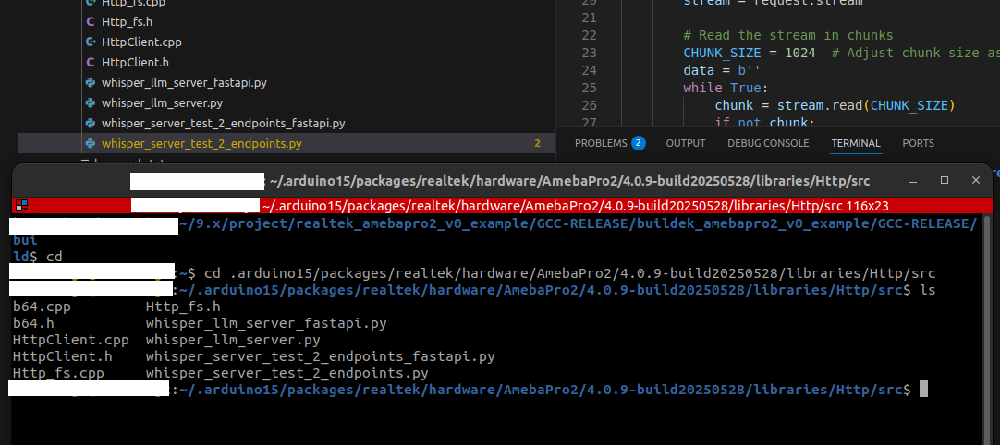

HTTP Post Image and MP4
=======================

Materials
---------

- `AMB82-mini <https://www.amebaiot.com/en/where-to-buy-link/#buy_amb82_mini>`__ x 1

-  PushButton x 1

-  220 ohm resistor x 1

-  MicroSD card x 1

Example
-------

In this example, we are doing a Post request with image and recorded audio file together to LLM Server. This example does not contain integration to the LLM server but integration to the HTTP server.

.. note::

    This server can only be run on Linux OS. Mac OS and Windows have not been supported yet.
    For fastapi examples, server setup may require that NVIDIA GPU and drivers.

Set up the HTTP server by locating the python script called ``whisper_server_test_2_endpoints.py`` or ``whisper_server_test_2_endpoints_fastapi.py``

Go to ``command prompt/terminal`` at ``libraries/Http/src`` folder. The files are located in the ``libraries/Http/src directory`` You will need to navigate to this folder before running the Python. Execute following code.

.. code-block:: bash

    # Setup env for running py file
    python3 -m venv .venv
    source .venv/bin/activate

    # Install requirement for test env
    sudo apt update && sudo apt install ffmpeg
    pip install --upgrade pip
    pip install -r requirements.txt

    # Chose 1 of the py file to run according to the example
    python3 whisper_server_test_2_endpoints.py
    # or
    python3 whisper_server_test_2_endpoints_fastapi.py

|image03|

After server is running successfully, incert the MicroSD card to Ameba board.

Open :guilabel:`File -> Examples -> AmebaHttp -> Capture_Image_HTTP_Post_Image_Llava_Server`

or :guilabel:`File -> Examples -> AmebaHttp -> Capture_Image_HTTP_Post_Image_Llava_Server_FASTAPI`

|image01|

Connect the pushbutton and resistor to AMB82 Mini as shown below.

|image02|

Compile and run the example.

Press button for 2s when you wish to take a snapshot and speak into the mic for the prompt to ask the Visual Language Model (VLM).

If the HTTP Post image and audio file is successful, the image and audio file will be saved at the location where this script is being run at.

.. |image02| image:: ../../../../_static/amebapro2/Example_Guides/HTTP/HTTP_Post_Image_and_MP4/image02.png
   :width: 988 px
   :height: 802 px

