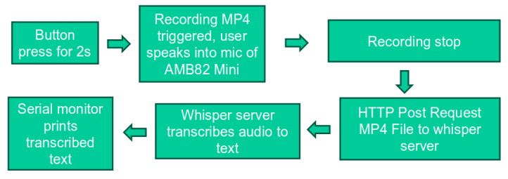
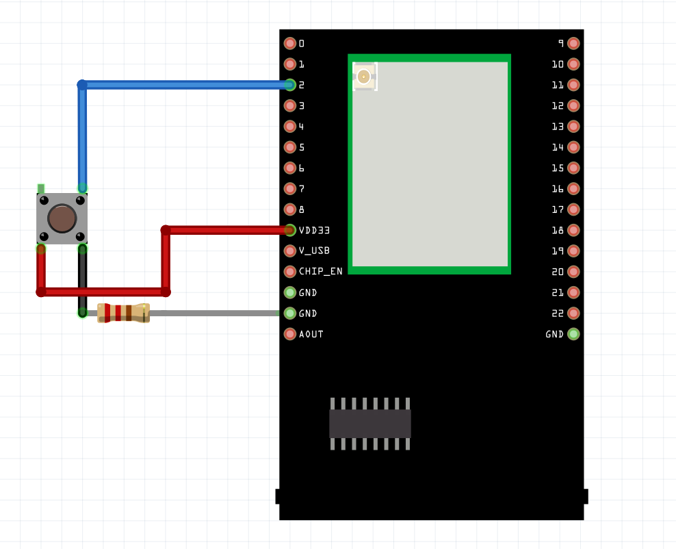
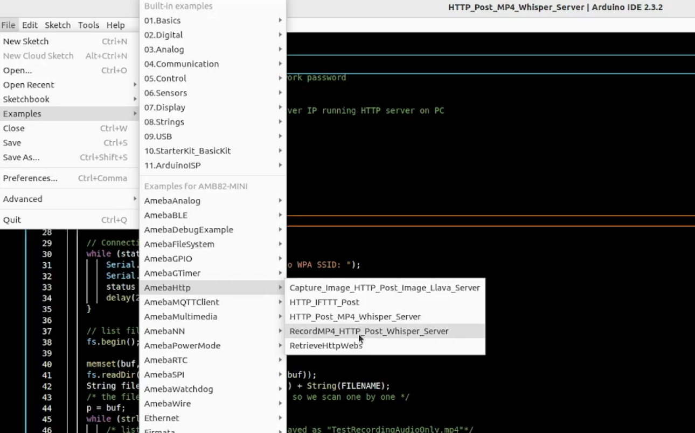
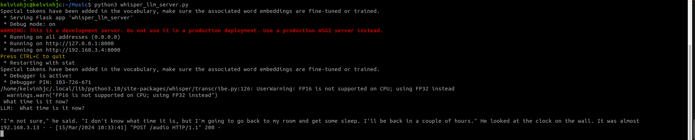

HTTP Post MP4
=============

Materials
---------

- `AMB82-mini <https://www.amebaiot.com/en/where-to-buy-link/#buy_amb82_mini>`__ x 1

-  PushButton x1

-  220 ohm resistor x1

-  MicroSD card x 1

Example
-------

These examples illustrate how to send HTTP Post request of MP4 audio file to a HTTP server.

This guide will be relevant to 2 examples:

1) HTTP_Post_MP4_Whisper_Server or HTTP_Post_MP4_Whisper_Server_FASTAPI

2) RecordMP4_HTTP_Post_Whisper_Server or RecordMP4_HTTP_Post_Whisper_Server_FASTAPI

The difference between these 2 type of examples is that type 1 is expected to have an MP4 file already saved inside the SD card. Whereas type 2 is not necessary to have a MP4 file inside the SD card.

This is the block diagram for the example flow.

|image01|

.. note:: This server can only be run on Linux OS. Mac OS and Windows have not been supported yet.

Set up the HTTP server by locating the python script called ``whisper_server_test_2_endpoints.py``, ``whisper_server_test_2_endpoints_fastapi.py``, ``whisper_llm_server.py`` or ``whisper_llm_server_fastapi.py`` in ``libraries/Http/src`` folder.

Go to ``command prompt/terminal`` at ``libraries/Http/src`` folder. The files are located in the ``libraries/Http/src directory`` You will need to navigate to this folder before running the Python. Execute following code.

python3 whisper_llm_server.py

.. code-block:: bash

    # Setup env for running py file
    python3 -m venv .venv
    source .venv/bin/activate

    # Install requirement for test env
    sudo apt update && sudo apt install ffmpeg
    pip install --upgrade pip
    pip install -r requirements.txt

    # Chose 1 of the py file to run according to the example
    python3 whisper_llm_server.py
    # or
    python3 whisper_llm_server_fastapi.py
    # or
    python3 whisper_server_test_2_endpoints.py
    # or
    python3 whisper_server_test_2_endpoints_fastapi.py

|image04|

Press the push button for 2s to trigger the recording. Speak into the microphone to ask the AI. This should be the expected output on the terminal that was running the python script. Please note that if you are to use a more powerful model such as MediaTek 7B model, you will need a PC with a powerful GPU to test. Purely CPU will not be able to run that model.

|image05|

Connect the pushbutton and resistor to AMB82 Mini as shown below.

|image02|

Open :guilabel:`File -> Examples -> AmebaHTTP -> HTTP_Post_MP4_Whisper_Server or RecordMP4_HTTP_Post_Whisper_Server`

or Open :guilabel:`File -> Examples -> AmebaHTTP -> HTTP_Post_MP4_Whisper_Server_FASTAPI or RecordMP4_HTTP_Post_Whisper_Server_FASTAPI`

|image03|

Compile and run the code.

.. |image04| image:: ../../../../_static/amebapro2/Example_Guides/HTTP/HTTP_Post_MP4/image04.png
   :width: 1082 px
   :height: 482 px

