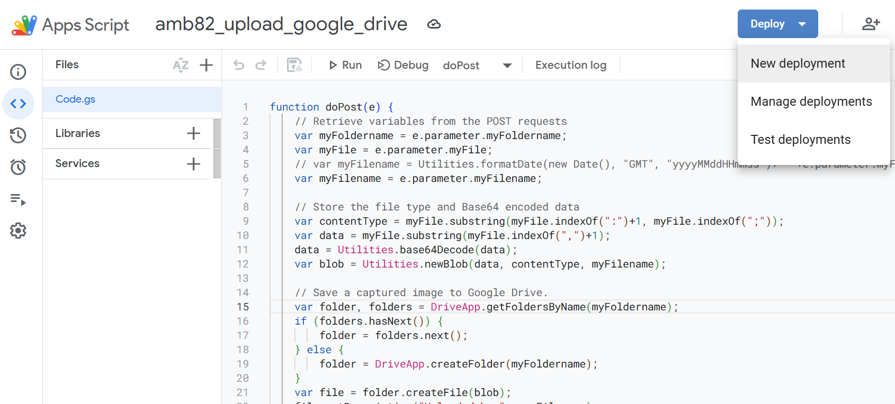
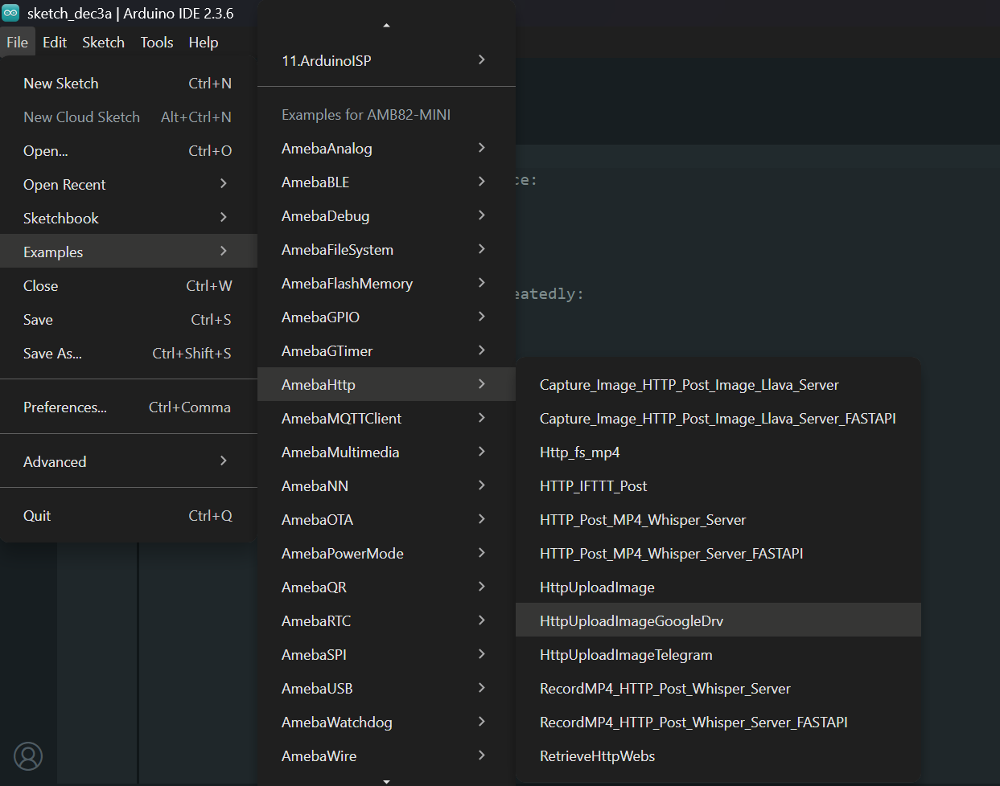
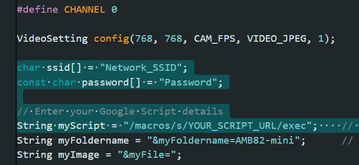

HTTP Upload Image Google Drive
==============================

.. contents::
  :local:
  :depth: 2

Materials
---------

- `AMB82-mini <https://www.amebaiot.com/en/where-to-buy-link/#buy_amb82_mini>`_ x 1

Example
-------

This example illustrates how to upload an image file to Google Drive.

Set up Google Script
~~~~~~~~~~~~~~~~~~~~

This Google Apps Script function is designed to handle POST requests so that captured photo can be saved to google drive. Its main functionalities include receiving a file and some related parameters, then saving that file to a specific folder in Google Drive. 

First, login to `Google Script <https://script.google.com/home/>`_ official website with your own Google Account.

Next, create a new Google Script project, copy the script below into the "Code.gs" file, renaming it as "amb82_doPost_test" then click the "Save" icon to save your script

.. code-block:: javascript

    function doPost(e) {
        // Retrieve variables from the POST requests
        var myFoldername = e.parameter.myFoldername;
        var myFile = e.parameter.myFile;
        var myFilename = e.parameter.myFilename;

        // Store the file type and Base64 encoded data
        var contentType = myFile.substring(myFile.indexOf(":")+1, myFile.indexOf(";"));
        var data = myFile.substring(myFile.indexOf(",")+1);
        data = Utilities.base64Decode(data);
        var blob = Utilities.newBlob(data, contentType, myFilename);

        // Save a captured image to Google Drive.
        var folder, folders = DriveApp.getFoldersByName(myFoldername);
        if (folders.hasNext()) {
            folder = folders.next();
        } else {
            folder = DriveApp.createFolder(myFoldername);
        }
        var file = folder.createFile(blob);
        file.setDescription("Uploaded by " + myFilename);

        var imageID = file.getUrl().substring(file.getUrl().indexOf("/d/")+3,file.getUrl().indexOf("view")-1);
        var imageUrl = "https://drive.google.com/uc?authuser=0&id="+imageID;
        

        // Returning Results
        return ContentService.createTextOutput(myFoldername+"/"+myFilename+"\n"+imageUrl);
        }

The script processes a POST request, extracting variables like "myFoldername," "myFile," "myFilename," and "myToken." It decodes the Base64-encoded file data and creates a Blob object with the decoded data and its content type. Base64 encoding is a method to encode binary data using 64 characters to convert binary data to an ASCII string for easier transport or storage in text formats.

Based on the "myFoldername" parameter, the script locates or creates the corresponding folder in Google Drive. The image data is then stored in this folder. Lastly a summary containing the folder name, file name, image URL are returned.

Upon the script is ready, select "Deploy" -> "New deployment" to initialize necessary configurations before script publishment:

|image01|

In the "Select type" under the "New deployment" configuration menu, choose to deploy your script as a "Web app" and grant the permission to "Anyone" who is using your script if it is a public project, then click "Deploy". Google requires to "Authorize access" by logging into your own Google Account credentials, so that the script could retrieve information from your Google Drive.

Click "Advanced" -> "Go to amb82-doPost_test (unsafe)" that allows the Google Script to: "See, edit, create, and delete all of your Google Drive files". Upon deployment is finished, copy your "Deployment ID" into example code, and replace it into "myScript" variable.

Open "File" -> "Examples" -> "AmebaHTTP" -> "HttpUploadImageGoogleDrv".

|image02|

Update WiFi credentials and deployment ID.

|image03|

Compile and run the code.

Once image is uploaded successfully, you will find it in your Google Drive folder.

