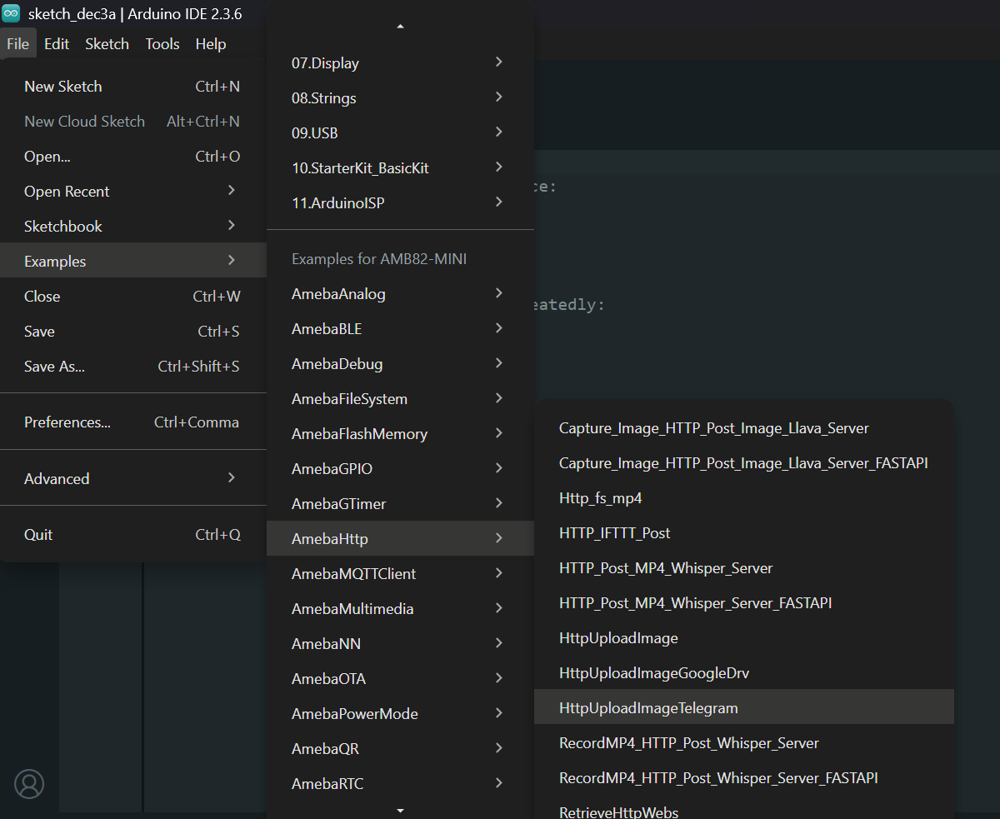
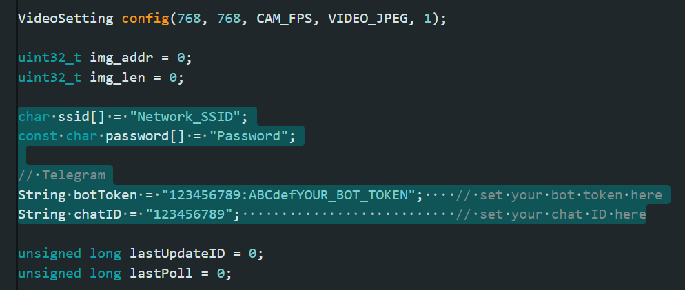

HTTP Upload Image Telegram
==========================

.. contents::
  :local:
  :depth: 2

Materials
---------

- `AMB82-mini <https://www.amebaiot.com/en/where-to-buy-link/#buy_amb82_mini>`_ x 1

-  SD card x1

Example
-------

This example illustrates how to upload an image file to A Telegram bot.

Open Telegram, search for @BotFather, send /newbot, then follow the instructions to create a bot.

Upon successful bot generation, you will receive a bot token.

Send your bot any message, then open "https://api.telegram.org/botYOUR_TOKEN/getUpdates", replace YOUR_TOKEN with received bot token.

In the JSON, please look for your chat ID. For example,

.. code-block:: text

    "chat": { "id": 987654321 }

987654321 is your chat ID.

Open "File" -> "Examples" -> "AmebaHTTP" -> "HttpUploadImageTelegram".

|image01|

Update WiFi credentials, bot token and chat ID.

|image02|

Compile and run the code.

Once image is uploaded successfully, you may see it on your Telegram bot.

