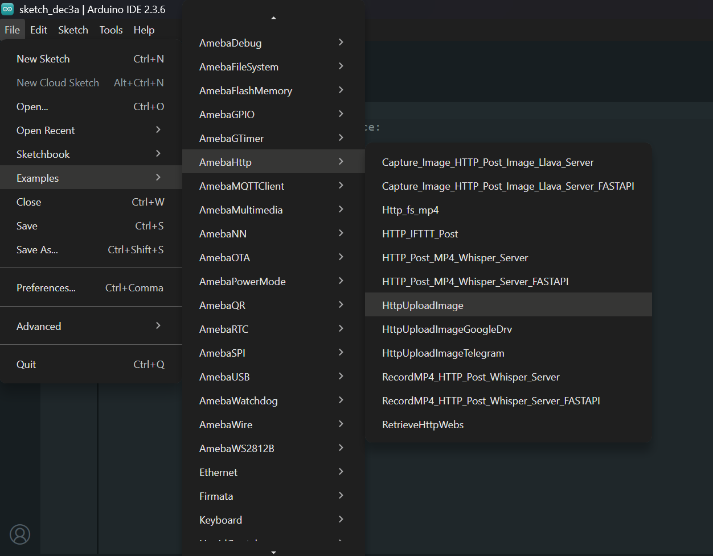
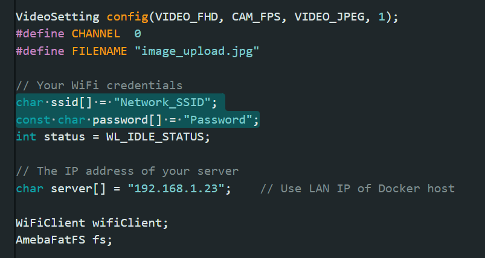

HTTP Upload Image
=================

Materials
---------

- `AMB82-mini <https://www.amebaiot.com/en/where-to-buy-link/#buy_amb82_mini>`__ x 1

-  SD card x1

Example
-------

This example illustrates how to upload an image file to a local server via HTTP, a copy of the uploaded image will also be saved to SD card.

Install Docker Desktop.

Download "http-image-server" package from 'Ameba_misc' folder.

Unzip "http-image-server" and run "docker compose up --build" command.

Open "File" -> "Examples" -> "AmebaHTTP" -> "HttpUploadImage".

|image01|

Update WiFi credentials and server IP. Kindly use LAN IP of the Docker host.

Compile and run the code.

Once image is uploaded successfully, you may find it in the "upload folder"

The uploaded image files are stored in the /http-image-server/uploads directory. You will need to navigate to this folder to look for the images.

|image02|

