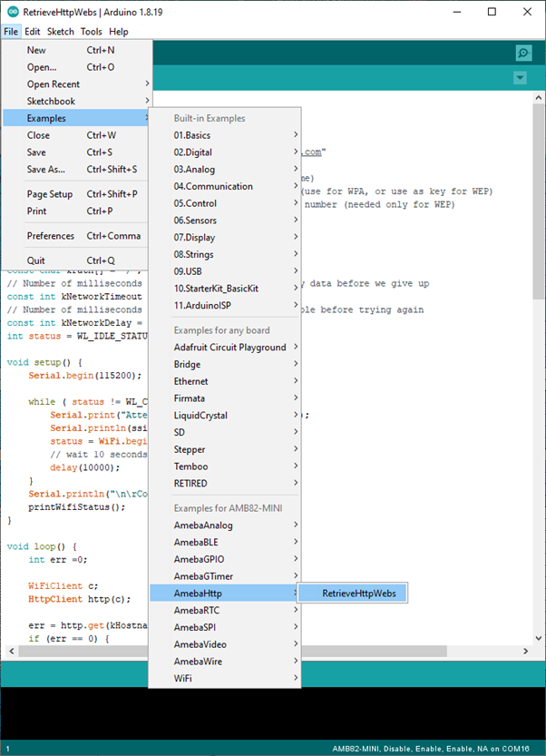
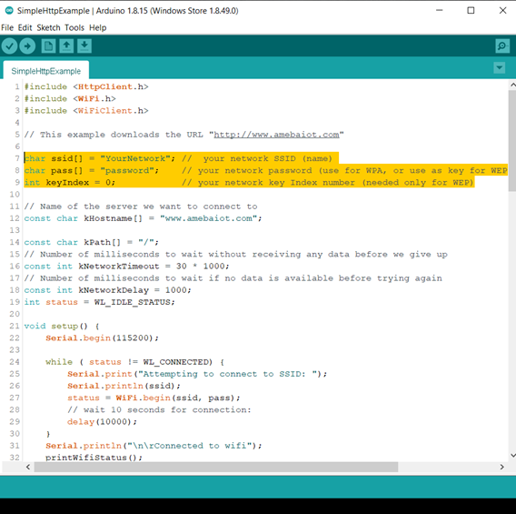

Retrieve HTTP webs
==================

Materials
---------

- `AMB82-mini <https://www.amebaiot.com/en/where-to-buy-link/#buy_amb82_mini>`__ x 1

Example
-------

| In this example, the HttpClient library is used to retrieve a webpage using the HTTP protocol.
| First, make sure that the correct Ameba development board is selected in :guilabel:`Tools -> Board`

Then open :guilabel:`File -> Examples -> AmebaHttp -> RetrieveHttpWebs`

|image01|

In the sample code, modify the highlighted section to enter the information required (ssid, password, key index) to connect to your WiFi network.

|image02|

Upload the code and press the reset button on Ameba once the upload is finished. Open the serial monitor in the Arduino IDE and you can see the information retrieved from the website.

|image03|

Code Reference
--------------

| Use WiFi.begin() to establish WiFi connection:
| https://www.arduino.cc/en/Reference/WiFiBegin
| To get the information of a WiFi connection:
| Use WiFi.SSID() to get SSID of the current connected network.
| https://www.arduino.cc/en/Reference/WiFiSSID
| Use WiFi.RSSI() to get the signal strength of the connection.
| https://www.arduino.cc/en/Reference/WiFiRSSI
| Use WiFi.localIP() to get the IP address of Ameba.
| https://www.arduino.cc/en/Reference/WiFiLocalIP
| Use WiFiClient to create a client to handle the WiFi connection.
| https://www.arduino.cc/en/Reference/WiFiClient
| Use HTTPClient to create a client to handle the HTTP connection.

Use http.get() to send a GET request to the website.

.. |image03| image:: ../../../../_static/amebapro2/Example_Guides/HTTP/Retrieve_HTTP_webs/image03.png
   :width: 752 px
   :height: 496 px
