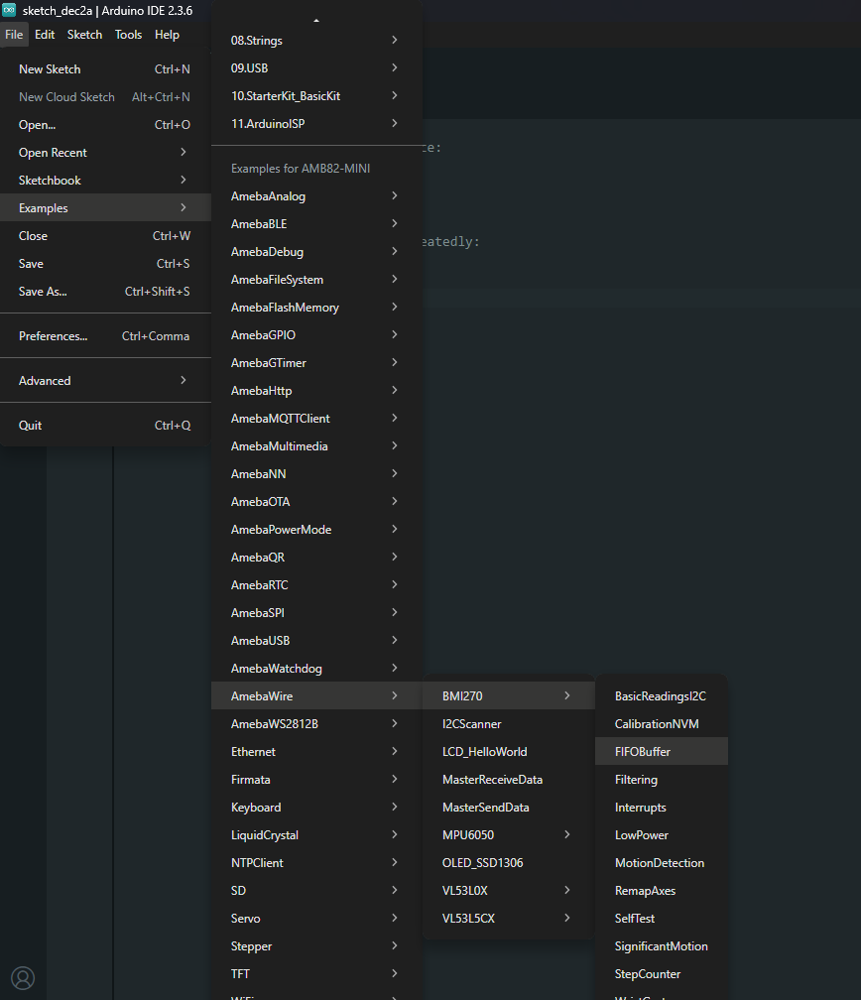
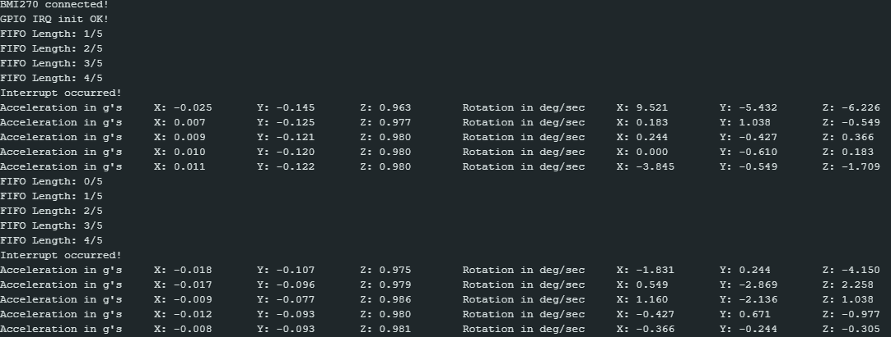

BMI270 FIFO Buffer
==================

Materials
---------

- `AMB82-mini <https://www.amebaiot.com/en/where-to-buy-link/#buy_amb82_mini>`__ x 1

- `SparkFun 6oF IMU Breakout - BMI270 <https://www.sparkfun.com/sparkfun-6dof-imu-breakout-bmi270-qwiic.html>`__ x 1

Example
-------

Introduction
~~~~~~~~~~~~

This example shows how to use SparkFun 6DoF BMI270 to get basic measurements using I2C based on FIFO buffer.

Procedure
~~~~~~~~~

Connect the AMB82-mini to I2C_SDA, I2C_SCL, INT1 of the sensor as shown in the diagram below.

|image01|

Open the example in :guilabel:`File -> Examples -> AmebaWire -> BMI270 -> FIFOBuffer`

|image02|

Compile and run the example.

The measurements from the sensor will be printed based on a FIFO buffer (default size is 5).

|image03|

.. |image01| image:: ../../../../_static/amebapro2/Example_Guides/I2C/BMI270_FIFO_Buffer/image01.png
    :width: 995 px
    :height: 780 px

