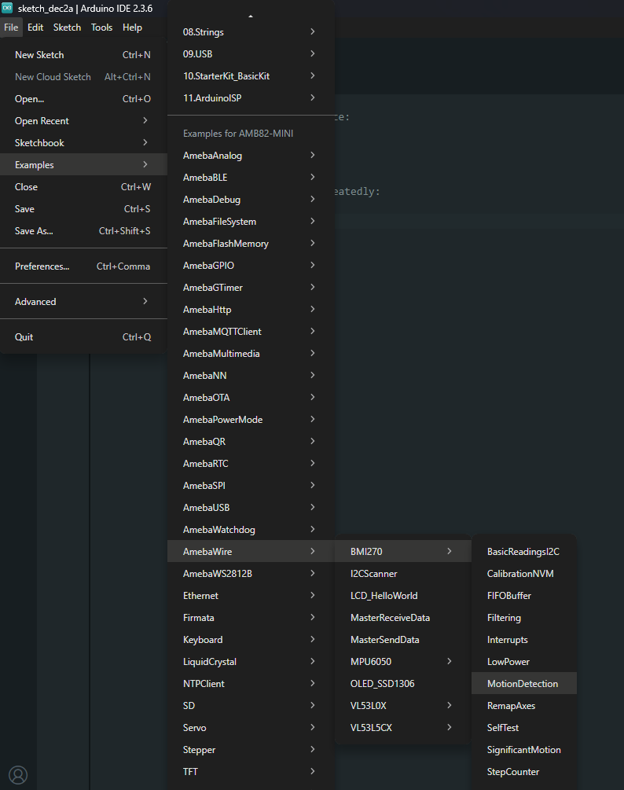
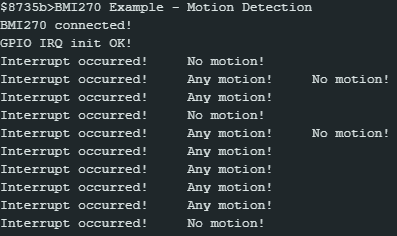

BMI270 Motion Detection
=======================

Materials
---------

- `AMB82-mini <https://www.amebaiot.com/en/where-to-buy-link/#buy_amb82_mini>`__ x 1

- `SparkFun 6oF IMU Breakout - BMI270 <https://www.sparkfun.com/sparkfun-6dof-imu-breakout-bmi270-qwiic.html>`__ x 1

Example
-------

Introduction
~~~~~~~~~~~~

This example shows how to enable motion detection using interrupts.

Procedure
~~~~~~~~~

Connect the BMI270 to I2C_SDA and I2C_SCL of the board as shown in the diagram below.

|image01|

Open the example in "File" -> "Examples" -> "AmebaWire" -> "BMI270" -> "MotionDetection".

|image02|

Compile and run the example.

A message will be printed out when a motion is triggered.

|image03|

.. |image01| image:: ../../../../_static/amebapro2/Example_Guides/I2C/BMI270_Motion_Detection/image01.png
    :width: 995 px
    :height: 780 px

