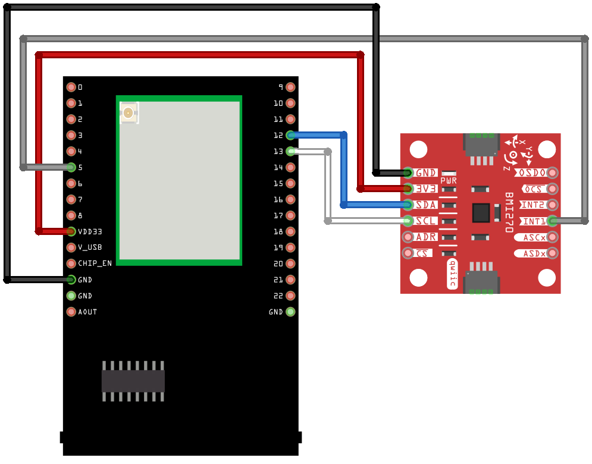
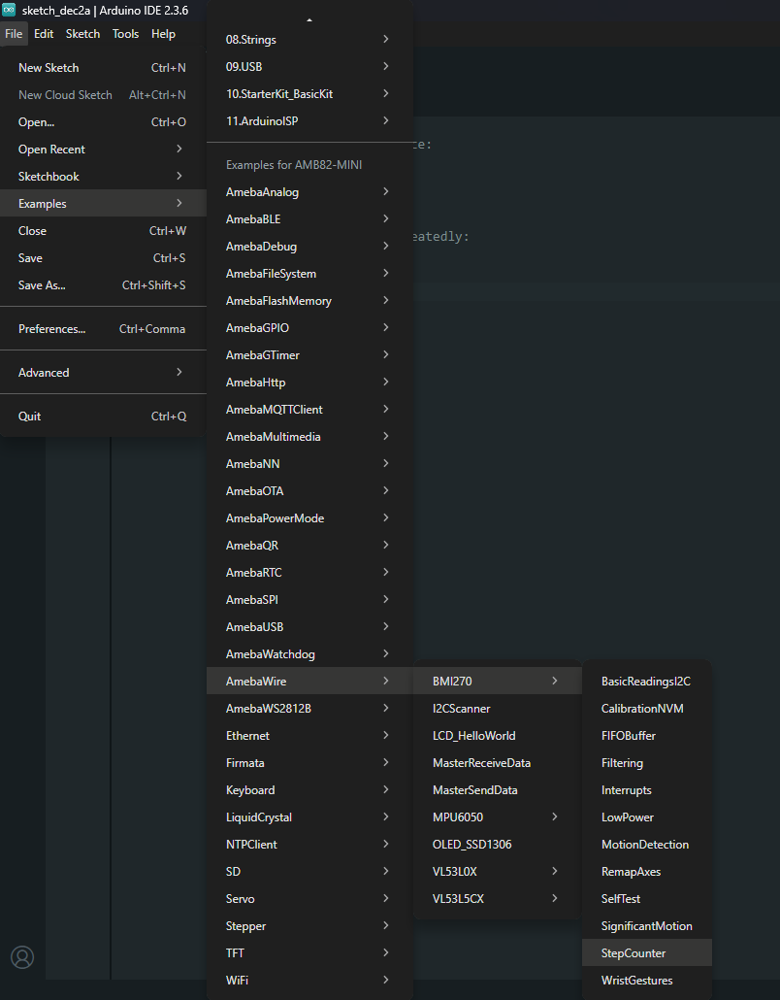
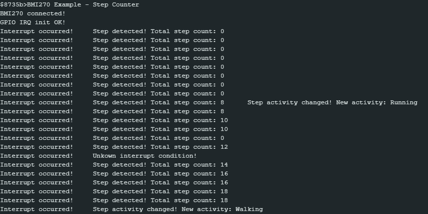

BMI270 Step Counter
===================

Materials
---------

- `AMB82-mini <https://www.amebaiot.com/en/where-to-buy-link/#buy_amb82_mini>`__ x 1

- `SparkFun 6oF IMU Breakout - BMI270 <https://www.sparkfun.com/sparkfun-6dof-imu-breakout-bmi270-qwiic.html>`__ x 1

Example
-------

Introduction
~~~~~~~~~~~~

This example shows how to enable the step detector, counter, and activity recognition features of the BMI270.

Procedure
~~~~~~~~~

Connect the AMB82-mini to I2C_SDA, I2C_SCL, INT1 of the sensor as shown in the diagram below.

|image01|

Open the example in "File" -> "Examples" -> "AmebaWire" -> "BMI270" -> "StepCounter".

|image02|

Compile and run the example.

The measurements from the sensor will be printed out upon interrupt trigger.

|image03|

