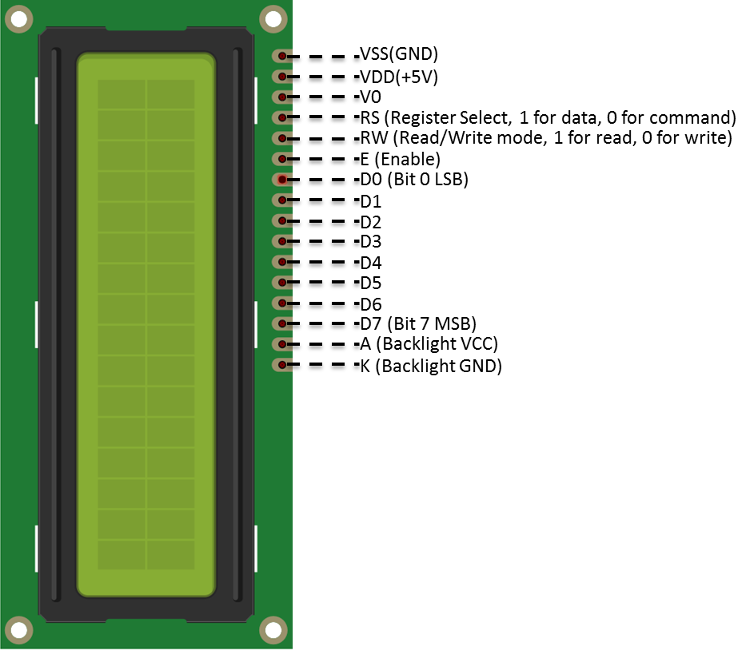
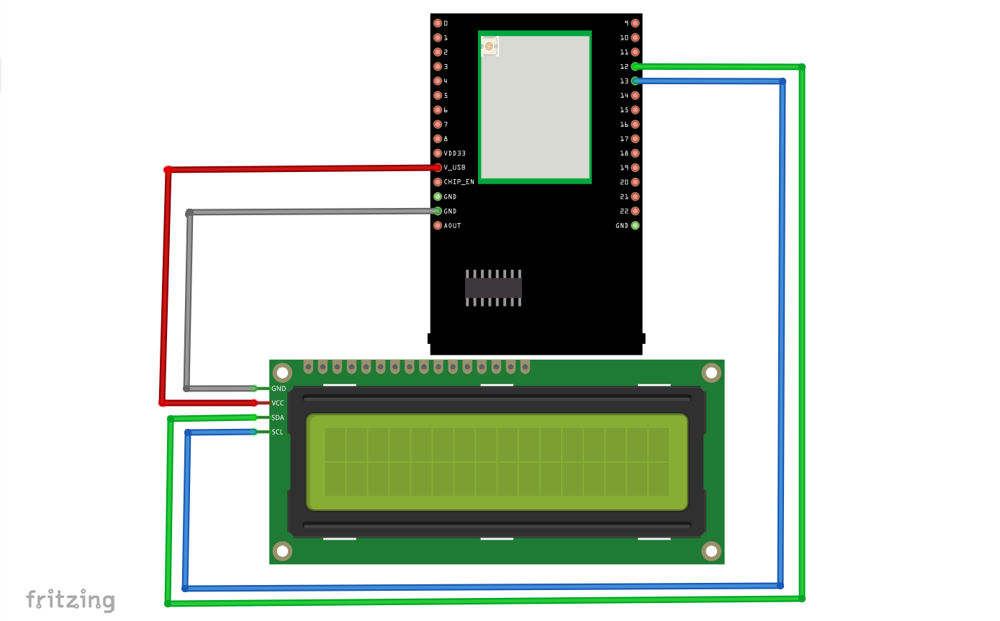
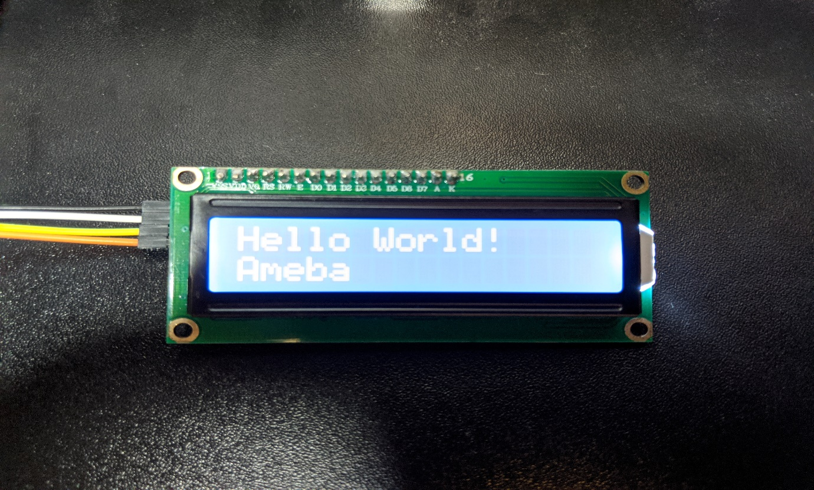
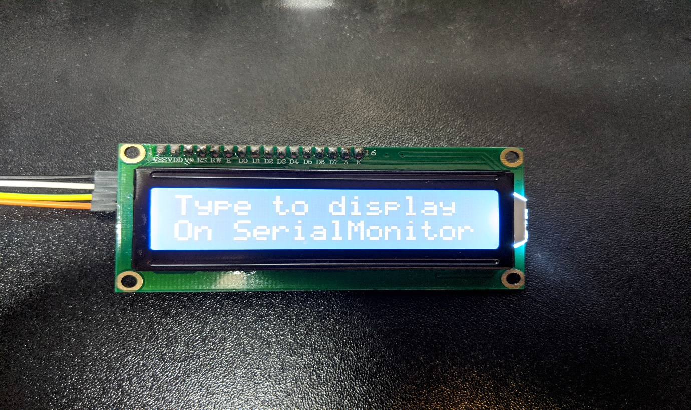
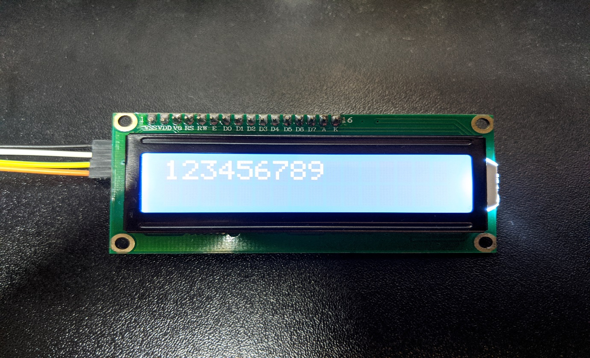

Display Data on LCD Screen
==========================

Materials
---------

-  `AMB82-mini <https://www.amebaiot.com/en/where-to-buy-link/#buy_amb82_mini>`__ x 1

-  I2C 2x16 LCD

Example
-------

Introduction
~~~~~~~~~~~~

Normally there are many pins on an LCD display, as shown below.

|image01|

An LCD display can be equipped with an additional processing chip to process the data. The processing chip can connect to a microcontroller
using the I2C interface.

Procedure
~~~~~~~~~

**AMB82 Mini** wiring diagram:

|image02|

| Open the example in "File" -> "Examples" -> "AmebaWire" -> "LCD_HelloWorld".
| Compile and upload to Ameba, then press the reset button.
| You can now see "Hello World" in the first line, and "Ameba" in the second line displayed on the LCD screen.

|image03|

After 8 seconds, you can input to the Serial Monitor the string you would like to display on the LCD.

|image04|

For example, we enter "123456789" and press "Send":

|image05|

Code Reference
--------------

The required settings for each model of LCD might be different. The constructor we use in this example is:

.. code:: c++

   LiquidCrystal_I2C(uint8_t lcd_Addr, uint8_t En, uint8_t Rw, uint8_t Rs, uint8_t d4, uint8_t d5, uint8_t d6, uint8_t d7, uint8_t backlighPin, t_backlighPol pol);

And the setting parameters are as follows:

.. code:: c++

   LiquidCrystal_I2C lcd(0x27, 2, 1, 0, 4, 5, 6, 7, 3, POSITIVE); // Set the LCD I2C address

The first parameter 0x27 is the address of I2C. Each of the following 8 parameters represents the meaning of each bit in a byte, i.e., En is bit 2, Rw is bit 1, Rs is bit 0, d4 is bit 4, and so forth.

| Call ``backlight()`` to light the screen.
| Call ``setCursor(0, 0)`` to set the position of the cursor.
| LCD inherits the Print class, so we can use ``lcd.print()`` to output string on the screen.

