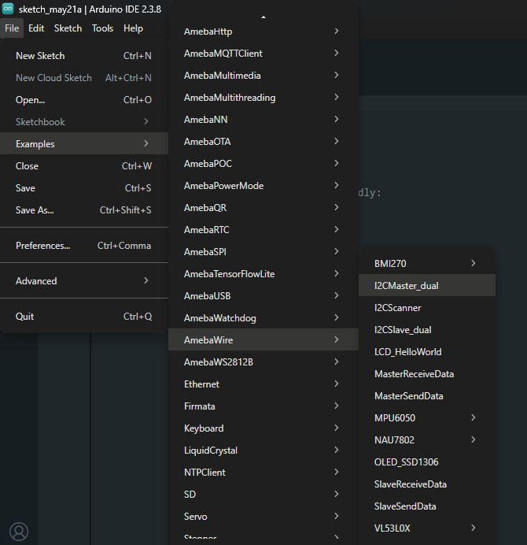
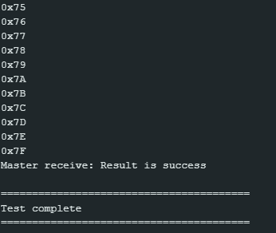

Dual Board I2C Master
=====================

Materials
---------

-  `AMB82-mini <https://www.amebaiot.com/en/where-to-buy-link/#buy_amb82_mini>`__ x 2

Example
-------

I2C Introduction
~~~~~~~~~~~~~~~~

There are two roles in the operation of I2C, one is "master", the other
is "slave". Only one master is allowed and can be connected to many
slaves. Each slave has its unique address, which is used in the
communication between master and the slave. I2C uses two pins, one is
for data transmission (SDA), the other is for the clock (SCL). Master
uses the SCL to inform slave of the upcoming data transmission, and the
data is transmitted through SDA. The I2C example was named "Wire" in the
Arduino example.

Introduction
~~~~~~~~~~~~

In this example, two AMB82-mini boards communicate with each other over
I2C. One board is configured as the I2C master and the other as the I2C
slave at address 0x08. The master first sends 127 bytes of data (0x02 to
0x80) to the slave at 100 kHz, then requests 127 bytes in return. The
master verifies that the received data matches the expected values (0x01
to 0x7F) and prints the verification result to the Serial Monitor.

This example uses the ``I2CMaster_dual`` sketch on the master board, paired
with the ``I2CSlave_dual`` sketch on the slave board.

Procedure
~~~~~~~~~

-  **Setting up the Slave Board**

| First, set up the slave AMB82-mini. Make sure to choose your AMB82-mini development board in the IDE :guilabel:`Tools -> Board`
| Open the "I2C Slave Dual" example in :guilabel:`File -> Examples -> AmebaWire -> I2CSlave_dual`

|image01|

Click :guilabel:`Sketch -> Upload` to compile and upload the example to the slave AMB82-mini.

-  **Setting up the Master Board**

| Next, open another window of Arduino IDE and select the master AMB82-mini's port in :guilabel:`Tools -> Port`
| Open the "I2C Master Dual" example in :guilabel:`File -> Examples -> AmebaWire -> I2CMaster_dual`

|image02|

Click :guilabel:`Sketch -> Upload` to compile and upload the example to the master AMB82-mini.

-  **Wiring**

| Connect the SDA pin (pin 12) of the master AMB82-mini to the SDA pin (pin 12) of the slave AMB82-mini with a pull-up resistor (3.3V).
| Connect the SCL pin (pin 13) of the master AMB82-mini to the SCL pin (pin 13) of the slave AMB82-mini with a pull-up resistor (3.3V).
| Connect the GND pins of both boards together.

| Press the reset button on the slave AMB82-mini first to initialize it. Then press the reset button on the master AMB82-mini.
| Open the Serial Monitor of the master AMB82-mini in :guilabel:`Tools -> Serial Monitor`.
| The master will send 127 bytes to the slave, then request 127 bytes back. The Serial Monitor will display the received bytes and the verification result ("Result is success" or "Result is fail").

|image03|

Code Reference
--------------

| Use ``Wire.begin()`` to join the I2C bus as a master.
| https://www.arduino.cc/en/Reference/WireBegin

| Use ``Wire.setClock()`` to set the I2C clock frequency.
| https://www.arduino.cc/en/Reference/WireSetClock

| Use ``Wire.beginTransmission(address)`` to begin a transmission to the I2C slave with the given address.
| https://www.arduino.cc/en/Reference/WireBeginTransmission

| Use ``Wire.write()`` to queue bytes for transmission from master to slave.
| https://www.arduino.cc/en/Reference/WireWrite

| Use ``Wire.endTransmission()`` to end a transmission to a slave and transmit the queued bytes.
| https://www.arduino.cc/en/Reference/WireEndTransmission

| Use ``Wire.requestFrom(address, quantity)`` to request bytes from a slave device. Retrieve the bytes using ``Wire.available()`` and ``Wire.read()``.
| https://www.arduino.cc/en/Reference/WireRequestFrom

.. |image01| image:: ../../../../_static/amebapro2/Example_Guides/I2C/Dual_Board_I2C_Master/image01.png
   :width: 662 px
   :height: 698 px

