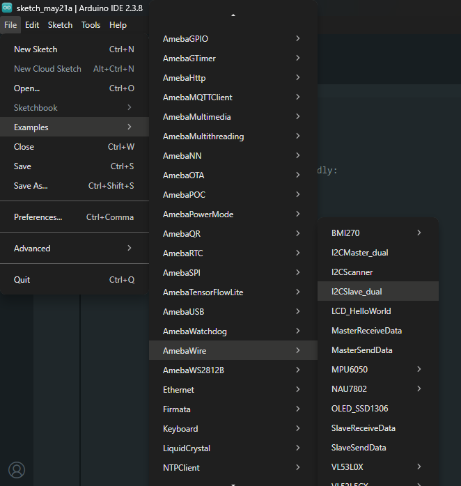
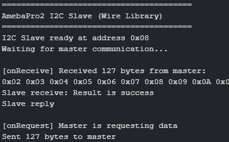

Dual Board I2C Slave
====================

Materials
---------

-  `AMB82-mini <https://www.amebaiot.com/en/where-to-buy-link/#buy_amb82_mini>`__ x 2

Example
-------

I2C Introduction
~~~~~~~~~~~~~~~~

There are two roles in the operation of I2C, one is "master", the other
is "slave". Only one master is allowed and can be connected to many
slaves. Each slave has its unique address, which is used in the
communication between master and the slave. I2C uses two pins, one is
for data transmission (SDA), the other is for the clock (SCL). Master
uses the SCL to inform slave of the upcoming data transmission, and the
data is transmitted through SDA. The I2C example was named "Wire" in the
Arduino example.

Introduction
~~~~~~~~~~~~

In this example, two AMB82-mini boards communicate with each other over
I2C. One board is configured as the I2C slave at address 0x08, and the
other as the I2C master. The slave listens for 127 bytes sent by the
master via an ``onReceive`` callback, verifies the received data, then
sends 127 bytes back to the master via an ``onRequest`` callback. This
example demonstrates full two-way I2C communication between two Ameba
boards from the slave's perspective.

This example uses the ``I2CSlave_dual`` sketch on the slave board, paired
with the ``I2CMaster_dual`` sketch on the master board. Refer to
`Dual Board I2C Master` for the full hardware setup and wiring.

Procedure
~~~~~~~~~

-  **Setting up the Slave Board**

| Make sure to choose your AMB82-mini development board in the IDE :guilabel:`Tools -> Board`
| Open the "I2C Slave Dual" example in :guilabel:`File -> Examples -> AmebaWire -> I2CSlave_dual`

|image01|

Click :guilabel:`Sketch -> Upload` to compile and upload the example to the slave AMB82-mini.

-  **Setting up the Master Board**

| Open another window of Arduino IDE and select the master AMB82-mini's port in :guilabel:`Tools -> Port`
| Open the "I2C Master Dual" example in :guilabel:`File -> Examples -> AmebaWire -> I2CMaster_dual`

|image02|

Click :guilabel:`Sketch -> Upload` to compile and upload the example to the master AMB82-mini.

-  **Wiring**

| Connect the SDA pin (pin 12) of the master AMB82-mini to the SDA pin (pin 12) of the slave AMB82-mini with a pull-up resistor (3.3V).
| Connect the SCL pin (pin 13) of the master AMB82-mini to the SCL pin (pin 13) of the slave AMB82-mini with a pull-up resistor (3.3V).
| Connect the GND pins of both boards together.

| Press the reset button on the slave board first to initialize it. Then press the reset button on the master board.
| Open the Serial Monitor of the slave AMB82-mini in :guilabel:`Tools -> Serial Monitor`.
| The slave will print the data received from the master and show the verification result ("Result is success" or "Result is fail"). It will also confirm when it has sent the response data back to the master.

|image03|

Code Reference
--------------

| Use ``Wire.begin(address)`` to join the I2C bus as a slave with the given address.
| https://www.arduino.cc/en/Reference/WireBegin

| Use ``Wire.onReceive(handler)`` to register a callback function that is called when the slave receives data from the master.
| https://www.arduino.cc/en/Reference/WireOnReceive

| Use ``Wire.onRequest(handler)`` to register a callback function that is called when the master requests data from this slave.
| https://www.arduino.cc/en/Reference/WireOnRequest

| Use ``Wire.available()`` and ``Wire.read()`` to read bytes received from the master inside the receive callback.
| https://www.arduino.cc/en/Reference/WireAvailable

| Use ``Wire.write()`` to queue data to be sent to the master inside the request callback.
| https://www.arduino.cc/en/Reference/WireWrite

| Use ``Wire.slaveReadLen()`` to set the expected number of bytes to read from the master.

| Use ``Wire.slaveWrite()`` to trigger the slave to prepare and send the queued data to the master.

.. |image02| image:: ../../../../_static/amebapro2/Example_Guides/I2C/Dual_Board_I2C_Slave/image02.png
   :width: 670 px
   :height: 692 px

