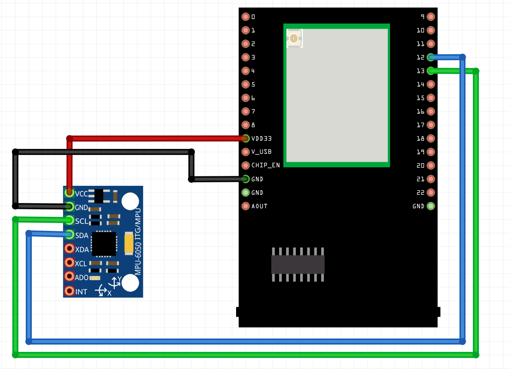

MPU6050 DMP6
============

Materials
---------

-  `AMB82-mini <https://www.amebaiot.com/en/where-to-buy-link/#buy_amb82_mini>`__ x 1

-  MPU6050 x 1

Example
-------

Introduction
~~~~~~~~~~~~

This example will demonstrate getting the data from MPU6050 with DMP6.
MPU6050 is equipped with a Digital Motion Processor (DMP) to handle the
calculations of motion algorithms such as conversion to 3-axis
yaw/pitch/roll of planes, conversion to quaternion, or conversion to
Euler angle.

| This guide will be the same for these 2 examples:
| 1) MPU6050_DMP6.ino
| 2) MPU6050_DMP6_using_DMP_V6v12.ino

The difference between these two examples is the DMP library being used.
For MPU6050_DMP6.ino, the DMP library version is 2.0. For
MPU6050_DMP6_using_DMP_V6v12.ino, the DMP library version is 6.12.

Procedure
~~~~~~~~~

Connect the MPU6050 to I2C_SDA and I2C_SCL of the board as shown in the
diagram below.

|image01|

Open the example in :guilabel:`File -> Examples -> AmebaWire -> MPU6050 -> MPU6050_DMP6 OR MPU6050_DMP6_using_DMP_V6v12`

|image02|

Compile and run the example. In the Serial Monitor, you should be able to see the prompt to begin DMP programming. Key in any character on the serial monitor and press 'Enter'.

|image03|

You should be able to see the output values calculated by the DMP.

|image04|

You can choose to uncomment either one of the options to see the type of
data to be printed out. The options are ``OUTPUT_READABLE_QUATERNION``,
``OUTPUT_READABLE_EULER``, ``OUTPUT_READABLE_YAWPITCHROLL``,
``OUTPUT_READABLE_REALACCEL``, ``OUTPUT_READABLE_WORLDACCEL`` and ``OUTPUT_TEAPOT``.
In this example, the option used is ``OUTPUT_READABLE_YAWPITCHROLL``.

The original example by ElectronicCats uses interrupt pin. Using
Interrupt pin will cause MPU6050 to hang, so this example can only work
reliably if no interrupt pin is used.

Code Reference
--------------

| [1] MPU6050 library and examples by ElectronicCats:
| https://github.com/ElectronicCats/mpu6050

