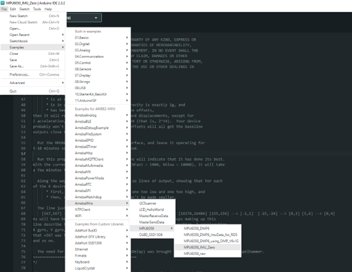
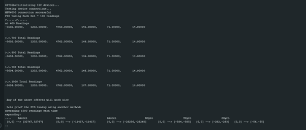
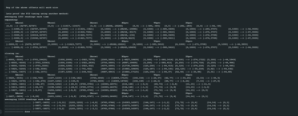

MPU6050 IMU Zero
================

Materials
---------

-  `AMB82-mini <https://www.amebaiot.com/en/where-to-buy-link/#buy_amb82_mini>`__ x 1

-  MPU6050 x 1

Example
-------

Introduction
~~~~~~~~~~~~

This example will demonstrate how to do calibration for the MPU6050 IMU.

Procedure
~~~~~~~~~

Connect the MPU6050 to I2C_SDA and I2C_SCL of the board as shown in the diagram below.

|image01|

Open the example in "File" -> "Examples" -> "AmebaWire" -> "MPU6050"-> "MPU6050_IMU_Zero"

|image02|

| If an MPU6050
| \* is an ideal member of its tribe,
| \* is properly warmed up,
| \* is at rest in a neutral position,
| \* is in a location where the pull of gravity is exactly 1g, and
| \* has been loaded with the best possible offsets,

then it will report 0 for all accelerations and displacements, except
for Z acceleration, for which it will report 16384 (that is, 2\ :sup:`14`). Your
device probably won't do quite this well, but good offsets will all get
the baseline outputs close to these target values. Put the MPU6050 on a
flat and horizontal surface and leave it operating for 5-10 minutes so
its temperature gets stabilized.

| Compile and run this example. A "----- done -----" line will indicate
  that it has done its best. With the current accuracy-related constants
  (NFast = 1000, NSlow = 10000), it will take a few minutes to get
  there. Along the way, it will generate a dozen or so lines of output,
  showing that for each of the 6 desired offsets, it is
| \* first, trying to find two estimates, one too low and one too high,
  and
| \* then, closing in until the bracket can't be made smaller.

The line just above the "done" line will look something like [567,567]
--> [-1,2] [-2223,-2223] --> [0,1] [1131,1132] --> [16374,16404]
[155,156] --> [-1,1] [-25,-24] --> [0,3] [5,6] --> [0,4].

As will have been shown in interspersed header lines, the six groups making up this
line describe the optimum offsets for the X acceleration, Y acceleration, Z acceleration,
X gyro, Y gyro, and Z gyro, respectively. In the sample shown just above, the trial showed
that +567 was the best offset for the X acceleration, -2223 was best for Y acceleration,
and so on.

Below shows the Serial Monitor output for running this example.

|image03|

|image04|

Code Reference
--------------

| [1] MPU6050 library and examples by ElectronicCats:
| https://github.com/ElectronicCats/mpu6050

.. |image01| image:: ../../../../_static/amebapro2/Example_Guides/I2C/MPU6050_IMU_Zero/image01.png
   :width: 1186 px
   :height: 860 px
   :scale: 70%

