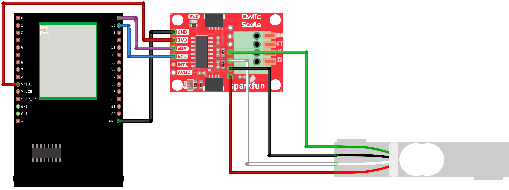
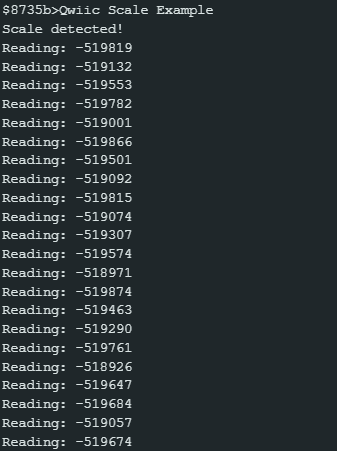

NAU7802 Advanced I2C
============================

Materials
---------

- `AMB82-mini <https://www.amebaiot.com/en/where-to-buy-link/#buy_amb82_mini>`__ x 1

- `SparkFun Qwiic Scale - NAU7802 <https://www.sparkfun.com/sparkfun-qwiic-scale-nau7802.html>`__ x 1

- `Load Cell (20 kg) <https://shopee.sg/Load-Cell-1kg-5kg-10kg-20kg-i.440521573.7989384220>`__  x 1

Example
-------

Introduction
~~~~~~~~~~~~

This example shows how to configure a different I2C bus with different clock speed for NAU7802.

Procedure
~~~~~~~~~

Connect the Load Cell to NAU7802.

    * Connect the red wire of Load Cell to RED pin (Excitation +) of NAU7802.
    * Connect the black wire of Load Cell to BLK pin (Excitation -) of NAU7802.
    * Connect the green wire of Load Cell to GRN pin (Signal +) of NAU7802.
    * Connect the white wire of Load Cell to WHT pin (Signal -) of NAU7802.

Connect the AMB82-mini to NAU7802.

    * Connect the VDD33 of AMB82-mini to 3V3 of NAU7802.
    * Connect the GND   of AMB82-mini to GND of NAU7802.
    * Connect the Pin 09 (I2C_SDA1 pin) of AMB82-mini to SDA of NAU7802.
    * Connect the Pin 10 (I2C_SCL1 pin) of AMB82-mini to SCL of NAU7802.

.. note:: Download `User Guide <https://www.amebaiot.com/?s2member_file_download=AMB82-Mini_Hardware_User_Guide_0V3_20230303.pdf>`__ to understand more on pin definition. If you are following through all other NAU7802 examples for AMB82-mini, do remember to configure your I2C pins properly, this example uses Pin 09 and Pin 10. 

.. tip:: Depending on your NAU7802 version, some may support 5V+ operating voltage—please check the official website before you connect to a 5V power supply. If your NAU7802 supports 5V+ operating voltage, connecting to V_USB instead of VDD33 tends to have less jitter effect.

The final wiring should look like the diagram below.

|image01|

Open the example in :guilabel:`File -> Examples -> AmebaWire -> NAU7802 -> AdvancedI2C`

|image02|

Compile and run the example.

|image03|

The NAU7802 supports up to **400k Hz**. You can also pass different wire port into the library.

.. To be added

.. |image02| image:: ../../../../_static/amebapro2/Example_Guides/I2C/NAU7802_Advanced_I2C/image02.png
    :width: 900 px
    :height: 600 px
    :scale: 80%

