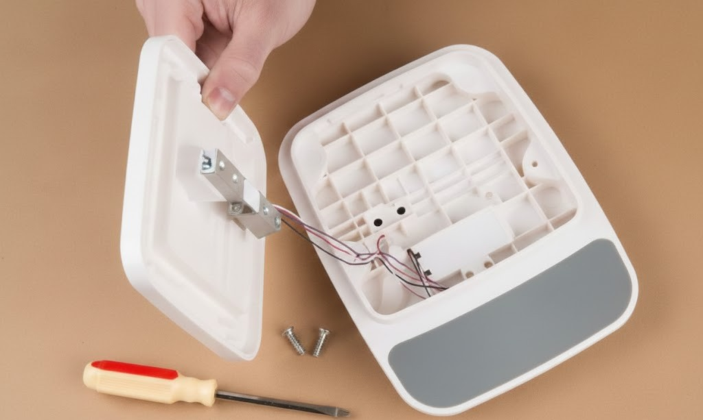
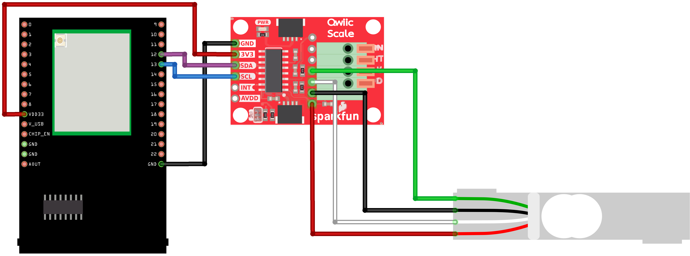
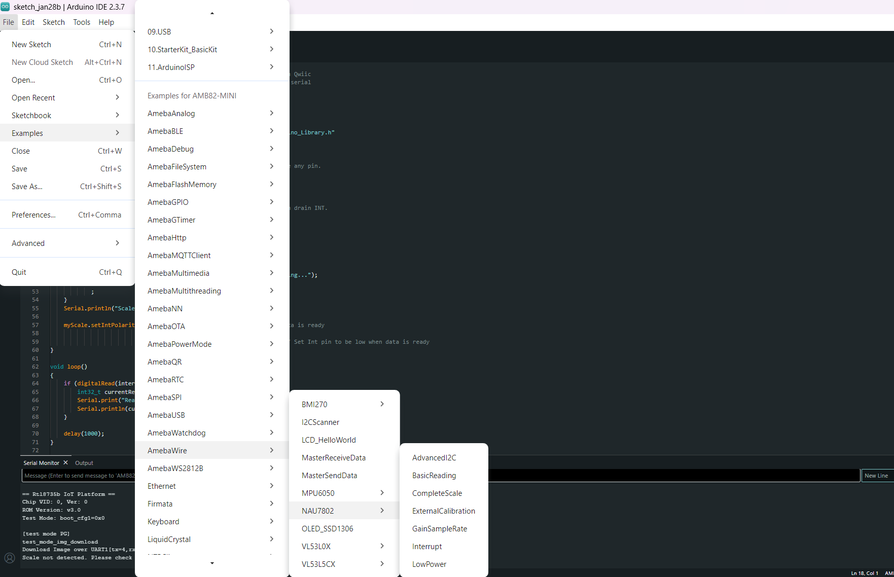
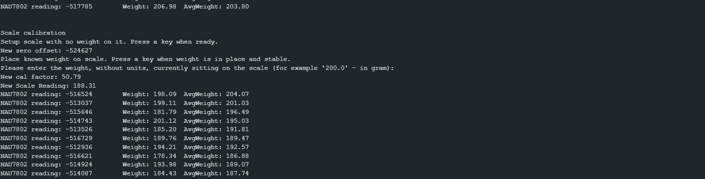

NAU7802 Complete Scale
=========================

Materials
---------

- `AMB82-mini <https://www.amebaiot.com/en/where-to-buy-link/#buy_amb82_mini>`__ x 1

- `SparkFun Qwiic Scale - NAU7802 <https://www.sparkfun.com/sparkfun-qwiic-scale-nau7802.html>`__ x 1

- `Load Cell (20 kg) <https://shopee.sg/Load-Cell-1kg-5kg-10kg-20kg-i.440521573.7989384220>`__  x 1

- `Known weights for calibration purposes (e.g., 200g and 500g)` x 2
    - 1st known weight is used DURING calibration to calculate calibration factor.
    - 2nd known weight is used AFTER calibration to test the accuracy of the calibrated setup.

.. note:: For more information, you may refer to the `Qwiic Scale Hookup Guide <https://learn.sparkfun.com/tutorials/qwiic-scale-hookup-guide>`__. 
    
- If you need very precise calibration (this example is only meant for learning purposes), you may need to 3D print or purchase a scale where you can fit your Load Cell into.

|image01|

Example
-------

Introduction
~~~~~~~~~~~~

This example shows how to calibrate SparkFun NAU7802 to get actual measurements (in grams) from a Load Cell, using software calibration.

Procedure
~~~~~~~~~

Connect the Load Cell to NAU7802.

    * Connect the red wire of Load Cell to RED pin (Excitation +) of NAU7802.
    * Connect the black wire of Load Cell to BLK pin (Excitation -) of NAU7802.
    * Connect the green wire of Load Cell to GRN pin (Signal +) of NAU7802.
    * Connect the white wire of Load Cell to WHT pin (Signal -) of NAU7802.

Connect the AMB82-mini to NAU7802.

    * Connect the VDD33 of AMB82-mini to 3V3 of NAU7802.
    * Connect the GND   of AMB82-mini to GND of NAU7802.
    * Connect the Pin 12 (I2C_SDA pin) of AMB82-mini to SDA of NAU7802.
    * Connect the Pin 13 (I2C_SCL pin) of AMB82-mini to SCL of NAU7802.

.. note:: Download `User Guide <https://www.amebaiot.com/?s2member_file_download=AMB82-Mini_Hardware_User_Guide_0V3_20230303.pdf>`__ to understand more on pin definition.

.. tip:: Depending on your NAU7802 version, some may support 5V+ operating voltage—please check the official website before you connect to a 5V power supply. If your NAU7802 supports 5V+ operating voltage, connecting to V_USB instead of VDD33 tends to have less jitter effect.

The final wiring should look like the diagram below.

|image02|

Open the example in :guilabel:`File -> Examples -> AmebaWire -> NAU7802 -> CompleteScale`

|image03|

The calibration process here involves 3 main steps:

    1. **Taring (Zeroing)** - Remove any offset to ensure the scale reads 0g when empty.
    2. **Calibration** - Use a known weight to calculate the calibration factor.
    3. **Verification** - Use another known weight to verify if the scale is accurate.

Compile and run the example.

|image04|

Follow the instructions on Serial Monitor to complete the calibrate process, start the process by sending ``c`` from Serial Monitor.

Step 1: Taring the Scale
~~~~~~~~~~~~~~~~~~~~~~~~~

**Purpose:** Zero out the scale to remove any initial offset or bias.

    1. Remove any objects from the Load Cell.
    2. Ensure the Load Cell is on a level, stable surface.
        * Please take note that the Load Cell is very sensitive to any form of vibration or pressure, you should ensure the Load Cell is firmly mounted a flat surface to get accurate readings.
    3. When prompted with ``Setup scale with no weight on it. Press a key when ready.``, send any key from the Serial Monitor, or simply type ``Enter``.
    4. Wait for the confirmation message like ``New zero offset: ...``.

**What's happening:** The NAU7802 takes multiple readings and sets this as the zero point (baseline). Any future measurements will be relative to this baseline.

Step 2: Measuring Known Weight
~~~~~~~~~~~~~~~~~~~~~~~~~~~~~~~

**Purpose:** Calculate the calibration factor by comparing raw sensor readings to a known weight.

**Procedure:**

    1. When prompted with ``Place known weight on scale. Press a key when weight is in place and stable.``, place your 1st known weight (e.g., 200g) on the Load Cell and send any key from the Serial Monitor, or simply press ``Enter``.
    2. When prompted with ``Please enter the weight, without units, currently sitting on the scale (for example '200.0' - in gram):``, send the weight in grams in the Serial Monitor (e.g., ``200.0`` for 200g).
    3. Press ``Enter`` to send the value.
    4. The system will take readings and calculate the calibration factor.
    5. Note down the ``New cal factor: ...`` displayed in the Serial Monitor.

**What's happening:** The code reads the raw and amplified signal from the NAU7802 and divides it by your known weight to determine how many raw units equal one gram. This ratio is your calibration factor.

Step 3: Re-Taring for Verification (Optional But Recommended)
~~~~~~~~~~~~~~~~~~~~~~~~~~~~~~~~~~~~~~~~~~~~~~~~~~~~~~~~~~~~~

**Purpose:** Verify that the scale correctly reads 0g when empty after calibration.

    1. Remove the known weight from the Load Cell.
    2. Send ``t`` from the Serial Monitor.

**What's happening:** This ensures that after calibration, the scale still properly zeros out when empty.

Step 4: Calibration Complete
~~~~~~~~~~~~~~~~~~~~~~~~~~~~~

After completing all three steps, your scale is now calibrated! The Serial Monitor will continuously display weight readings every second.
    
    1. Now, place you 2nd known weight to test if the calibrated setup is accurate.
    2. Finally, you can use these commands in the Serial Monitor:

        * ``t`` - Tare (zero) the scale
        * ``c`` - Run the full calibration procedure again

.. tip:: Use heavier calibration weights (200g-1000g) as they provide more reliable calibration factors.

.. To be added

