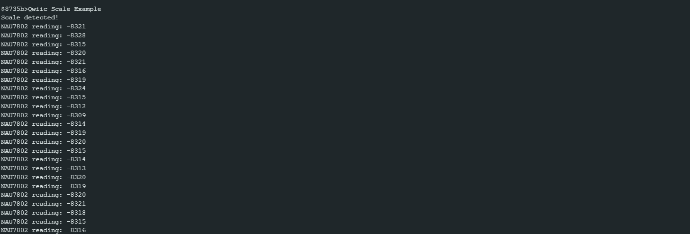

NAU7802 Gain Sample Rate
============================

Materials
---------

- `AMB82-mini <https://www.amebaiot.com/en/where-to-buy-link/#buy_amb82_mini>`__ x 1

- `SparkFun Qwiic Scale - NAU7802 <https://www.sparkfun.com/sparkfun-qwiic-scale-nau7802.html>`__ x 1

- `Load Cell (20 kg) <https://shopee.sg/Load-Cell-1kg-5kg-10kg-20kg-i.440521573.7989384220>`__  x 1

Example
-------

Introduction
~~~~~~~~~~~~

This example shows how to adjust the specific parameters used in SparkFun NAU7802.

1. **Gain** - The magnitude of amplification. Setting higher gain usually gives higher sensitivity.
    * Gain can be set to one of the following values:
        * ``NAU7802_GAIN_128``  - 128x
        * ``NAU7802_GAIN_64``   - 64x
        * ``NAU7802_GAIN_32``   - 32x
        * ``NAU7802_GAIN_16``   - 16x (default gain)
        * ``NAU7802_GAIN_8``    - 8x
        * ``NAU7802_GAIN_4``    - 4x
        * ``NAU7802_GAIN_2``    - 2x
        * ``NAU7802_GAIN_1``    - 1x (zero gain)
    
2. **Sample Rate** - The number of samples taken per second (SPS).
    * Sample Rate can be set to one of the following values:
        * ``NAU7802_SPS_320``   - 320 Hz
        * ``NAU7802_SPS_80``    -  80 Hz
        * ``NAU7802_SPS_40``    -  40 Hz
        * ``NAU7802_SPS_20``    -  20 Hz
        * ``NAU7802_SPS_10``    -  10 Hz (default sample rate)

Procedure
~~~~~~~~~

Connect the Load Cell to NAU7802.

    * Connect the red wire of Load Cell to RED pin (Excitation +) of NAU7802.
    * Connect the black wire of Load Cell to BLK pin (Excitation -) of NAU7802.
    * Connect the green wire of Load Cell to GRN pin (Signal +) of NAU7802.
    * Connect the white wire of Load Cell to WHT pin (Signal -) of NAU7802.

Connect the AMB82-mini to NAU7802.

    * Connect the VDD33 of AMB82-mini to 3V3 of NAU7802.
    * Connect the GND   of AMB82-mini to GND of NAU7802.
    * Connect the Pin 12 (I2C_SDA pin) of AMB82-mini to SDA of NAU7802.
    * Connect the Pin 13 (I2C_SCL pin) of AMB82-mini to SCL of NAU7802.

.. note:: Download `User Guide <https://www.amebaiot.com/?s2member_file_download=AMB82-Mini_Hardware_User_Guide_0V3_20230303.pdf>`__ to understand more on pin definition.

.. tip:: Depending on your NAU7802 version, some may support 5V+ operating voltage—please check the official website before you connect to a 5V power supply. If your NAU7802 supports 5V+ operating voltage, connecting to V_USB instead of VDD33 tends to have less jitter effect.

The final wiring should look like the diagram below.

|image01|

Open the example in :guilabel:`File -> Examples -> AmebaWire -> NAU7802 -> GainSampleRate`

|image02|

Compile and run the example.

|image03|

You can try setting different values for **Gain** or **Sample Rate** to see the difference. The output above sets **Gain** to 2x and **Sample Rate** to 40 Hz (40 SPS). If you set the **Sample Rate** to 8x, you should see the values doubled.

.. To be added
.. |image01| image:: ../../../../_static/amebapro2/Example_Guides/I2C/NAU7802_Gain_Sample_Rate/image01.png
    :width: 650 px
    :height: 350 px
.. |image02| image:: ../../../../_static/amebapro2/Example_Guides/I2C/NAU7802_Gain_Sample_Rate/image02.png
    :width: 1000 px
    :height: 600 px
    :scale: 80%
