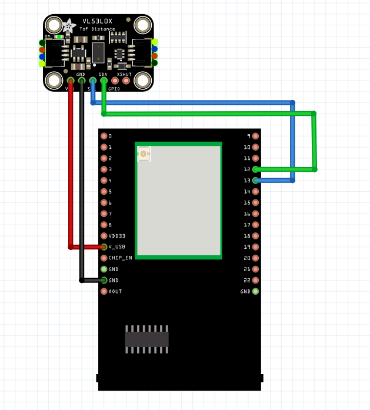
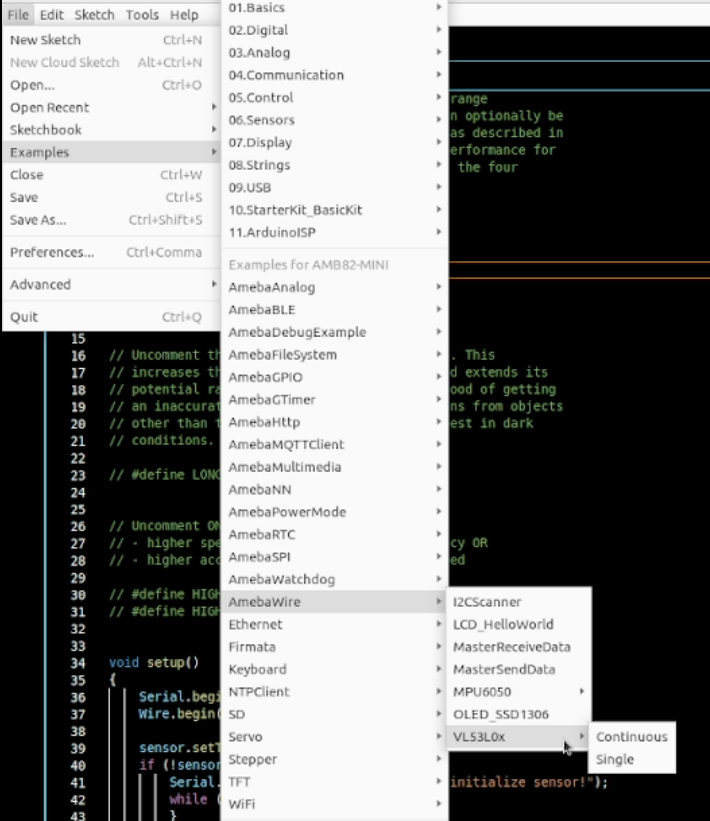
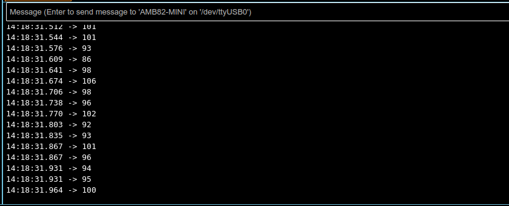

Retrieve Data from VL53L0X IR sensor
====================================

Materials
---------

-  `AMB82-mini <https://www.amebaiot.com/en/where-to-buy-link/#buy_amb82_mini>`__ x 1

-  VL53L0X IR sensor x 1

Example
-------

Introduction
~~~~~~~~~~~~

This example will illustrate how to retrieve the value of VL53L0X IR
sensor and pass it to the AMB82-Mini board. VL53L0X Distance Sensor is a
Time-of-Flight (ToF) ranging module based on the VL53L0X from ST, with
accurate ranging up to 2m, which can be controlled via I2C interface and
has pretty low power consumption.

| This guide will be the same for these 2 examples:
| 1) Continuous.ino
| 2) Single.ino

Procedure
~~~~~~~~~

Connect the VL53L0X IR sensor to I2C_SDA and I2C_SCL of the board as shown in the diagram below.

|image01|

Open the example in "File" -> "Examples" -> "AmebaWire" -> "VL53L0X" -> "Continuous" OR "Single".

|image02|

You will choose "Single" if you want to get single-shot range
measurements from the VL53L0X sensor. The sensor can be optionally be
configured with different ranging profiles to get better performance for
a certain application.

For both examples, the Serial Monitor will output the range measurements
as shown in the below image. It will output 8190 if there is no object
within 2m range.

|image03|

Code Reference
--------------

| [1] VL53L0X library and examples by Pololu:
| https://github.com/pololu/vl53l0x-arduino

