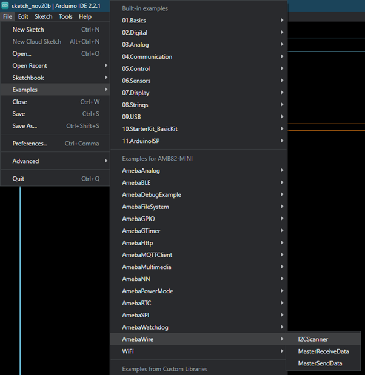
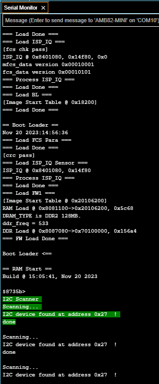
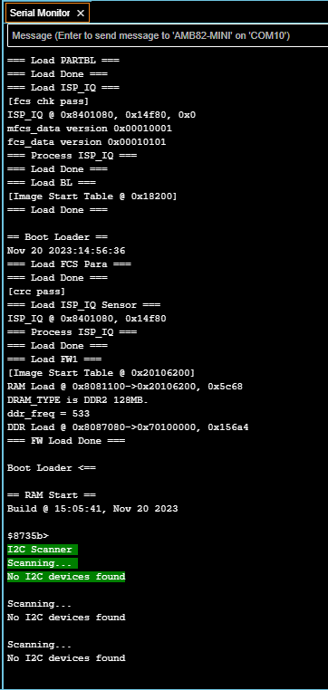

Scan I2C devices
================

Materials
---------

-  `AMB82-mini <https://www.amebaiot.com/en/where-to-buy-link/#buy_amb82_mini>`__ x 1

-  Any I2C device x 1

Example
-------

Introduction
~~~~~~~~~~~~

The example will scan the I2C bus for devices that is connected to Ameba. When a device is found, it will be shown on the serial monitor
with the address of the device.

Procedure
~~~~~~~~~

Connect any I2C device to I2C_SDA and I2C_SCL of the board.

Open the example in :guilabel:`File -> Examples -> AmebaWire -> I2C_Scanner`

|image01|

When the I2C bus detect any I2C device, the serial monitor will show the
address of the I2C device as shown below:

|image02|

When there is no I2C device connected to the board, the Arduino IDE
serial monitor will show the message below:

|image03|

Code Reference
--------------

| You can find detailed information of this example in the documentation of Arduino:
| https://playground.arduino.cc/Main/I2cScanner/

