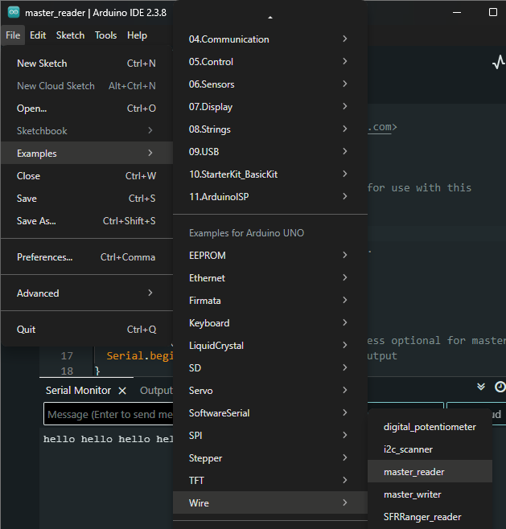
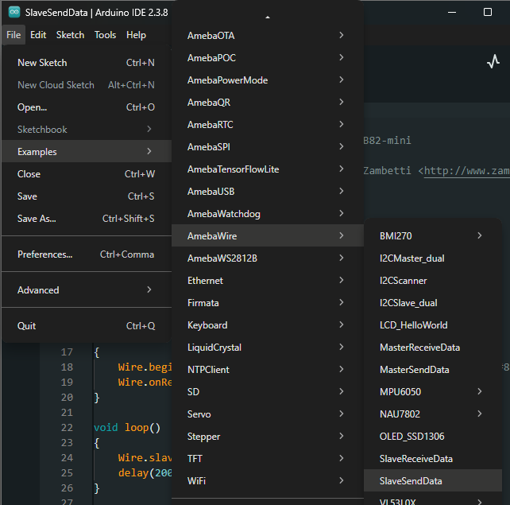
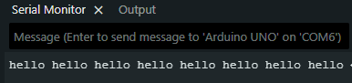
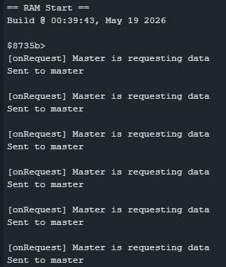

Slave Send Data to Arduino UNO
===============================

Materials
---------

-  `AMB82-mini <https://www.amebaiot.com/en/where-to-buy-link/#buy_amb82_mini>`__ x 1

-  Arduino UNO x 1

Example
-------

I2C Introduction
~~~~~~~~~~~~~~~~

There are two roles in the operation of I2C, one is "master", the other
is "slave". Only one master is allowed and can be connected to many
slaves. Each slave has its unique address, which is used in the
communication between master and the slave. I2C uses two pins, one is
for data transmission (SDA), the other is for the clock (SCL). Master
uses the SCL to inform slave of the upcoming data transmission, and the
data is transmitted through SDA. The I2C example was named "Wire" in the
Arduino example.

Introduction
~~~~~~~~~~~~

In this example, the AMB82-mini is configured as an I2C slave sender at
address 0x08, while the Arduino UNO acts as the I2C master reader. The
Arduino UNO requests data from the AMB82-mini every 500 milliseconds,
and the AMB82-mini responds with the message "hello master from slave".
The Arduino UNO prints the received message on its Serial Monitor.

Procedure
~~~~~~~~~

-  **Setting up Arduino Uno to be I2C Master**

| First, select Arduino in the Arduino IDE in :guilabel:`Tools -> Board -> Arduino Uno`
| Open the "Master Reader" example in :guilabel:`Examples -> Wire -> master_reader`

|image01|

Then click :guilabel:`Sketch -> Upload` to compile and upload the example to Arduino Uno.

-  **Setting up AMB82-mini to be I2C Slave**

| Next, open another window of Arduino IDE, make sure to choose your AMB82-mini development board in the IDE :guilabel:`Tools -> Board`
| Open the "Slave Send Data" example in :guilabel:`File -> Examples -> AmebaWire -> SlaveSendData`

|image02|

Click :guilabel:`Sketch -> Upload` to compile and upload the example to AMB82-mini.

-  **Wiring**

| The Arduino UNO uses A4 as the I2C SDA and A5 as the I2C SCL.
| Connect the SDA pin (pin 12) of AMB82-mini to the SDA pin (A4) of Arduino UNO with a pull-up resistor (3.3V).
| Connect the SCL pin (pin 13) of AMB82-mini to the SCL pin (A5) of Arduino UNO with a pull-up resistor (3.3V).
| Another important thing is that the GND pins of Arduino UNO and AMB82-mini should be connected to each other.

| Open the Serial Monitor of Arduino UNO in :guilabel:`Tools -> Serial Monitor`
| Press the reset button on AMB82-mini first to initialize the slave. Then press the reset button on Arduino UNO to start requesting data.
| The Arduino UNO will print the received message from AMB82-mini in its Serial Monitor.

|image03|

AMB82-mini will print out the following logs if the message has been sent to master.

|image04|

Code Reference
--------------

| Use ``Wire.begin(address)`` to join the I2C bus as a slave with the given address.
| https://www.arduino.cc/en/Reference/WireBegin

| Use ``Wire.onRequest(handler)`` to register a callback function that is called when the master requests data from this slave.
| https://www.arduino.cc/en/Reference/WireOnRequest

| Use ``Wire.write()`` to write data from a slave device in response to a request from a master.
| https://www.arduino.cc/en/Reference/WireWrite

| Use ``Wire.slaveWrite()`` to trigger the slave to prepare and send the queued data to the master.

