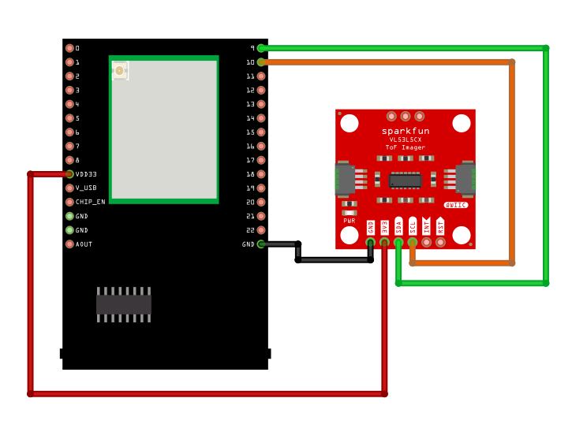

VL53L5CX Advanced I2C
======================

.. contents::
  :local:
  :depth: 2

Materials
---------

- `AMB82-mini <https://www.amebaiot.com/en/where-to-buy-link/#buy_amb82_mini>`_ x 1

- `SparkFun Qwiic ToF Imager - VL53L5CX <https://www.sparkfun.com/sparkfun-qwiic-tof-imager-vl53l5cx.html>`_ x 1

Example
-------

Introduction
~~~~~~~~~~~~

This example shows how to use the SparkFun VL53L5CX Time-of-Flight sensor on AMB82 Mini and how to start a sensor with an alternate I2C address or Wire port.

Procedure
~~~~~~~~~

Connect the VL53L5CX to I2C_SDA and I2C_SCL of the board as shown in the diagram below.

|image01|

Open the example in "File" -> "Examples" -> "AmebaWire" -> "VL53L5CX" -> "AdvancedI2C".

|image02|

Compile and run the example. 

You can see that the sensor initializes at address 0x3C on the Wire1 port.

|image03|

