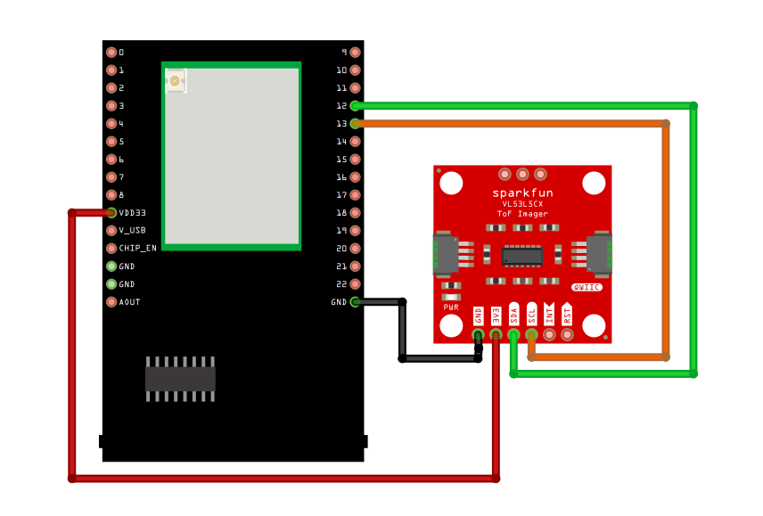
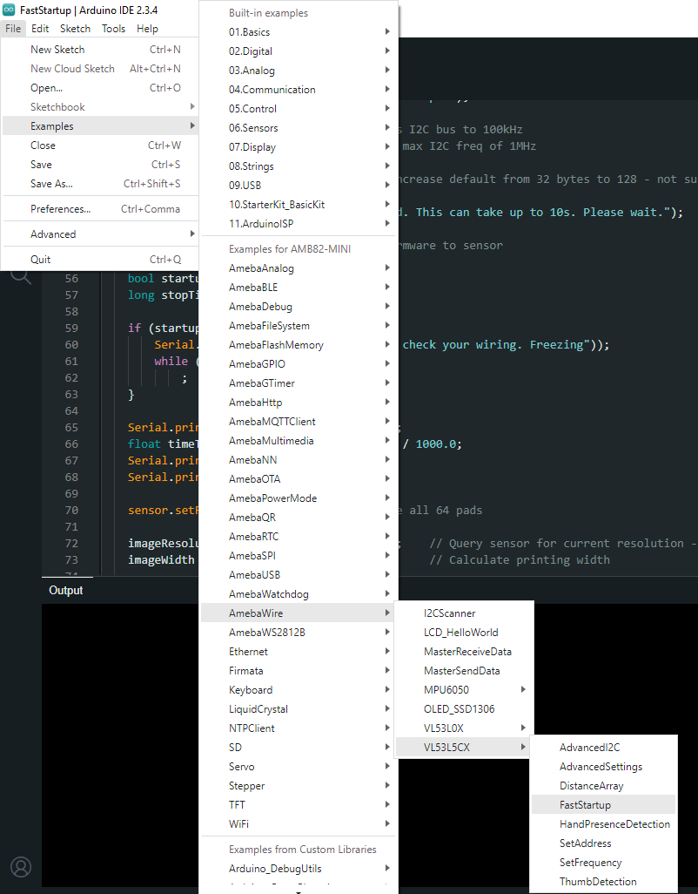
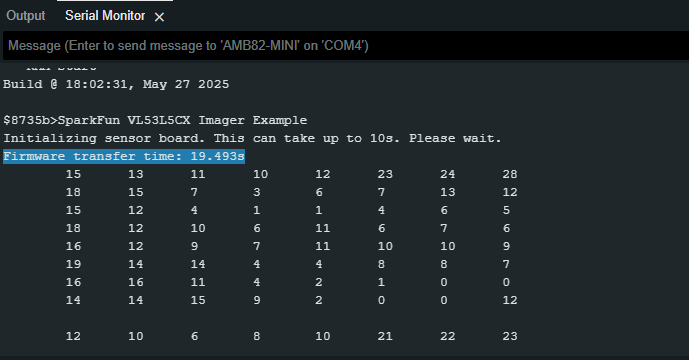

VL53L5CX Fast Start Up
=======================

Materials
---------

- `AMB82-mini <https://www.amebaiot.com/en/where-to-buy-link/#buy_amb82_mini>`__ x 1

- `SparkFun Qwiic ToF Imager - VL53L5CX <https://www.sparkfun.com/sparkfun-qwiic-tof-imager-vl53l5cx.html>`__ x 1

Example
-------

Introduction
~~~~~~~~~~~~

This example shows how to use the SparkFun VL53L5CX Time-of-Flight sensor on AMB82 Mini and how to setup the I2C bus to minimize the amount of time taken to init the sensor.

Procedure
~~~~~~~~~

Connect the VL53L5CX to I2C_SDA and I2C_SCL of the board as shown in the diagram below.

|image01|

Open the example in :guilabel:`File -> Examples -> AmebaWire -> VL53L5CX -> FastStartup`

|image02|

Compile and run the example.

You will be able to see the firmware transfer time (Transfer firmware to sensor).

|image03|

