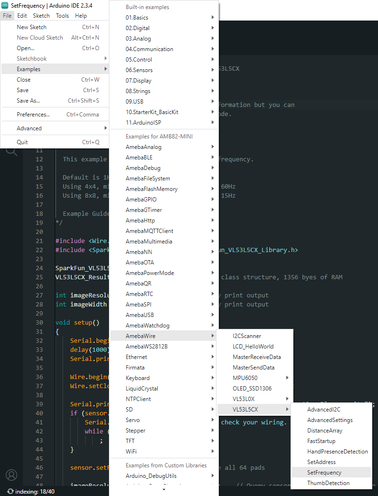
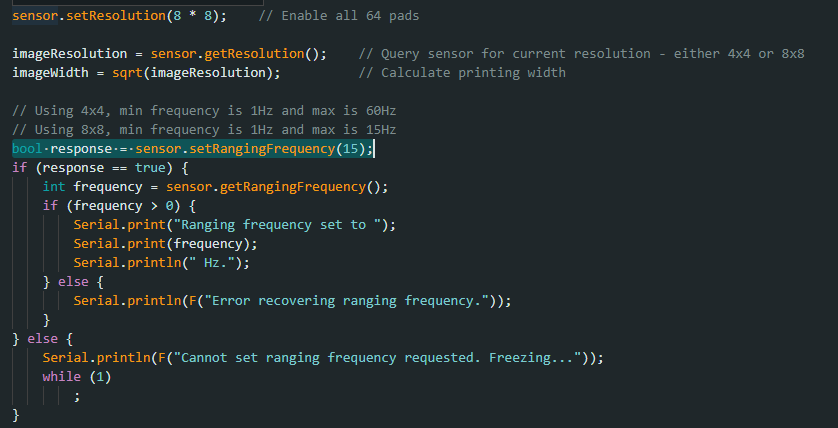
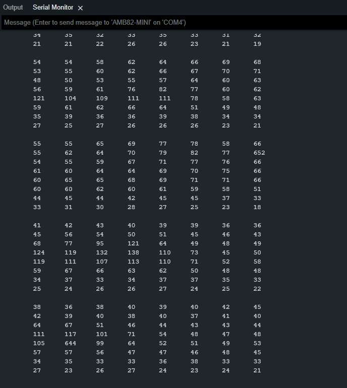

VL53L5CX Set Frequency
=======================

Materials
---------

- `AMB82-mini <https://www.amebaiot.com/en/where-to-buy-link/#buy_amb82_mini>`__ x 1

- `SparkFun Qwiic ToF Imager - VL53L5CX <https://www.sparkfun.com/sparkfun-qwiic-tof-imager-vl53l5cx.html>`__ x 1

Example
-------

Introduction
~~~~~~~~~~~~

This example shows how to use the SparkFun VL53L5CX Time-of-Flight sensor on AMB82 Mini and how to increase output frequency.

Procedure
~~~~~~~~~

Connect the VL53L5CX to I2C_SDA and I2C_SCL of the board as shown in the diagram below.

|image01|

Open the example in "File" -> "Examples" -> "AmebaWire" -> "VL53L5CX" -> "SetFrequency".

|image02|

The frequency can be modified in the highlighted code.

|image03|

Compile and run the example.

You should be able to see the 8x8 distance array printed in the Serial Monitor.

|image04|

.. |image01| image:: ../../../../_static/amebapro2/Example_Guides/I2C/VL53L5CX_Set_Frequency/image01.png
    :width: 856 px
    :height: 579 px

