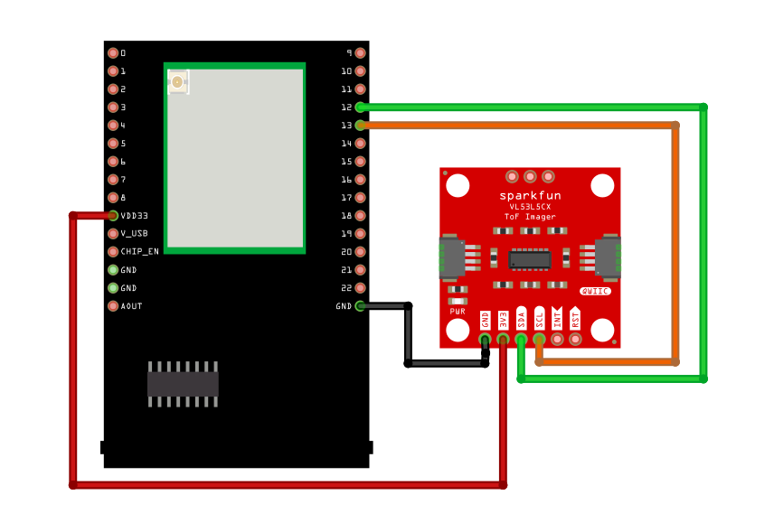

VL53L5CX Thumb Detection
=========================

Materials
---------

- `AMB82-mini <https://www.amebaiot.com/en/where-to-buy-link/#buy_amb82_mini>`__ x 1

- `SparkFun Qwiic ToF Imager - VL53L5CX <https://www.sparkfun.com/sparkfun-qwiic-tof-imager-vl53l5cx.html>`__ x 1

Example
-------

Introduction
~~~~~~~~~~~~

This example shows how to use the SparkFun VL53L5CX Time-of-Flight sensor in 8x8 mode to detect thumbs-up or thumbs-down gestures.

Procedure
~~~~~~~~~

Connect the VL53L5CX to I2C_SDA and I2C_SCL of the board as shown in the diagram below.

|image01|

Open the example in :guilabel:`File -> Examples -> AmebaWire -> VL53L5CX -> ThumbDetection`

|image02|

Compile and run the example. In the Serial Monitor, you should be able to see the logs.

When no thumb direction is detected, the log will display "Unclear thumb direction".

|image03|

If a thumbs-up is detected, it will display "Thumbs up".

|image04|

and if a thumb-down is detected, it will display "Thumbs down".

|image05|

