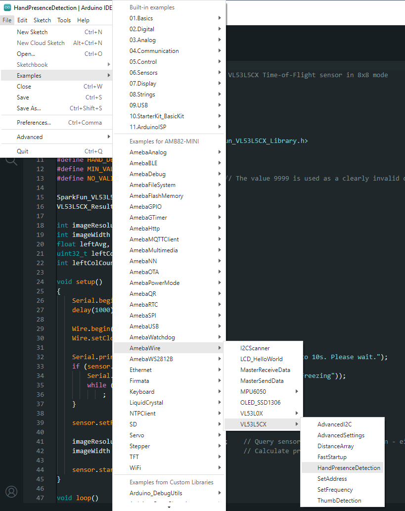
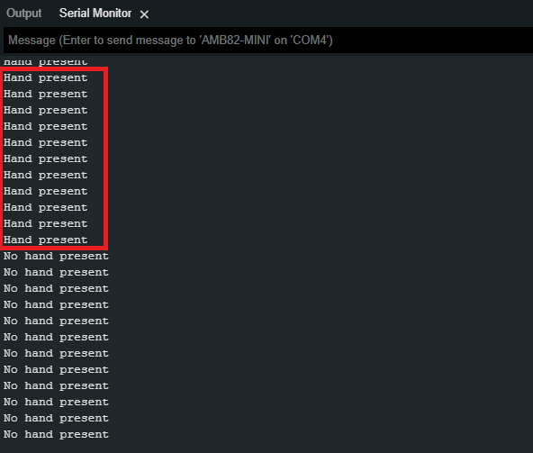
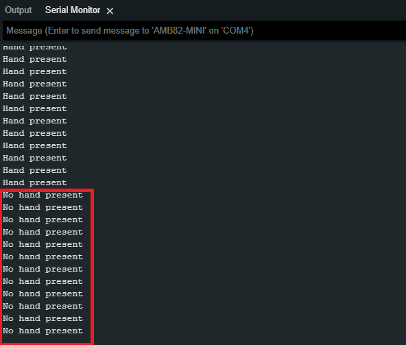

VL53L5CX Hand Presence Detection
=================================

.. contents::
  :local:
  :depth: 2

Materials
---------

- `AMB82-mini <https://www.amebaiot.com/en/where-to-buy-link/#buy_amb82_mini>`_ x 1

- `SparkFun Qwiic ToF Imager - VL53L5CX <https://www.sparkfun.com/sparkfun-qwiic-tof-imager-vl53l5cx.html>`_ x 1

Example
-------

Introduction
~~~~~~~~~~~~

This example shows how to use the SparkFun VL53L5CX Time-of-Flight sensor in 8x8 mode to detect if hand is present.

Procedure
~~~~~~~~~

Connect the VL53L5CX to I2C_SDA and I2C_SCL of the board as shown in the diagram below.

|image01|

Open the example in "File" -> "Examples" -> "AmebaWire" -> "VL53L5CX" -> "HandPresenceDetection".

|image02|

Compile and run the example. In the Serial Monitor, you should be able to see the logs.

When hand is detected, the log will display “Hand present”. 

|image03|

When no hand is detected, it will display “No hand present”. 

|image04|

.. |image01| image:: ../../../../_static/amebapro2/Example_Guides/I2C/VL53L5CX_Hand_Presence_Detection/image01.png
   :width: 856 px
   :height: 579 px

