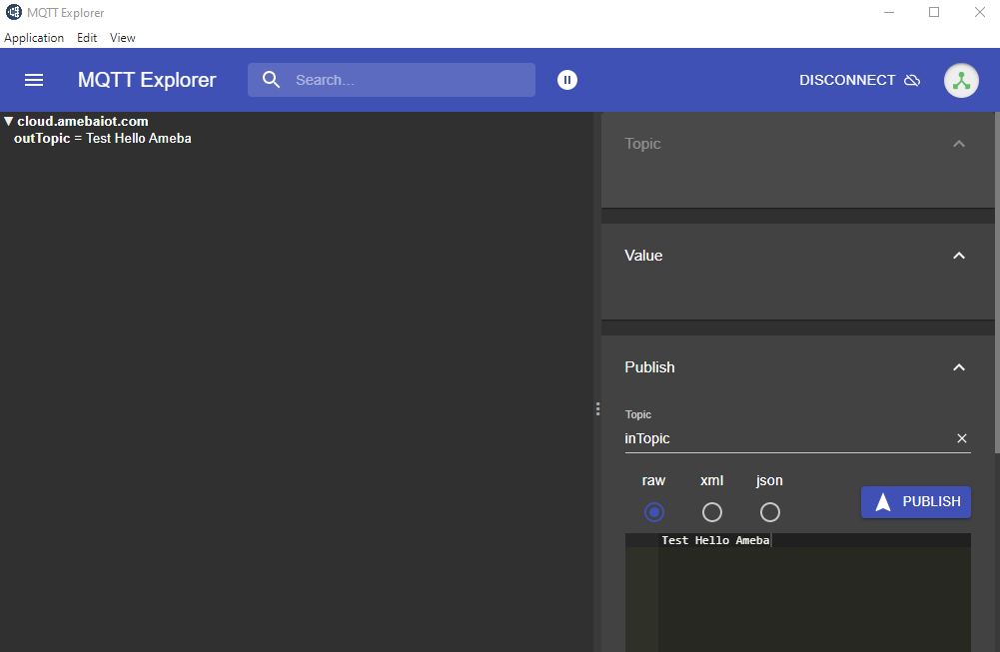
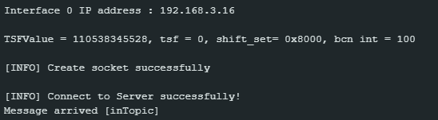

Set up MQTT Client-Broker Authenticated Connection with Publish in Callback
===========================================================================

Materials
---------

- `AMB82-mini <https://www.amebaiot.com/en/where-to-buy-link/#buy_amb82_mini>`__ x 1

Example
-------

MQTT (Message Queuing Telemetry Transport) is a protocol proposed by IBM and Eurotech. The introduction in MQTT Official Website:
MQTT is a machine-to-machine (M2M)/"Internet of Things" connectivity protocol. It was designed as an extremely lightweight publish/subscribe messaging transport.We can say MQTT is a protocol designed for IoT. MQTT is based on TCP/IP and transmits/receives data via publish/subscribe.

Please refer to the figure below:

|image01|

In the operation of MQTT, there are several roles:

-  Publisher: Usually publishers are the devices equipped with sensors
   (ex. Ameba). Publishers uploads the data of the sensors to
   MQTT-Broker, which serves as a database with MQTT service.

-  Subscriber: Subscribers are referred to the devices which receive and
   observe messages, such as a laptop or a mobile phone.

-  Topic: Topic is used to categorize the messages, for example the
   topic of a message can be "PM2.5" or "Temperature". Subscribers can
   choose messages of which topics they want to receive.

This example shows how to connect Ameba to MQTT-Broker with authentication.
Then, send messages as publisher and receive messages from MQTT-Broker as
subscriber.

**MQTT_Publish_In_Callback example**

Open the MQTT example :guilabel:`File -> Examples -> AmebaMQTTClient -> MQTT_Publish_In_Callback`

Please modify some WiFi-related parameter and some information related to MQTT:

|image08|

-  All parameters are same as MQTT_Auth example.

Next, compile the code and upload it to Ameba. Press the reset button,
then open the serial monitor. After Ameba is connected to MQTT server,
it sends the message "hello world" to "outTopic". To see the message,
another MQTT client needs to be set up.

Start the MQTT Explore, and setup the auth connection. All setting is
same as MQTT_Auth example.

|image09|

Click "ADVANCED" at bottom for topic setup. Use "outTopic" that same as
"publishTopic" of the board. Click "ADD" then "BACK".

Click "CONNECT". The "hello world" message show up at left side. At
right side, under "Publish" use "inTopic" same as "subscribeTopic" of the
board. Choose "raw" and input "Text hello Ameba", then click "PUBLISH".
The board will receive the MQTT Explorer published raw message. Then
publish it from the board side and MQTT Explorer will receive at the
left side. Note, "hello world" sometimes is not shown up because the
boards connect to MQTT broker before the MQTT Explorer.

|image12|

|image13|

.. |image01| image:: ../../../../_static/amebapro2/Example_Guides/MQTT/Set_up_Client/image01.png
   :width:  940 px
   :height:  617 px

.. |image08| image:: ../../../../_static/amebapro2/Example_Guides/MQTT/Set_up_Client/image08.png
   :width:  524 px
   :height:  217 px

.. |image09| image:: ../../../../_static/amebapro2/Example_Guides/MQTT/Set_up_Client/image09.png
   :width:  998 px
   :height:  652 px

