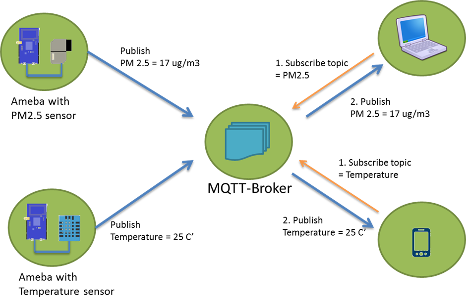
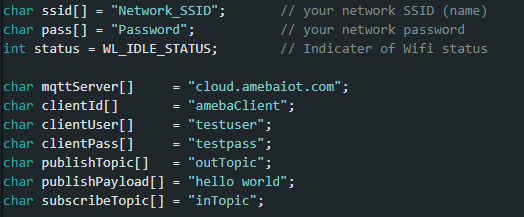
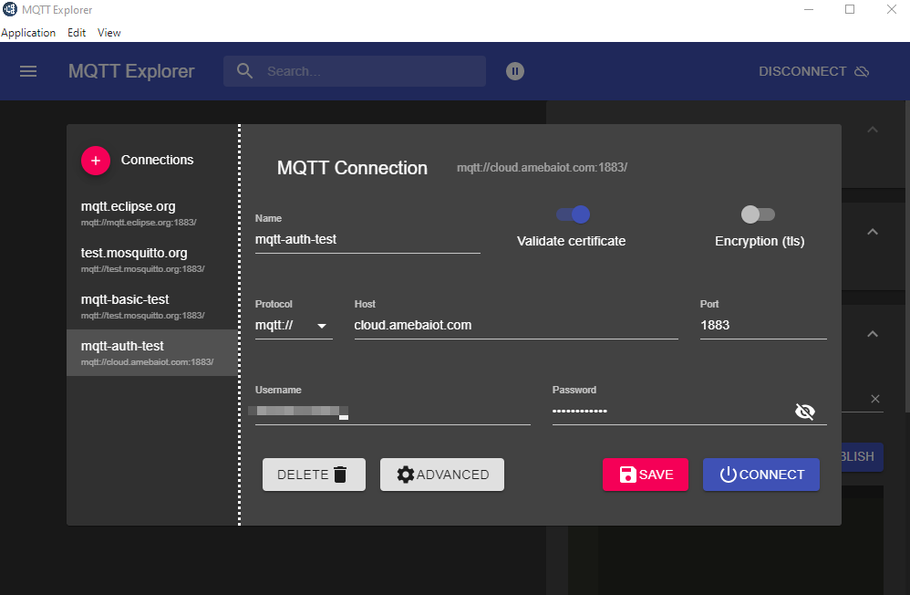
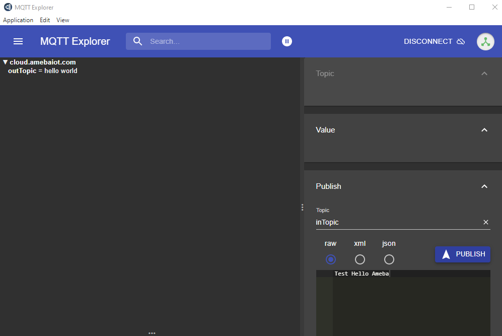
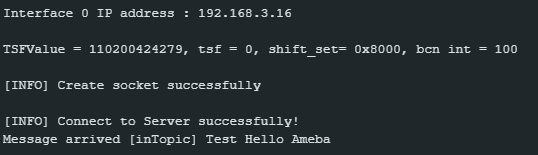

Set up MQTT Client-Broker Authenticated Connection
==================================================

Materials
---------

- `AMB82-mini <https://www.amebaiot.com/en/where-to-buy-link/#buy_amb82_mini>`__ x 1

Example
-------

MQTT (Message Queuing Telemetry Transport) is a protocol proposed by IBM and Eurotech. The introduction in MQTT Official Website:
MQTT is a machine-to-machine (M2M)/"Internet of Things" connectivity protocol. It was designed as an extremely lightweight publish/subscribe messaging transport.We can say MQTT is a protocol designed for IoT. MQTT is based on TCP/IP and transmits/receives data via publish/subscribe.

Please refer to the figure below:

|image01|

In the operation of MQTT, there are several roles:

-  Publisher: Usually publishers are the devices equipped with sensors
   (ex. Ameba). Publishers uploads the data of the sensors to
   MQTT-Broker, which serves as a database with MQTT service.

-  Subscriber: Subscribers are referred to the devices which receive and
   observe messages, such as a laptop or a mobile phone.

-  Topic: Topic is used to categorize the messages, for example the
   topic of a message can be "PM2.5" or "Temperature". Subscribers can
   choose messages of which topics they want to receive.

This example shows how to connect Ameba to MQTT-Broker with authentication.
Then send messages as publisher and receive messages from MQTT-Broker as
subscriber.

**MQTT_Auth example**

| Open the MQTT example :guilabel:`File -> Examples -> AmebaMQTTClient -> MQTT_Auth`
| Please modify some WiFi-related parameter and some information related to MQTT:

|image08|

-  "mqttServer" refers to the MQTT-Broker. The MQTT auth host setup may request service from online paid service. There is also local server setup for testing, refer to 3rd party `Tutorials <https://m-ichae-l.github.io/Public-tutorial/docs/local_emqx_mqtt_server.html>`__

-  "clientId" is an identifier for MQTT-Broker to identify the connected
   device. In this case, it is the registered device name.

-  "clientUser" is the authentication username. In this case, it is the
   login username of Realtek IoT/Wi-Fi MCU Solutions website. Note, it
   will be unable to receive message if use the email as "clientUser".

-  "clientPass" is the authentication password. In this case, it is the
   login password of Realtek IoT/Wi-Fi MCU Solutions website.

-  The other parameters are same as previous.

Next, compile the code and upload it to Ameba. Press the reset button, then open the serial monitor. After Ameba is connected to MQTT server, it sends the message "hello world" to "outTopic". To see the message, another MQTT client needs to be set up.

Start the MQTT Explore, and setup the auth connection.

Click "Connections" at top left to start a new connection setup. "Name" can be customized. Set "Host" as the server IP address (or domain name). "Username" and "Password" are same as "clientUser" and "clientPass".

|image09|

Click "ADVANCED" at bottom for topic setup. Use "outTopic" that same as "publishTopic" of the board. Click "ADD" then "BACK".

Click "CONNECT". The "hello world" message show up at left side. At right side, under "Publish" use "inTopic" same as "subscribeTopic" of the board. Choose "raw" and input "Text hello Ameba", then click "PUBLISH". The board will receive the MQTT Explorer published raw message. Note, "hello world" sometimes is not shown up because the boards connect to MQTT broker before the MQTT Explorer.

|image10|

|image11|

