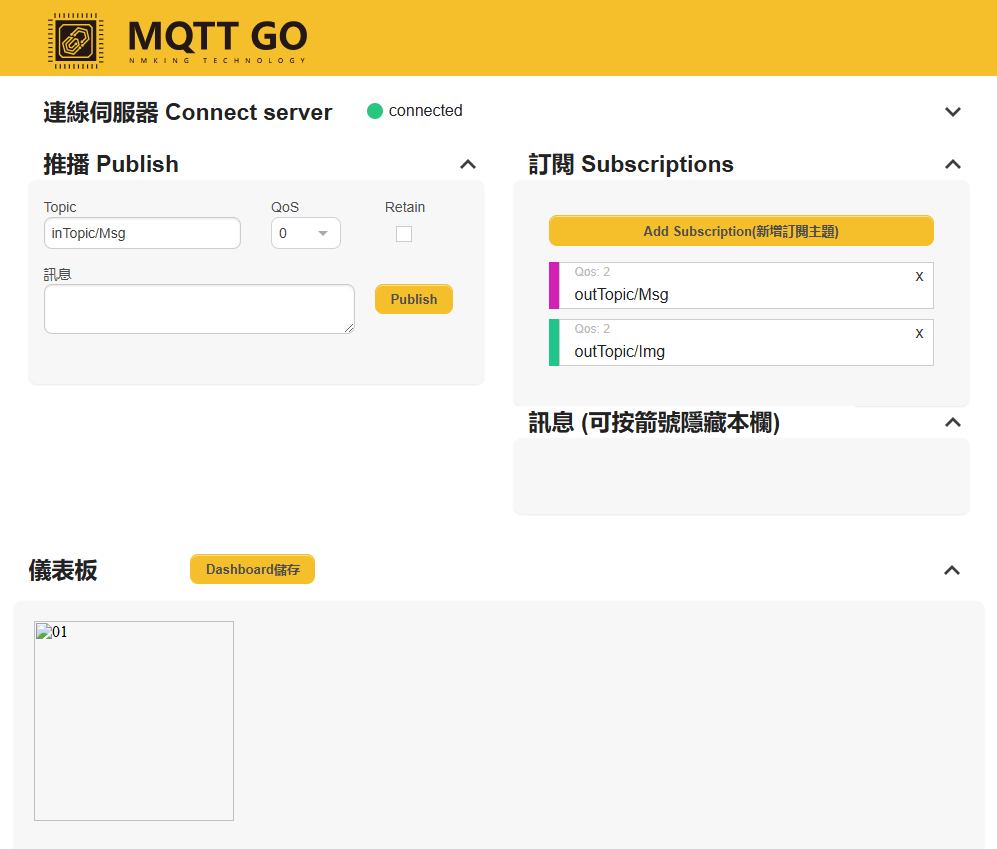

Set up MQTT Client-Broker Basic Connection for Image Publishing
===============================================================

.. contents::
  :local:
  :depth: 2

Materials
---------

- `AMB82-mini <https://www.amebaiot.com/en/where-to-buy-link/#buy_amb82_mini>`_ x 1

Example
-------

MQTT (Message Queuing Telemetry Transport) is a protocol proposed by IBM and Eurotech. The introduction in MQTT Official Website:
MQTT is a machine-to-machine (M2M)/”Internet of Things” connectivity protocol. It was designed as an extremely lightweight publish/subscribe messaging transport.We can say MQTT is a protocol designed for IoT. MQTT is based on TCP/IP and transmits/receives data via publish/subscribe.

Please refer to the figure below:

|image01|

In the operation of MQTT, there are several roles:

-  Publisher: Usually publishers are the devices equipped with sensors
   (ex. Ameba). Publishers uploads the data of the sensors to
   MQTT-Broker, which serves as a database with MQTT service.

-  Subscriber: Subscribers are referred to the devices which receive and
   observe messages, such as a laptop or a mobile phone.

-  Topic: Topic is used to categorize the messages, for example the
   topic of a message can be “PM2.5” or “Temperature”. Subscribers can
   choose messages of which topics they want to receive.

This example shows how to connect Ameba to MQTT-Broker.
Then, send messages as publisher and receive messages from MQTT-Broker as
subscriber.

**MQTT_Image example**

Open the MQTT example “File” -> “Examples” -> “AmebaMQTTClient” ->
“MQTT_Image”

Please modify WiFi SSID and password according to your network.

-  “ssid” is the network SSID for internet access.

-  “pass” is the network password for internet access.

-  “mqttServer” refers to the MQTT-Broker, we will be using "broker.mqttgo.io" for this example.

-  “clientId” is an identifier for MQTT-Broker to identify the connected
   device.

-  “publishTopic” is the topic of the published message in the example
   it is “outTopic/Msg”. The devices that subscribed to “outTopic” will
   receive the message. 

-  “publishPayload” is the content to be published.

-  “subscribeTopic” is to tell MQTT-broker which topic to subscribe to
   by the board.

-  Image taken will be publish to "outTopic/Img".

Go to `MQTTGO.io <https://broker.mqttgo.io/>`_, and connect to server. 

Subscribe to "outTopic/Msg" and "outTopic/Img", while the publish topic is set to "inTopic/Msg".

|image14|

Next, compile and upload the example code to Ameba. After Ameba is connected to MQTT server,
it publishes the message “hello world” to “outTopic/Msg” and an image to "outTopic/Img".

.. note :: You may redefine the topics for your own message and image publishing

.. |image01| image:: ../../../../_static/amebapro2/Example_Guides/MQTT/Set_up_Client/image01.png
   :width:  940 px
   :height:  617 px

