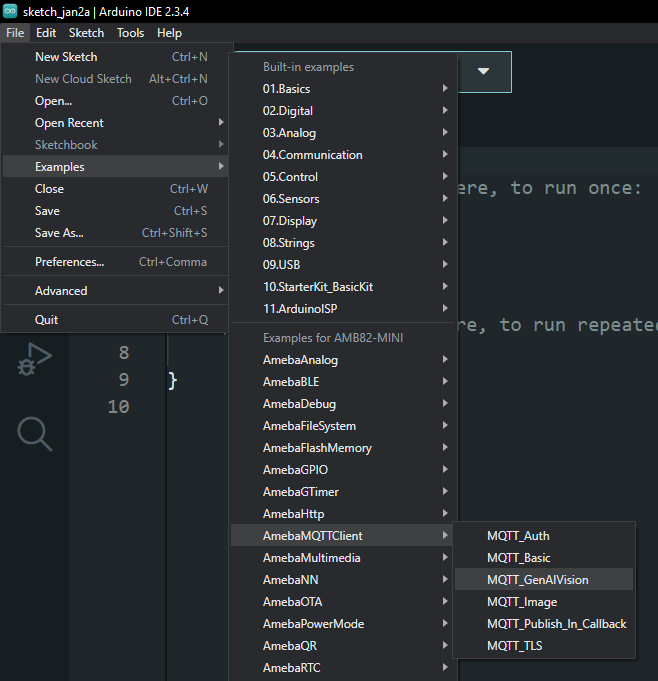
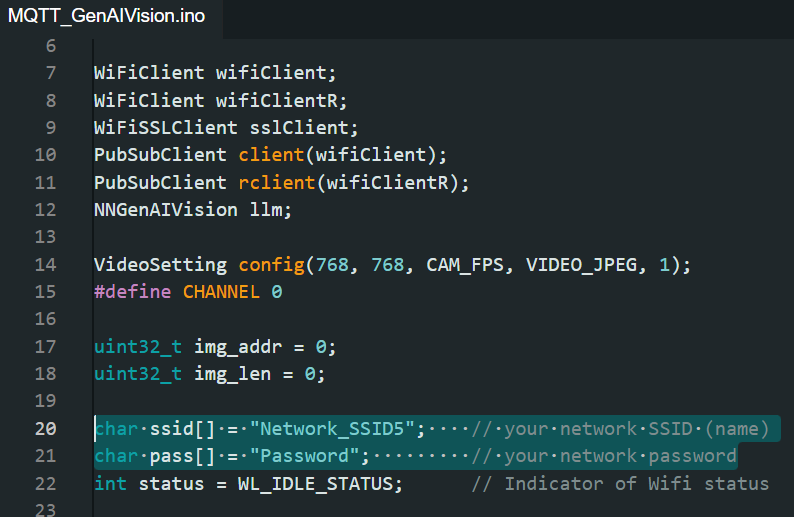
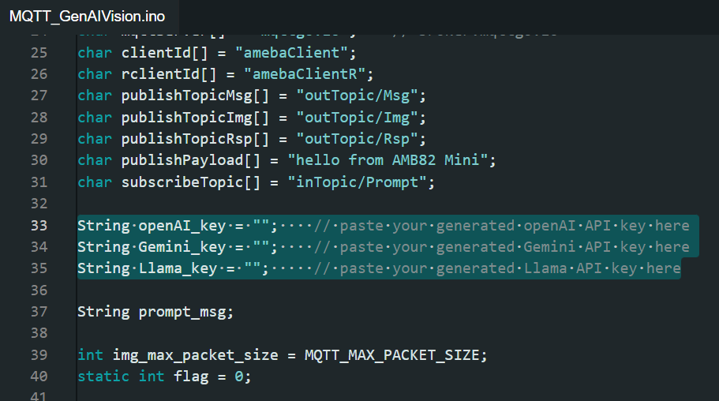
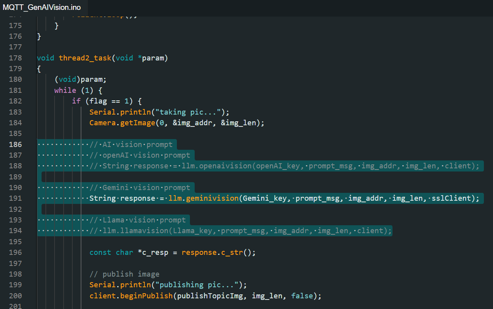
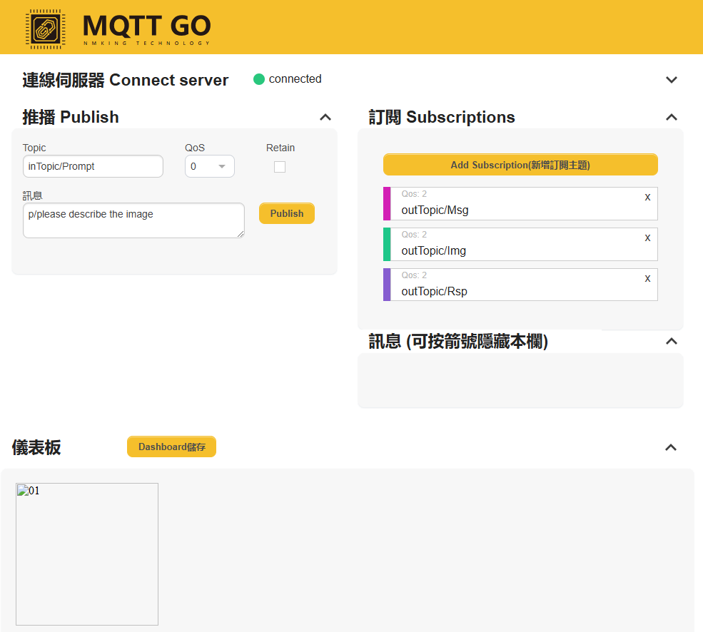

Set up MQTT Client-Broker Basic Connection with Generative AI Vision
====================================================================

.. contents::
  :local:
  :depth: 2

Materials
---------

- `AMB82-mini <https://www.amebaiot.com/en/where-to-buy-link/#buy_amb82_mini>`_ x 1

Example
-------

In this example, we will be connecting AMB82-mini to a MQTT-Broker that could display images, i.e. broker.mqttgo.io. 

Open Generative AI Vision with MQTT example in “File” -> “Examples” -> “AmebaMQTTClient” -> “MQTT_GenAIVision”.

|image01|

Please modify "ssid" and "pass" according to your WiFi network SSID and password.

|image02|

Create your API key and paste it in the following section. Please refer to `GenAIVision Example <https://ameba-doc-arduino-sdk.readthedocs-hosted.com/en/latest/ameba_pro2/amb82-mini/Example_Guides/Neural%20Network/Multimedia%20AI/Generative%20AI%20Vision.html>`_ for more details on creating API.

|image03|

Uncomment the vision prompt function according to your model.

|image04|

Compile and upload the firmware to AMB82-mini. 

Go to `MQTTGO.io <https://broker.mqttgo.io/>`_, and connect to server. 

Subscribe to the topics to receive the **message, image and response** published by AMB82-mini. Publish your prompt to a topic where AMB82-mini has subscribed to. 

.. note :: Only message that starts with ``p/`` will be recognized as a prompt message, please insert "p/" before your prompt to trigger image capture and sending to Gen AI server.

You may refer to the snapshot below for prompt sending and response receiving over MQTT broker. **Kindly define your own topics to publish and subscribe.**

|image05|

Resources
---------

| MQTT GO Broker 
| https://broker.mqttgo.io/

| openAI platform - openAI vision
| https://platform.openai.com/docs/guides/vision

| Google AI Studio - Gemini vision
| https://ai.google.dev/gemini-api/docs/vision

| GroqCloud - Llama vision
| https://console.groq.com/docs/overview

