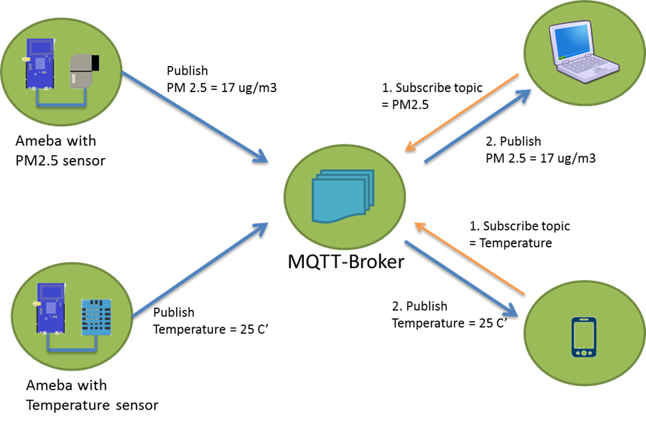
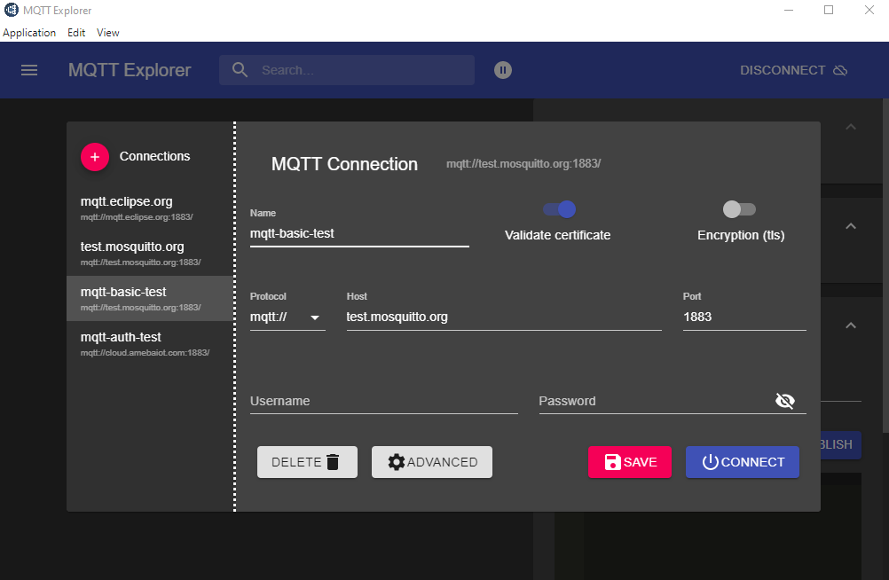

Set up MQTT Client-Broker Basic Connection
==========================================

Materials
---------

- `AMB82-mini <https://www.amebaiot.com/en/where-to-buy-link/#buy_amb82_mini>`__ x 1

Example
-------

MQTT (Message Queuing Telemetry Transport) is a protocol proposed by IBM and Eurotech. The introduction in MQTT Official Website:
MQTT is a machine-to-machine (M2M)/"Internet of Things" connectivity protocol. It was designed as an extremely lightweight publish/subscribe messaging transport.We can say MQTT is a protocol designed for IoT. MQTT is based on TCP/IP and transmits/receives data via publish/subscribe.

Please refer to the figure below:

|image01|

In the operation of MQTT, there are several roles:

-  Publisher: Usually publishers are the devices equipped with sensors
   (ex. Ameba). Publishers uploads the data of the sensors to
   MQTT-Broker, which serves as a database with MQTT service.

-  Subscriber: Subscribers are referred to the devices which receive and
   observe messages, such as a laptop or a mobile phone.

-  Topic: Topic is used to categorize the messages, for example the
   topic of a message can be "PM2.5" or "Temperature". Subscribers can
   choose messages of which topics they want to receive.

This example shows how to connect Ameba to MQTT-Broker.
Then, send messages as publisher and receive messages from MQTT-Broker as
subscriber.

**MQTT_Basic example**

| Open the MQTT example "File" -> "Examples" -> "AmebaMQTTClient" -> "MQTT_Basic"
| Please modify some WiFi-related parameter and some information related to MQTT:

|image02|

-  "ssid" is the network SSID for internet access.

-  "pass" is the network password for internet access.

-  "mqttServer" refers to the MQTT-Broker, there is free MQTT sandbox
   "test.mosquitto.org" for testing.

-  "clientId" is an identifier for MQTT-Broker to identify the connected
   device.

-  "publishTopic" is the topic of the published message in the example
   it is "outTopic". The devices that subscribed to "outTopic" will
   receive the message.

-  "publishPayload" is the content to be published.

-  "subscribeTopic" is to tell MQTT-broker which topic to subscribe to
   by the board.

Next, compile the code and upload it to Ameba. Press the reset button, then open the serial monitor.

|image03|

After Ameba is connected to MQTT server, it sends the message "hello world" to "outTopic". To see the message, another MQTT client needs to be set up.

The "MQTT Explore" is an all-platform application that can be set as the MQTT client. Refer to the website http://mqtt-explorer.com/.

Click "Connections" at top left to start a new connection setup. "Name" can be customized. Set "Host" as "test.mosquitto.org".

|image04|

Click "ADVANCED" at bottom for topic setup. Use "outTopic" that same as "publishTopic" of the board. Click "ADD" then "BACK".

|image05|

Click "CONNECT". The "hello world" message show up at left side. At right side, under "Publish" use "inTopic" same as "subscribeTopic" of the board. Choose "raw" and input "Text hello Ameba", then click "PUBLISH". The board will receive the MQTT Explorer published raw message. Note, because of the host is a free public host, the board may receive unexpected messages.

|image06|

|image07|

.. |image02| image:: ../../../../_static/amebapro2/Example_Guides/MQTT/Set_up_Client/image02.png
   :width:  498 px
   :height:  182 px

.. |image05| image:: ../../../../_static/amebapro2/Example_Guides/MQTT/Set_up_Client/image05.png
   :width:  996 px
   :height:  655 px

.. |image06| image:: ../../../../_static/amebapro2/Example_Guides/MQTT/Set_up_Client/image06.png
   :width:  1000 px
   :height:  655 px

.. |image07| image:: ../../../../_static/amebapro2/Example_Guides/MQTT/Set_up_Client/image07.png
   :width:  449 px
   :height:  142 px
