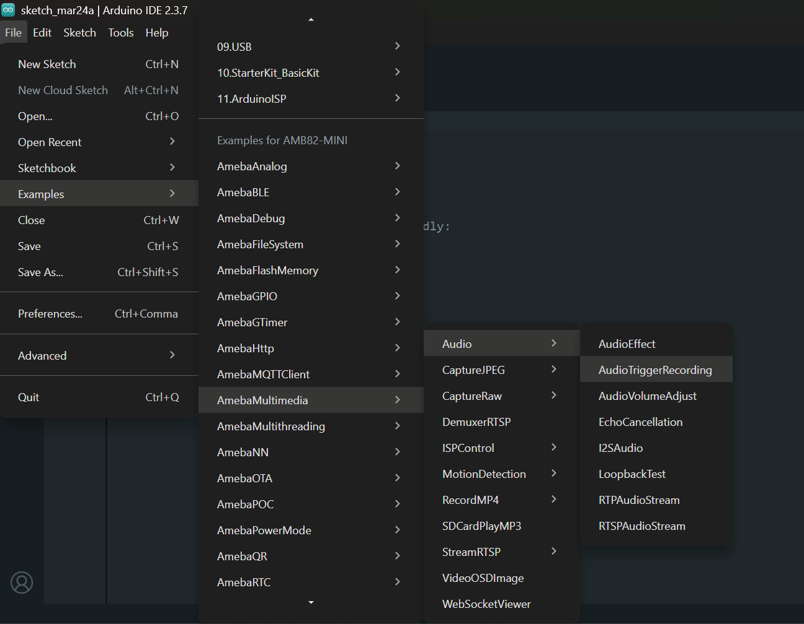

Audio Trigger Recording
=======================

Materials
---------

- `AMB82-mini <https://www.amebaiot.com/en/where-to-buy-link/#buy_amb82_mini>`__ x 1
- SD card x 1

Example
-------

In this example, we will use the Ameba Pro2 development board microphone sound level to trigger the recording of MP4 audio file into the SD card.

Open example in :guilabel:`File -> Examples -> AmebaMultimedia -> Audio -> AudioTriggerRecording`

|image01|

Compile and upload the code to AMB82-mini. Press Reset button to start LISTENING mode.

To begin RECORDING, speak to the microphone, recording process will be triggered automatically once the sound level hits above the preset threshold.

Once recording process has ended, disconnect power from the Ameba Pro 2 board, remove the SD card and connect it to a computer to view the contents.

