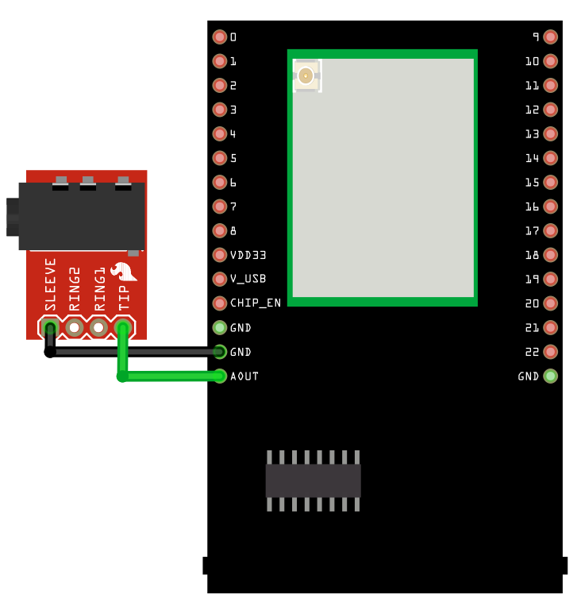
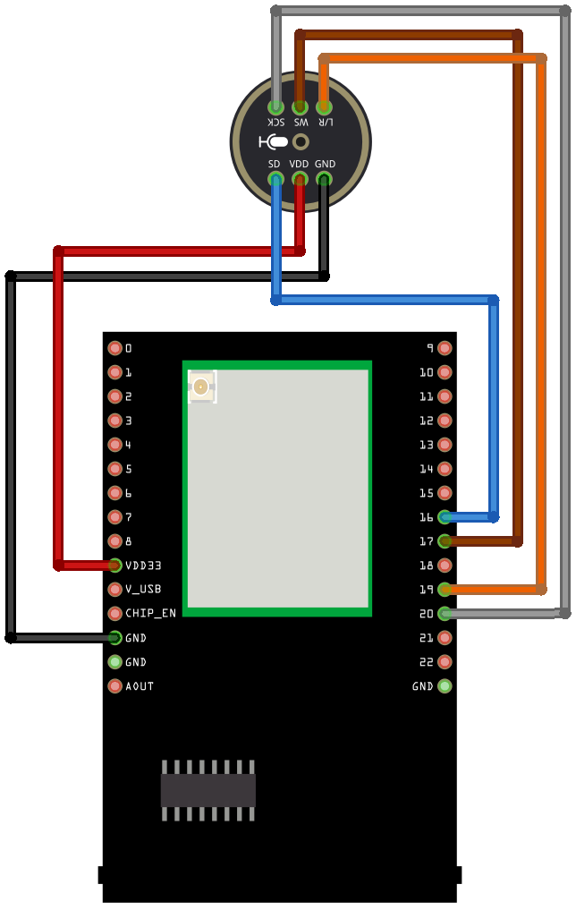
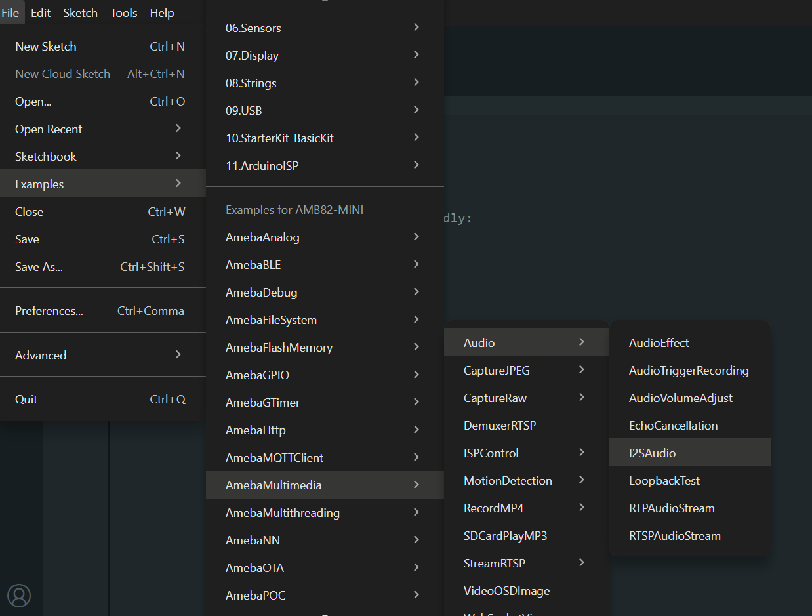

I2S Audio
=========

Materials
---------

- `AMB82-mini <https://www.amebaiot.com/en/where-to-buy-link/#buy_amb82_mini>`__ x 1
- 3.5mm TRS/TRRS breakout x 1 (e.g., Adafruit 2791 / Sparkfun 11570)
- INMP441 x 1

Example
-------
In this example, we will use the Ameba Pro2 board with I2S INMP441 microphone.

Connect the audio jack to the Ameba board as shown in the diagram.

|image01|

Then, connect the I2S mic to AMB82-mini according to the diagram below.

|image02|

+--------------------+------------------------+
| I2S mic            | AMB82-mini             |
+====================+========================+
| VDD                | 3v3 (VDD33)            |
+--------------------+------------------------+
| GND                | GND                    |
+--------------------+------------------------+
| SCK                | GPIOD_14 (20)          |
+--------------------+------------------------+
| L/R                | GPIOD_15 (19)          |
+--------------------+------------------------+
| WS                 | GPIOD_17 (17)          |
+--------------------+------------------------+
| SD                 | GPIOD_18 (16)          |
+--------------------+------------------------+

Open one of the Audio examples in :guilabel:`File -> Examples -> AmebaMultimedia -> Audio -> I2SAudio`

|image03|

Compile the code and upload it to Ameba.

Plug in a pair of wired earbuds into the audio jack. After pressing the Reset button, you should be able to hear sound picked up by the I2S microphone.

