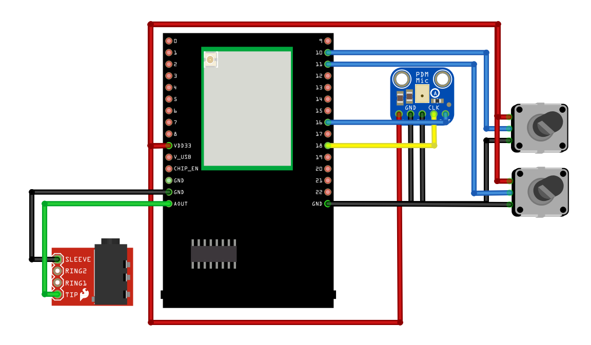

Loopback Test
=============

.. contents::
  :local:
  :depth: 2

Materials
---------

- `AMB82-mini <https://www.amebaiot.com/en/where-to-buy-link/#buy_amb82_mini>`_ x 1
- 3.5mm TRS/TRRS breakout x 1 (e.g., Adafruit 2791 / Sparkfun 11570)
- Adafruit PDM Microphone Breakout x 1 [Optional]
- Potentiometer x 2

Example
-------
In this example, we will use the Ameba Pro2 board to playback audio recorded by the onboard analogue microphone or an external PDM (Pulse Density Modulation) microphone.

Connect the audio jack to the Ameba board as shown in the diagram, you may ignore the potentiometers connection for this example.

|image01|

Alternatively, connect the audio jack and PDM Microphone as shown in the diagram below if you would like to use a digital microphone, you may ignore the potentiometers connection for this example.

|image02|

Open one of the Audio examples in “File” -> “Examples” -> “AmebaMultimedia” -> “Audio” -> "LoopbackTest".

|image03|

Compile the code and upload it to Ameba.

Plug in a pair of wired earbuds into the audio jack. After pressing the Reset button, you should be able to hear sounds picked up by the onboard microphone replayed through the earbuds.

.. |image01| image:: ../../../../../_static/amebapro2/Example_Guides/Multimedia/Audio_Basic/image01.png
   :width:  719 px
   :height: 577 px

